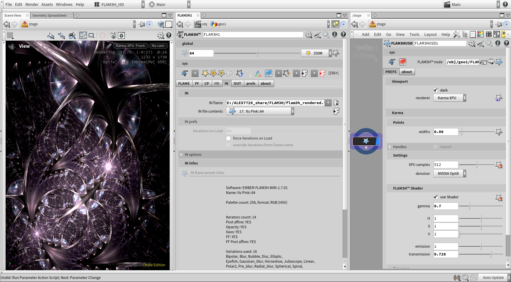

## License
- Software: [GNU GPL v3.0](LICENSE)
- Documentation: [CC BY-SA 4.0](LICENSE.docs)

## Houdini versions
_The following are Houdini versions where FLAM3H™ is fully functional, tested and supported._
- from **H19** to **H20.5**

 
 

# The Fractal Flame Algorithm

`The above fractal Flame image consist of 400M points and rendered with Houdini internal Karma renderer.`

## FLAM3 for SideFX Houdini - aka: FLAM3H™
**_A huge special thanks and lots of gratitude toward my family who kept up with me for so long while I was inside the fractal Flame bubble!_**

  

**[FLAM3H™ website](https://www.alexnardini.net/flame-home/)**

**[FLAM3H™ tutorials](https://www.youtube.com/@alexnardiniITALY/videos)**

**[FLAM3H™ instagram](https://www.instagram.com/alexnardini/)**

### Premise

One of the main missions was to pack the entire algorithm and functionalities I desired inside a tool using only Houdini out of the box. No HDK.
As a result, it became a somewhat conservative implementation, it has everything but also some limits as I needed to cut corners everywhere, which became a daunting process to put into balance.

A big commitment I needed to honor was to learn how to do fractal art. 
Building a fractal art tool without knowing what a fractal artist needs and feels while doing it is kind of meaningless. And thus, while creating this tool, I engaged in so much fractal art with it that I unavoidably developed a love for the field.
It was important, so I could shape and steer this tool in the right direction.

### Description

`FLAM3H™ node OTL documentation.`

CVEX has been used to implement the algorithm in its entirety.
Although it's not a real-time thing, it will be a lot of fun if you have a powerful CPU (two powerful CPUs are even better).

The code went up and down and finally settled on the most minimalistic version in favor of performance.
The language allowed me to take many shortcuts. He is dealing with execution threading and memory management and has offered me
fast, ready-to-use functions like **creating and sampling a cdf**, a very robust **random number generator**, and more.

Part of the work is done inside the HDA in the Houdini environment
like attribute binding, UI building, parameter creations, their visibility conditions, the final compile and much more.

Python has been used to enhance the user experience and add functionalities like:
copy/paste iterator data, load/save palette's libraries, load/save Flame's file format, responses/automations to user actions, and much more.

FLAM3 for SideFX Houdini generates a live point cloud of the fractal Flame being worked on, which is the actual render.
From there to the final image, it is left to the users ( aka points rendering ).
With Houdini integrated Karma renderer, you will be able to render the generated fractal Flames in nearly real time.

### Karma render Note:

Karma viewport renders do not use any density estimator, or log density display ( a form of tone mapping ) that is instead present in other applications. It does brighten up the high-density areas instead ( more points, more bright ) while using the raw color coming from the palette the Flame is currently using.

A custom shader could, in theory, implement a log density display and some form of density estimator. However, the beauty of outputting fractal Flame images in a 16bit or 32bit exr format will give joy when color correcting them, something we, in VFX, take for granted.

Karma interactive rendering in the Houdini's viewport:

`Worlds - Author: Alessandro Nardini`

`Its Pink - Author: Plangkye`

**Highly inspired by Apophysis software and its workflow design.**

Many Apophysis fractal Flames are available for download on the web, and you can load them inside FLAM3H™.
Or you can use Apophysis or Fractorium to author your Flames first and load them back into FLAM3H™. But also the other way around, create your Flames in Houdini and render them inside other applications. You've got choices.

**Download Apophysis 7x here**: [**Apophysis 7x download**](https://sourceforge.net/projects/apophysis7x/)

**Download Fractorium here**: [**Fractorium download**](http://fractorium.com/)

## Viewport live point cloud

Imagine the possibilities using Houdini procedural paradigm and toolsets to control all aspects of your Flame.

`FLAM3 for Houdini generate a live point cloud of the fractal Flame being worked on.`

## Camera sensor

All the render settings required by third-party programs such as Apophysis and Fractorium are stored together with the fractal Flames when they are saved from FLAM3H™.

A portion of the render parameters deal with the camera and how the fractal Flame you just saved is framed.

The FLAM3H™ camera sensor will precisely display the image framing.

Once framed, you can save the Flame and be sure it will be framed the same in other applications like Apophysis, Fractorium and others.

`Camera sensor: FLAM3H™ to Fractorium`

## Load Flames files authored with Apophysis, Fractorium, etc.

Following are some images showing FLAM3H™ rendering some of the Fractorium's example Flame files.
Some have been modified to fit within FLAM3H™ available variations. The screenshots show
Houdini Karma interactive on the left, and Fractorium with the same Flame file on the right.

`Chocolate Scaffold in Too Many Dimensions by plangkye. Source: Fractorium`

`Mountain by tatasz. Source: Fractorium`

`Bipolar by tatasz. Source: Fractorium`

`Flipped disk. Source: Fractorium`

## List of all available variations/plugins:

_Note that all the followings, are also available as PRE__ _and/or POST__ _variations._

_`Arch` `Auger` `Bent` `Bent2` `Bipolar` `Blade` `Blob` `Blur` `Boarders` `Bubble` `Butterfly` `Bwraps` `Cell` `Conic` `Cos` `Cosh` `Cosine` `Cot` `Coth` `Cpow` `Crop` `Cross` `Csc` `Csch` `Curl` `Curve` `Cylinder` `Diamond` `Disc` `Disc2` `Edisc` `Elliptic` `Escher` `Ex` `Exp` `Exponential` `Eyefish` `Fan` `Fan2` `Fisheye` `Flower` `Flux` `Foci` `Gaussian_blur` `Glynnia` `Handkerchief` `Heart` `Hemisphere` `Horseshoe` `Hyperbolic` `Julia` `JuliaN` `Juliascope` `Lazysusan` `Linear` `Log` `Loonie` `Mobius` `Modulus` `Ngon` `Noise` `Oscope` `Parabola` `Pdj` `Perspective` `Pie` `Point_symmetry` `Polar` `Polar2` `Polynomial` `Popcorn` `Popcorn2` `Power` `Pre_blur` `Radialblur` `Rays` `Rectangles` `Rings` `Rings2` `Scry` `Sec` `Secant2` `Sech` `Separation` `Sin` `Sinh` `Sinusoidal` `Spherical` `Spiral` `Split` `Splits` `Square` `Stripes` `Supershape` `Swirl` `Tan` `Tangent` `Tanh` `Twintrian` `Unpolar` `Waves` `Waves2` `Wedge` `Wedgejulia` `Wedgesph` `Whorl`_

_They are 106, if you were wondering..._

## User experience

Using Houdini's cvex/vex language, this implementation initially concentrated only on the core algorithm. However, it gradually became apparent that a significant portion of the work needed to be focused on the user experience and how all the algorithm pieces are stitched together in a meaningful way for the user, making this part of the project very time consuming.

Because FLAM3H™ was designed with fractal artists in mind, many internal automation that could be done to provide a seamless and pleasurable experience has been completed.

FLAM3H™ prioritizes the user and their quality of life while using it, from completely automated Xaos and iterators/xforms handling to a slick, practical, and compact user interface.

The workflow is convenient and quick since data can be copied and pasted between iterators/xforms and between various FLAM3H™ nodes.
Along with many other quality-of-life features inside the Houdini environment, third-party tools like Apophysis and Fractorium allow you to interchange data from and to FLAM3H™ simply by copying and pasting from the clipboard, making the process as smooth and comprehensive as possible.

It fully support the *.flame file format for maximun compatibility.

Python and the Houdini's HOM libraries have been used to achieve all of this.

Any parameter that is available in FLAM3H™ can be animated using any of the Houdini procedural paradigms and toolkits. These include but not limited to animation curves, expressions, and procedurally produced data from anywhere in Houdini, such as DOP Simulations, Particles data, CHOPS, and many more.

FLAM3H™ comes with a straightforward utility LOP node call **FLAM3HUSD** to makes it easier to move the fractal Flame point cloud into the USD context Solaris. This node allow to set up and render FLAM3H™ fractal Flames using Houdini's Karma renderer within a few clicks.

To finish, FLAM3H™ features a detailed documentation that is designed to provide you with all the informations you would need. This also extend to generous tooltips for each parameter in the FLAM3H™ Houdini user interface.

## Considerations

Given how expensive it is to compute fractal Flames, it is not surprising that GPUs have performed wonders in this area as well.

The main benefits of being inside Houdini are numerous. Consider the options available to you while animating those Flames with Houdini's procedural approach and toolsets. Additionally, the Python HOM libraries for Houdini can be used to build a pipeline around this tool.

Karma and the built-in Nvidia Optix denoiser make a fantastic combination for rendering fractal Flame images.

As far as I know, there are no switch/case constructors or other types of pointer functions in the CVEX language. I connected hundreds of "if"/"else if" statements to arrive at the chosen variation. Despite my best efforts to partition them, this section ended up becoming somewhat of a bottleneck for the entire implementation.

Python run single threaded here, now that this tool has lots of python code running or when many iterators are created, Houdini's FLAM3H™ user interface becames slow.
I made some effort to make it better, and from [v1.4.75](https://github.com/alexnardini/FLAM3_for_SideFX_Houdini/releases/tag/v1.4.75) I was finally able to start improving the UI performance a fair bit.

All the python automations that are currently in place are really "nice to have" features that improve the workflow by a lot.
There is also a big chunk of python code that deal with making the UI pretty and nice to look at, with lots of icons changing based on the user actions.
A computer processor with strong single-threaded performance would be very helpful here.

Also, I used 128+ iterators in all of my stress tests.
In reality, though, I've never used more than 20 iterators in any of the fractal Flames I've created thus far, nearly all of them used less than 10.

Almost all fractal Flame images on my website and instagram use an average of 64 iterations max,
Some use less, and some use a bit more. A few exceptions went above 128 and up to 256/512. 

Some Flames need truly an high number of iterations to be resolved correctly.

Listed below are presets from Chaotica software that were converted to FLAM3H™. They were chosen because some of them are very expensive to solve and because they make use of variations I've already implemented.

Some require thousands of iterations to show you the proper results; some of them require hundreds, and some others are really quick.

### Lets start with this gnarl preset:

Iterations needed in FLAM3H™ to resolve: **1280**

`ieddaka gnarl. Author: zuek`

### The next two are a bit more speedy:

Iterations needed in FLAM3H™ to resolve: **512**
( potentially a bit less are needed for those but just in case. )

`blue modulus. Author: tatasz`

`lazyswirls. Author: meckie`

### This one is quick and beautiful:

Iterations needed in FLAM3H™ to resolve: **64**

`majestic. Author: tatasz`

### And the last one:

Iterations needed in FLAM3H™ to resolve: **32**

`blurry splits. Author: tatasz`

The following is another preset Chaotica software ship with I truly loved ported inside FLAM3H™ and rendered with Karma renderer.

Iterations needed in FLAM3H™ to resolve: **64**

`Golden Dragon - Author: meckie`

You'll find other scenarios where your iterations number will need to rise up,
especially when relying heavily on containers and such.

However, from all my tests, between 10 and 96 iterations will get you covered for almost all your needs. And don't forget, you can create some beautiful fractal Flames with just six iterations. Here is one I did:

Iterations needed in FLAM3H™ to resolve: **6**

`Knot clusters - Author: Alessandro Nardini`

I could add a lot more functionalities, but this project consumed me for a very long time.
Every aspect of this algorithm, once understood, looks simple on the surface, but they all present challenges on their own. It has been quite a crazy ride to pack everything into this implementation.

It is time to park this project for a little bit, but I really, really loved the long journey on this topic, and I will now forever love fractal Flames as a whole, they are awesome  ( and addictive )!

## Example Flame files.

Some of the example Flame files I'm using as a proof of correctness and shipped with this implementation were created or authored by some incredible fractal artists using a variety of open source and free apps like Apophysis and Fractorium among the most popular.

Please be sure to check out their gallery:

[tatasz](https://www.deviantart.com/tatasz/gallery), 
[plangkye](https://www.deviantart.com/plangkye/gallery), 
[Pillemaster](https://www.deviantart.com/pillemaster/gallery), 
[Triptychaos](https://www.deviantart.com/triptychaos/gallery), 
[TyranWave](https://www.deviantart.com/tyrantwave/gallery), 
[Zy0rg](https://www.deviantart.com/zy0rg/gallery)

## References

Reference A: [**Github :: FLAM3 from Scott Draves and Erik Reckase**](https://github.com/scottdraves/flam3)

Reference B: [**Bitbucket :: Fractorium from Matt Feemster**](https://bitbucket.org/mfeemster/fractorium/src/master/)

Reference C: [**Github :: Apophysis 7x from Georg Kiehne**](https://github.com/xyrus02/apophysis-7x)

Reference D: [**PDF :: The Fractal Flame Algorithm publication**](https://flam3.com/flame_draves.pdf)

Reference E: [**WEB :: A more accurate Elliptic variation from Claude Heiland-Allen**](https://mathr.co.uk/blog/2017-11-01_a_more_accurate_elliptic_variation.html)

## Example videos

**[FLAM3HOUDINI vimeo](https://vimeo.com/alexnardini)**

## Copyrights

_All images and logos copyright © F stands for liFe 2021, and their other respective owners._
