### FLAM3H™ Palette presets libraries ###
- #### THIS FILE IS ONLY INFORMATIVE and part of the Documentations

 

- #### Quick links

  - **FLAM3H™** [**UI_ICON_map H19.0 to H20.0**](../src/F3H_UI_ICON_H19_to_H20.md)
  - **FLAM3H™** [**UI_ICON_map H20.5 to H22.0 UP**](../src/F3H_UI_ICON_H205_to_H22_UP.md)
  - **FLAM3H™** [**PY_PARM_map H19.0 to H20.0**](../src/F3H_PY_PARM_H19_to_H20.md)
  - **FLAM3H™** [**PY_PARM_map H20.5 to H22.0 UP**](../src/F3H_PY_PARM_H205_to_H22_UP.md)

   

  - **FLAM3H™USD** [**UI_ICON_map**](../src/F3HUSD_UI_ICON.md)
  - **FLAM3H™USD** [**PY_PARM_map H19 to H20**](../src/F3HUSD_PY_PARM_H19_to_H20.md)
  - **FLAM3H™USD** [**PY_PARM_map H20.5 to H22 UP**](../src/F3HUSD_PY_PARM_H205_to_H22_UP.md)

   

  - [**FULL ICON set**](../icons/README.md)

   

  - [**FLAME PRESETS**](../__FLAM3H_flame_libs/README.md)

 
 
 
 

Those files are the **FLAM3H™** Palette presets libraries. 
They are available to load in and familiarize with the Palette tab (**CP** _which stand for Color Palette_). 
Each file contain multiple Palette presets, read the HDA documentation to know more about the file format. 

Fractal Flames historically use a Palette composed of 256 colors. 
**FLAM3H™** allow to go beyound this limit and up to 1024 colors. 
Some Palette library files included here are made specifically for this as well for 512 colors.

 

<b>NOTE</b>:

- _All these library presets have also been converted into Houdini's native Recipes, allowing them to be previewed in the new H22 Color Palette Gallery window_.
- _Instead of one asset for each JSON library file these new Recipes have been organized into **2**(two) main **H**oudini **D**igital **A**ssets:_
    
    - **alexnardini__FLAM3H_f3h_palette.hda** ( _FLAM3H™ palette libs_ )
    - **alexnardini__FLAM3H_apo_palette.hda** ( _APOPHYSIS palette libs_ )

 

- _They can be found inside the_ **`./otls/PALETTE__Recipes/`** _directory of this repository_.

 
 
 
 

# Contents

 

List of every Palette library files and their Presets contents list. 
A SVG preview icon is also provided to make it easier to find and review them. 

They are subdivided in 2(_two_) main categories:
- **FLAM3H™ palette libs**:
    - These palette have been created specifically for FLAM3H™.
    - They use **512** (_HQ_) and/or **1024** (_SHQ_) color keys.
- **APOPHYSIS palette libs**:
    - These palettes are the original historical palettes used in Apophysis software, and they are at least 20–30 years old.
    - They all use **256** color keys (_the standard at the time_).
    - These are the palettes that fractal artists used at the time to create their fractal art.
    - They have been converted and included with FLAM3H™ as a tribute to them!
    - More historical palette libraries may be added in the future.

 
 
 
 

<h1 style="display: inline;">FLAM3H™ palette libs</h1>

 
 

- #   json
- ## File name: [**`F3H_LOCK_alexnardini_50s_Heros_HQ.json`**](F3H_LOCK_alexnardini_50s_Heros_HQ.json) _color keys_: **512**
    1. - `50s Superman` 
    2. - `50s Thor` 
    3. - `50s Goblin`  
    4. - `50s Batman`  
    5. - `50s Spiderman`  
    6. - `50s old Superman`  
    7. - `50s old Batman`  
    8. - `50s old Wolverine`  
    9. - `50s X-Man origin Wolverin`  
    10. - `50s Hulk`  
    11. - `50s fat Batman`  
    12. - `50s young Joker`  
    13. - `50s fat Captain America`  
    14. - `50s fat IronMan`  
    15. - `50s fat X-Man origin Wolverine`  
    16. - `50s fat Deadpool`  
    17. - `50s old X-Man`  
    18. - `50s old Captain America`  
    19. - `50s fat Spiderman`  
    20. - `50s Akira`  
    21. - `50s demon in the wood`  
    22. - `50s old demon in roots`  
    23. - `50s tree man`  
    24. - `50s tree goblin`  
    25. - `50s X-Man origin Wolverine`  

 
 

- #   json
- ## File name: [**`F3H_LOCK_alexnardini_ArchViz_HQ_set_A.json`**](F3H_LOCK_alexnardini_ArchViz_HQ_set_A.json) _color keys_: **512**
    1. - `ArchViz_HQ_set_A_01`  
    2. - `ArchViz_HQ_set_A_02`  
    3. - `ArchViz_HQ_set_A_03`  
    4. - `ArchViz_HQ_set_A_04`  
    5. - `ArchViz_HQ_set_A_05`  
    6. - `ArchViz_HQ_set_A_06`  
    7. - `ArchViz_HQ_set_A_07`  
    8. - `ArchViz_HQ_set_A_08`  
    9. - `ArchViz_HQ_set_A_09`  
    10. - `ArchViz_HQ_set_A_10`  
    11. - `ArchViz_HQ_set_A_11`  
    12. - `ArchViz_HQ_set_A_12`  
    13. - `ArchViz_HQ_set_A_13` 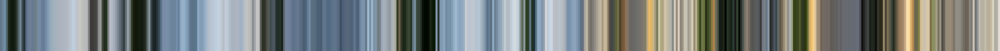 
    14. - `ArchViz_HQ_set_A_14`  
    15. - `ArchViz_HQ_set_A_15`  
    16. - `ArchViz_HQ_set_A_16`  
    17. - `ArchViz_HQ_set_A_17`  
    18. - `ArchViz_HQ_set_A_18`  
    19. - `ArchViz_HQ_set_A_19` 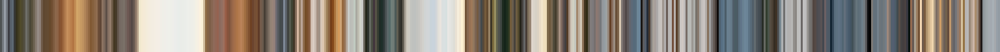 
    20. - `ArchViz_HQ_set_A_20`  
    21. - `ArchViz_HQ_set_A_21`  
    22. - `ArchViz_HQ_set_A_22`  
    23. - `ArchViz_HQ_set_A_23`  
    24. - `ArchViz_HQ_set_A_24`  
    25. - `ArchViz_HQ_set_A_25`  
    26. - `ArchViz_HQ_set_A_26`  

 
 

- #   json
- ## File name: [**`F3H_LOCK_alexnardini_ArchViz_HQ_set_B.json`**](F3H_LOCK_alexnardini_ArchViz_HQ_set_B.json) _color keys_: **512**
    1. - `ArchViz_HQ_set_B_01`  
    2. - `ArchViz_HQ_set_B_02`  
    3. - `ArchViz_HQ_set_B_03`  
    4. - `ArchViz_HQ_set_B_04`  
    5. - `ArchViz_HQ_set_B_05`  
    6. - `ArchViz_HQ_set_B_06`  
    7. - `ArchViz_HQ_set_B_07`  
    8. - `ArchViz_HQ_set_B_08`  
    9. - `ArchViz_HQ_set_B_09` 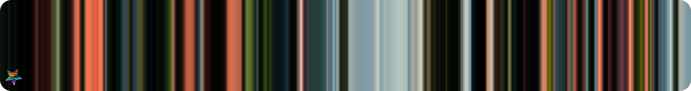 
    10. - `ArchViz_HQ_set_B_10` 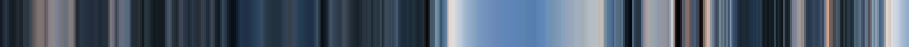 
    11. - `ArchViz_HQ_set_B_11`  
    12. - `ArchViz_HQ_set_B_12`  
    13. - `ArchViz_HQ_set_B_13`  
    14. - `ArchViz_HQ_set_B_14`  
    15. - `ArchViz_HQ_set_B_15`  
    16. - `ArchViz_HQ_set_B_16`  
    17. - `ArchViz_HQ_set_B_17` 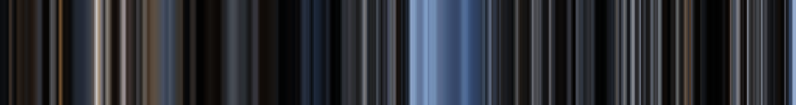 
    18. - `ArchViz_HQ_set_B_18`  
    19. - `ArchViz_HQ_set_B_19`  
    20. - `ArchViz_HQ_set_B_20`  
    21. - `ArchViz_HQ_set_B_21`  
    22. - `ArchViz_HQ_set_B_22`  
    23. - `ArchViz_HQ_set_B_23`  
    24. - `ArchViz_HQ_set_B_24`  

 
 

- #   json
- ## File name: [**`F3H_LOCK_alexnardini_ArchViz_HQ_set_C.json`**](F3H_LOCK_alexnardini_ArchViz_HQ_set_C.json) _color keys_: **512**
    1. - `ArchViz_HQ_set_C_01`  
    2. - `ArchViz_HQ_set_C_02`  
    3. - `ArchViz_HQ_set_C_03`  
    4. - `ArchViz_HQ_set_C_04`  
    5. - `ArchViz_HQ_set_C_05`  
    6. - `ArchViz_HQ_set_C_06`  
    7. - `ArchViz_HQ_set_C_07`  
    8. - `ArchViz_HQ_set_C_08`  
    9. - `ArchViz_HQ_set_C_09`  
    10. - `ArchViz_HQ_set_C_10`  
    11. - `ArchViz_HQ_set_C_11`  
    12. - `ArchViz_HQ_set_C_12`  
    13. - `ArchViz_HQ_set_C_13`  
    14. - `ArchViz_HQ_set_C_14`  
    15. - `ArchViz_HQ_set_C_15`  
    16. - `ArchViz_HQ_set_C_16`  
    17. - `ArchViz_HQ_set_C_17`  
    18. - `ArchViz_HQ_set_C_18`  
    19. - `ArchViz_HQ_set_C_19`  
    20. - `ArchViz_HQ_set_C_20`  
    21. - `ArchViz_HQ_set_C_21`  
    22. - `ArchViz_HQ_set_C_22`  

 
 

- #   json
- ## File name: [**`F3H_LOCK_alexnardini_HQ_set_A.json`**](F3H_LOCK_alexnardini_HQ_set_A.json) _color keys_: **512**
    1. - `a women in pink and cyan hairs`  
    2. - `Shiny cyborg enjoying the moment`  
    3. - `Under the Northern Lights`  
    4. - `Teckno kid facing the green gem`  
    5. - `Mazinga Zeta fashion style`  
    6. - `Cow in a grass field enjoying the day`  
    7. - `Gems and burgers for the Queen`  
    8. - `Hot spas with salty walls`  
    9. - `Picasso women looking at you`  
    10. - `Waxed cyborg thoughts`  
    11. - `Portrait like the old one`  
    12. - `Samurai in a pose`  
    13. - `At the barber shop`  
    14. - `Metro in Iceland on a clear day`  
    15. - `River cactusses on sunset`  
    16. - `Midnight fever in HongKong`  
    17. - `Dusty helmet on explorer sunset`  
    18. - `Tree of life and lonely`  
    19. - `Little Canadian house in the wood`  
    20. - `Dark punk clown trying to smile`  
    21. - `The path to pandora is beautiful`  
    22. - `Warrior and his armour`  
    23. - `Ninja cat with furry cloths`  
    24. - `The Hobbyt house on a cloudy day`  
    25. - `SciFi in the 50s was great`  
    26. - `Fancy women at a pub in violet`  

 
 

- #   json
- ## File name: [**`F3H_LOCK_alexnardini_HQ_set_B.json`**](F3H_LOCK_alexnardini_HQ_set_B.json) _color keys_: **512**
    1. - `Pink hairy punk girls`  
    2. - `Walkmen girls in Japan`  
    3. - `Ulysse in a dramatic moment`  
    4. - `Dark girl with metal hairs`  
    5. - `Butterfly wings on dress`  
    6. - `Monster attach with energy`  
    7. - `Painted env on a rainy day`  
    8. - `Castle so high it reach the sky`  
    9. - `Little devil fox`  
    10. - `Sport car at nigh in the rain`  
    11. - `Magical sky lights`  
    12. - `Prince of Arabia`  
    13. - `Soulless dark punk`  
    14. - `Girl with big red petals`  
    15. - `Serene water in Venice`  
    16. - `Alice in Wonderland`  
    17. - `Flying from the deepest ocean`  
    18. - `Walking on an Alien planet`  
    19. - `Sunset and high grass field`  
    20. - `Girl smiling with a pinky`  
    21. - `Nazy but elegant`  
    22. - `Planet skies fantasy`  
    23. - `The old elegant man`  
    24. - `Angels on fire`  
    25. - `Fancy wearing glasses`  
    26. - `Crystal with colors`  
    27. - `Tsunamy but bigger`  
    28. - `Starry night on a tulips field`  
    29. - `Lovely cabin in the wood`  
    30. - `Gems over gems over gems`  
    31. - `Smoky night in the city`  
    32. - `Portal to ice and flowers`  
    33. - `Mad scientist office at night`  
    34. - `Pink evrything on a blue sky`  

 
 

- #   json
- ## File name: [**`F3H_LOCK_alexnardini_HQ_set_C.json`**](F3H_LOCK_alexnardini_HQ_set_C.json) _color keys_: **512**
    1. - `Golden tree at the pool`  
    2. - `Sunset war for the kids`  
    3. - `Rainbows in the desert`  
    4. - `Walking on red moss`  
    5. - `Mountain under colors sky`  
    6. - `Magical trees with stars`  
    7. - `Subway neons`  
    8. - `Green soldier on cyan smoke`  
    9. - `Sky timelapse with a tree`  
    10. - `City inside a violet sky`  
    11. - `Plexiglass watch`  
    12. - `Color bushes on grey env`  
    13. - `Dinner in Tokyo`  
    14. - `Peach and yougurt with nuts`  
    15. - `The teacher was listening`  
    16. - `The museum entrance was bright`  
    17. - `Wet city in the eveing`  
    18. - `Kimonos for the occasions`  
    19. - `A poster for SciFi`  
    20. - `Good looking piece of Sushi`  
    21. - `The monastery was packed`  
    22. - `Waling peacefully and serene`  
    23. - `DaVinci marble block`  
    24. - `turquoise sky and red trees`  
    25. - `Indian woman thinking`  
    26. - `A chrystal mountain`  
    27. - `Aline wandering at the market`  
    28. - `Hidden world`  
    29. - `This watch is misty`  
    30. - `Precious stone`  
    31. - `Lake under shiny stars`  
    32. - `Waxed skeleton`  
    33. - `Monster and candle lights`  

 
 

- #   json
- ## File name: [**`F3H_LOCK_alexnardini_HQ_set_D.json`**](F3H_LOCK_alexnardini_HQ_set_D.json) _color keys_: **512**
    1. - `Interior and lemons`  
    2. - `Alone inside fantasy worlds`  
    3. - `The doll house`  
    4. - `Dutch living room`  
    5. - `Portrait of a serene woman`  
    6. - `Pinups and comic books`  
    7. - `Barbie house`  
    8. - `Synthetic pets portraits`  
    9. - `Colibries and oranges`  
    10. - `Little and yellow kid`  
    11. - `Queen and Prince on a sofa`  
    12. - `Moulin Rouge star`  
    13. - `Final fantasy girl`  
    14. - `Smiling pumpkin`  
    15. - `Deepspace ship over planet`  
    16. - `Oil painting about nature`  
    17. - `Watercolors on paper`  
    18. - `Butterfly in pencils`  

 
 

- #   json
- ## File name: [**`F3H_LOCK_alexnardini_MultiVibrance_SHQ.json`**](F3H_LOCK_alexnardini_MultiVibrance_SHQ.json) _color keys_: **1024**
    1. - `MultiFrame_SHQ_01`  
    2. - `MultiFrame_SHQ_02`  
    3. - `MultiFrame_SHQ_03`  
    4. - `MultiFrame_SHQ_04` 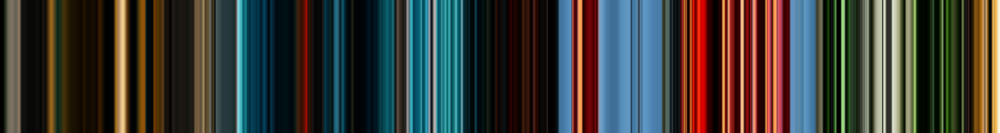 
    5. - `MultiFrame_SHQ_05` 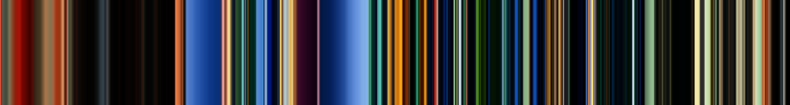 
    6. - `MultiFrame_SHQ_06` 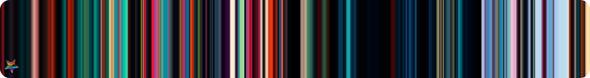 
    7. - `MultiFrame_SHQ_07`  
    8. - `MultiFrame_SHQ_08`  
    9. - `MultiFrame_SHQ_09`  
    10. - `MultiFrame_SHQ_10`  
    11. - `MultiFrame_SHQ_11`  
    12. - `MultiFrame_SHQ_12` 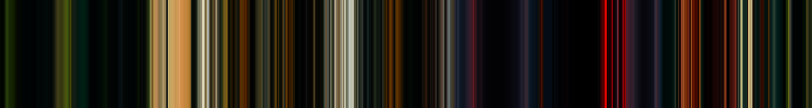 
    13. - `MultiFrame_SHQ_13` 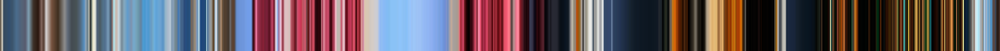 
    14. - `MultiFrame_SHQ_14`  
    15. - `MultiFrame_SHQ_15`  
    16. - `MultiFrame_SHQ_16`  
    17. - `MultiFrame_SHQ_17`  
    18. - `MultiFrame_SHQ_18` 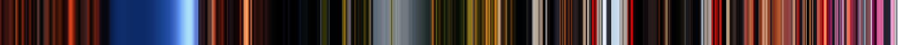 
    19. - `MultiFrame_SHQ_19`  
    20. - `MultiFrame_SHQ_20`  

 
 

- #   json
- ## File name: [**`F3H_LOCK_alexnardini_PORTRAITS_HQ_set_A.json`**](F3H_LOCK_alexnardini_PORTRAITS_HQ_set_A.json) _color keys_: **512**
    1. - `At the Pool`  
    2. - `Eiffel on a rainy night`  
    3. - `Natural with flowers`  
    4. - `Morning breakfast at home`  
    5. - `Sensorial swim`  
    6. - `Cold bikini bath`  
    7. - `Stanley park jogging on a sunny day`  
    8. - `Pinky wall and a turquoise kimono`  
    9. - `Elegant old and beautiful`  
    10. - `Young and astute`  
    11. - `Diligent in the city streets`  
    12. - `Without compromises`  
    13. - `Casual shopping`  
    14. - `Heros by accident`  
    15. - `Yeah that midnight date`  
    16. - `Swimming in a japanese pool`  
    17. - `Playboy bunny`  
    18. - `Tan in a yellow bikini`  
    19. - `Flintstones mama`  
    20. - `Train waiting on a red dress`  
    21. - `Music listening in Malibu`  
    22. - `Sofa chair thinking of you`  

 
 
 
 
 
 
 
 

<h1 style="display: inline;">APOPHYSIS palette libs</h1>

 
 

- #   json
- ## File name: [**`F3H_LOCK_boxtail_pack_03_triangle.json`**](F3H_LOCK_boxtail_pack_03_triangle.json) _color keys_: **256**
    1. - `At_corner` 
    2. - `Beam`  
    3. - `Blood_in_bathroom`  
    4. - `Bright_but_also_dark`  
    5. - `Chocolate`  
    6. - `Cold_again`  
    7. - `desudesu_err`  
    8. - `Fresh`  
    9. - `Garden`  
    10. - `Hey_lets_go` 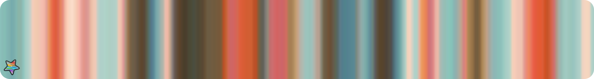 
    11. - `Hipster_cat`  
    12. - `I_see_it_tehe`  
    13. - `I_sit_and_wait`  
    14. - `Just_cycling`  
    15. - `Kaamos`  
    16. - `Kawaii_Cafe`  
    17. - `Lisardz`  
    18. - `Looking_at_me`  
    19. - `MELONS`  
    20. - `Nice_feet_you_got` 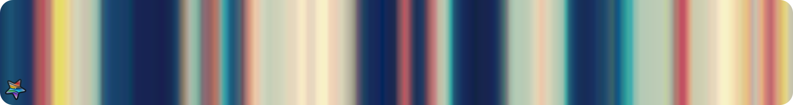 
    21. - `Obsidian`  
    22. - `Somewhat_blurry`  
    23. - `Sun_and_sea`  
    24. - `Take_them_off`  
    25. - `Teatable`  
    26. - `That_chinese_you_mentioned`  
    27. - `Tiger`  
    28. - `Underwear`  
    29. - `Werewolves_toilet`  
    30. - `Yeo_thats_the_trick`  

 
 

- #   json
- ## File name: [**`F3H_LOCK_boxtail_pack_04.json`**](F3H_LOCK_boxtail_pack_04.json) _color keys_: **256**
    1. - `After_hard_day`  
    2. - `Alone_floating_stone`  
    3. - `Another_day` 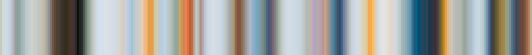 
    4. - `Capes`  
    5. - `Custom_skies`  
    6. - `Death`  
    7. - `Diamond`  
    8. - `Dirt`  
    9. - `Dirties`  
    10. - `Dyes`  
    11. - `Emerald`  
    12. - `Eyes_in_dark`  
    13. - `Flower_forest`  
    14. - `Flowers`  
    15. - `Found_apples`  
    16. - `Hero`  
    17. - `Juice`  
    18. - `Jungle`  
    19. - `Light_forest`  
    20. - `Melons_and_carrots`  
    21. - `Mesa`  
    22. - `Mossy_Cobble`  
    23. - `Nether`  
    24. - `Primaries`  
    25. - `Rich_over_vein`  
    26. - `Smooth_Stone`  
    27. - `Spider`  
    28. - `Tall_Grass`  
    29. - `Torch`  
    30. - `Unknown_Sun`  
    31. - `Village`  
    32. - `Water_sheep_meat`  
    33. - `Witch`  

 
 

- #   json
- ## File name: [**`F3H_LOCK_fardareismai_pack_01_A.json`**](F3H_LOCK_fardareismai_pack_01_A.json) _color keys_: **256**
    1. - `a_really_pleasing_red_thing` 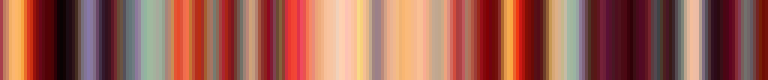 
    2. - `a_warm_dark_place`  
    3. - `almost_all_sea_green`  
    4. - `almost_too_classic`  
    5. - `amber`  
    6. - `amigo`  
    7. - `anime`  
    8. - `arthropod_colors` 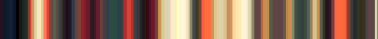 
    9. - `backlit`  
    10. - `barton`  
    11. - `barton_contrast`  
    12. - `beautiful_overexposure`  
    13. - `beige_and_grey`  
    14. - `bioluminescence`  
    15. - `blue_green_orange`  
    16. - `blue_orange_and_creamy`  
    17. - `blue_white_pink`  
    18. - `blue_and_dark_salmon`  
    19. - `blue_and_dust`  
    20. - `blue_and_green` 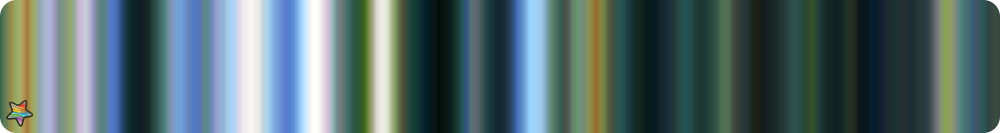 
    21. - `blue_and_orange`  
    22. - `blue_and_red` 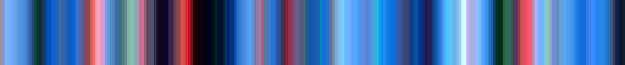 
    23. - `cadet_and_cream`  
    24. - `cadet_and_olive`  
    25. - `cadet_and_orange`  
    26. - `cadet_and_red`  
    27. - `cave_crystals`  
    28. - `cave_flashlights`  
    29. - `city`  
    30. - `city_at_night` 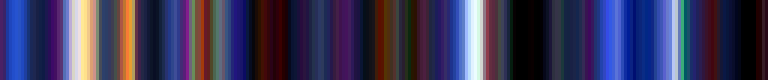 
    31. - `clouds_and_icecream`  
    32. - `cyan_sienna_black`  
    33. - `cyan_goes_with_everything`  
    34. - `dark_blue_with_gold_and_orange`  
    35. - `desaturated_midtones`  
    36. - `desaturated_with_red`  
    37. - `disney_polaroid`  
    38. - `dusty_rose_and_lavander`  
    39. - `florence`  
    40. - `fuchsia_and_gold`  
    41. - `fuck_yeah_rainbows`  
    42. - `gold_and_cyan`  
    43. - `grey_salmon_cyan`  

 
 

- #   json
- ## File name: [**`F3H_LOCK_fardareismai_pack_01_B.json`**](F3H_LOCK_fardareismai_pack_01_B.json) _color keys_: **256**
    1. - `grey_and_red_forever`  
    2. - `grey_with_orange`  
    3. - `grey_with_shocks`  
    4. - `greyed_rainbow`  
    5. - `greygreen_with_pink`  
    6. - `hardcore`  
    7. - `high_contrast_banana`  
    8. - `high_contrast_fern`  
    9. - `i_hardly_ever_use_green`  
    10. - `ice_and_orange`  
    11. - `impressionism`  
    12. - `just_after_dawn_in_winter`  
    13. - `lavander_gold_cyan`  
    14. - `like_a_bomb_pop`  
    15. - `lime_cyan_orange` 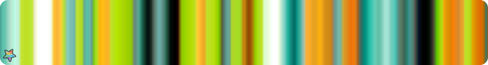 
    16. - `lut_gholein`  
    17. - `mauve_and_cyan`  
    18. - `mint_orange_blue`  
    19. - `modern_orange`  
    20. - `monochrome_is_unimaginative`  
    21. - `mood_swings` 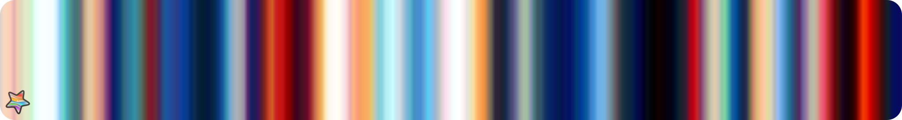 
    22. - `mostly_grey`  
    23. - `motherfucking_rainbow`  
    24. - `movie_posters`  
    25. - `muted_and_dark`  
    26. - `muted_but_wide_hued`  
    27. - `neonest_of_the_rainbows` 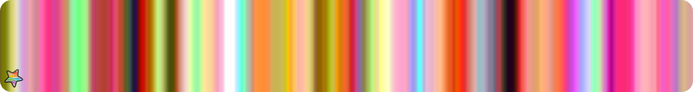 
    28. - `never_as_good`  
    29. - `nom_those_rainbows`  
    30. - `oil_painting`  
    31. - `oil_painting_at_night`  
    32. - `olive_and_sky`  
    33. - `opening_the_drapes`  
    34. - `orange_lime_aqua`  
    35. - `orange_and_dark_cyan`  
    36. - `orange_and_ff00ff`  
    37. - `orange_like_a_sunset`  
    38. - `paradiso`  
    39. - `pink_cyan_grey`  
    40. - `pink_cyan_white`  
    41. - `pink_royal_purple_cyan`  
    42. - `pink_yellow_white`  

 
 

- #   json
- ## File name: [**`F3H_LOCK_fardareismai_pack_01_C.json`**](F3H_LOCK_fardareismai_pack_01_C.json) _color keys_: **256**
    1. - `pink_and_blue`  
    2. - `pink_and_green`  
    3. - `pretty_damn_yellow`  
    4. - `primaries`  
    5. - `purple_cyan_beige`  
    6. - `purple_and_red`  
    7. - `purple_and_yellow`  
    8. - `purple_with_mint_stripes`  
    9. - `rainbow_and_black`  
    10. - `red_beige_black`  
    11. - `red_black_and_cyan`  
    12. - `red_blue_black`  
    13. - `red_blue_yellow` 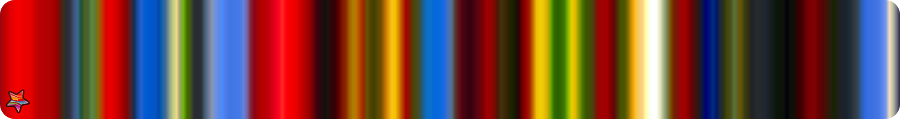 
    14. - `red_grey_beige`  
    15. - `red_and_cadet`  
    16. - `red_and_pale_green`  
    17. - `sand_sea_bonfire` 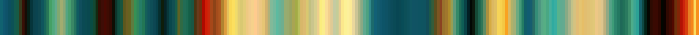 
    18. - `scuba_lights`  
    19. - `shades_of_pink`  
    20. - `shanty-metropolis`  
    21. - `silhouette`  
    22. - `soap_bubbles_fuck_yeah`  
    23. - `sparsely_flowered_meadown`  
    24. - `strawberries`  
    25. - `strawberries_at_night`  
    26. - `subtlety`  
    27. - `sunlight_and_motes`  
    28. - `sunlight_and_teacups`  
    29. - `sunlight_by_the_lake` 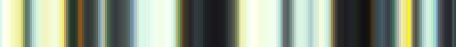 
    30. - `super_blue`  
    31. - `super_motherfucking_blue`  
    32. - `theme_and_variation`  
    33. - `they_were_here_first` 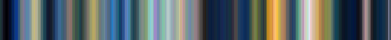 
    34. - `too_many_colors`  
    35. - `universalism`  
    36. - `variations_on_grey`  
    37. - `very_desaturated`  
    38. - `warm_flame`  
    39. - `white_and_burgundy`  
    40. - `white_blue_mauvish`  
    41. - `why_so_desaturated`  

 
 

- #   json
- ## File name: [**`F3H_LOCK_fardareismai_pack_02_A.json`**](F3H_LOCK_fardareismai_pack_02_A.json) _color keys_: **256**
    1. - `agnus_dei`  
    2. - `beige_with_colors`  
    3. - `black_yellow_teal_maroon`  
    4. - `black_and_cyan`  
    5. - `blue_green_red`  
    6. - `blue_and_orange`  
    7. - `brown_cyan_green`  
    8. - `brown_cyan_purple_coral` 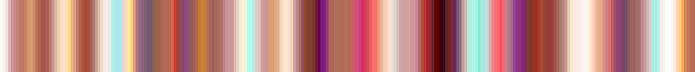 
    9. - `brown_with_brights`  
    10. - `burgundy_and_flame`  
    11. - `burgundy_and_sea_green`  
    12. - `chromatic_aberration`  
    13. - `coral_and_moss`  
    14. - `cyan_and_orange`  
    15. - `cyan_and_pink`  
    16. - `cyan_and_plum`  
    17. - `cyan_and_warms`  
    18. - `cyanoburgundygrey`  
    19. - `dark_pink_cyan_purple`  
    20. - `dark_red_and_cyan`  
    21. - `dawn`  
    22. - `desaturated_green_and_purple`  
    23. - `encore` 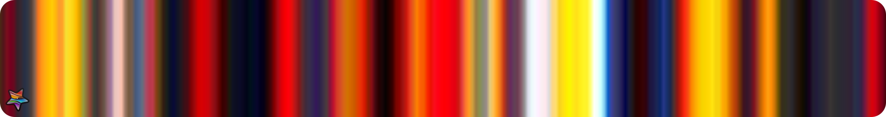 
    24. - `evening_reflection`  
    25. - `garden`  
    26. - `garish`  
    27. - `gold_and_turquoise`  
    28. - `green_grey_pink`  
    29. - `green_and_pink`  
    30. - `grey_and_red`  
    31. - `high_contrast`  
    32. - `i_hate_spring`  
    33. - `kites` 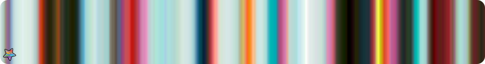 
    34. - `lime_pink_orange`  
    35. - `melon_modern` 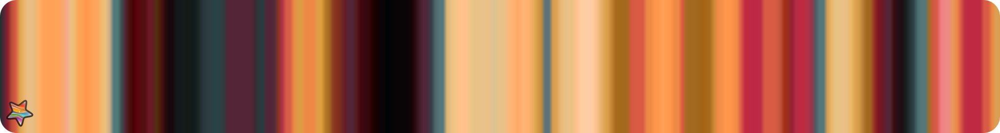 

 
 

- #   json
- ## File name: [**`F3H_LOCK_fardareismai_pack_02_B.json`**](F3H_LOCK_fardareismai_pack_02_B.json) _color keys_: **256**
    1. - `midnight_reflection` 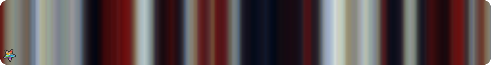 
    2. - `morning_reflection` 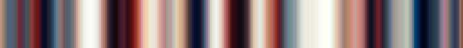 
    3. - `mostly_blush`  
    4. - `mostly_orange`  
    5. - `mostrly_pink`  
    6. - `multihue`  
    7. - `multihue_balanced`  
    8. - `multihue_cool_pastel`  
    9. - `multihue_pastel` 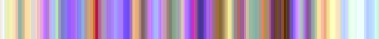 
    10. - `multihue_photo`  
    11. - `multihue_plus_grey`  
    12. - `multihue_saturated`  
    13. - `neon_beige_night` 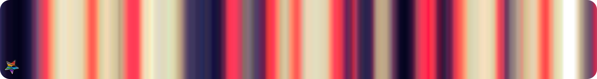 
    14. - `neovictorian`  
    15. - `neutral_cyan_red`  
    16. - `noon_reflection`  
    17. - `orange_and_sea_green`  
    18. - `periwinkle_burgundy_yellow`  
    19. - `pink_and_cyan`  
    20. - `pink_and_purple`  
    21. - `polaroid`  
    22. - `purple_and_gold`  
    23. - `red_and_cyan`  
    24. - `red_and_cyan_2`  
    25. - `red_and_neutrals`  
    26. - `red_and_royal_purple`  
    27. - `scene_kids_discover_instagram`  
    28. - `tasteful_decor`  
    29. - `thunderstorm_meadow`  
    30. - `trifecta`  
    31. - `violet_and_lights` 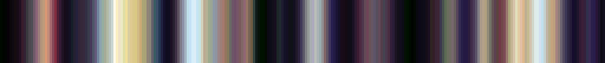 
    32. - `watermelon`  
    33. - `white_cyan_red`  
    34. - `yellow_pink_cyan`  
    35. - `yellow_pink_cyan_royal_purple`  

 
 

- #   json
- ## File name: [**`F3H_LOCK_tatasz_pack_01.json`**](F3H_LOCK_tatasz_pack_01.json) _color keys_: **256**
    1. - `tatasz_pack_01_01`  
    2. - `tatasz_pack_01_02`  
    3. - `tatasz_pack_01_03`  
    4. - `tatasz_pack_01_04`  
    5. - `tatasz_pack_01_05`  
    6. - `tatasz_pack_01_06`  
    7. - `tatasz_pack_01_07`  
    8. - `tatasz_pack_01_08` 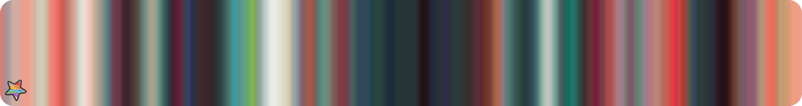 
    9. - `tatasz_pack_01_09`  
    10. - `tatasz_pack_01_10`  
    11. - `tatasz_pack_01_11`  
    12. - `tatasz_pack_01_12`  
    13. - `tatasz_pack_01_13`  
    14. - `tatasz_pack_01_14`  
    15. - `tatasz_pack_01_15`  
    16. - `tatasz_pack_01_16` 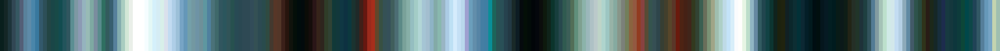 
    17. - `tatasz_pack_01_17`  
    18. - `tatasz_pack_01_18`  
    19. - `tatasz_pack_01_19`  
    20. - `tatasz_pack_01_20`  

 
 

- #   json
- ## File name: [**`F3H_LOCK_tatasz_pack_02_colder.json`**](F3H_LOCK_tatasz_pack_02_colder.json) _color keys_: **256**
    1. - `tatasz_pack_02_colder_01`  
    2. - `tatasz_pack_02_colder_10`  
    3. - `tatasz_pack_02_colder_13`  
    4. - `tatasz_pack_02_colder_17`  
    5. - `tatasz_pack_02_colder_19` 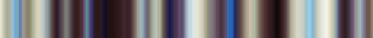 
    6. - `tatasz_pack_02_colder_02`  
    7. - `tatasz_pack_02_colder_21`  
    8. - `tatasz_pack_02_colder_23`  
    9. - `tatasz_pack_02_colder_26`  
    10. - `tatasz_pack_02_colder_27` 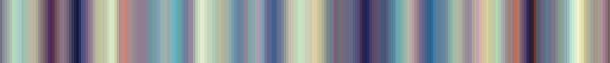 
    11. - `tatasz_pack_02_colder_29`  
    12. - `tatasz_pack_02_colder_30`  
    13. - `tatasz_pack_02_colder_34`  
    14. - `tatasz_pack_02_colder_35`  
    15. - `tatasz_pack_02_colder_38`  
    16. - `tatasz_pack_02_colder_39`  
    17. - `tatasz_pack_02_colder_40`  
    18. - `tatasz_pack_02_colder_41` 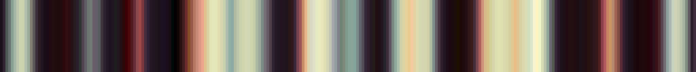 
    19. - `tatasz_pack_02_colder_42`  
    20. - `tatasz_pack_02_colder_48`  

 
 

- #   json
- ## File name: [**`F3H_LOCK_tatasz_pack_02_dark.json`**](F3H_LOCK_tatasz_pack_02_dark.json) _color keys_: **256**
    1. - `tatasz_pack_02_dark_11`  
    2. - `tatasz_pack_02_dark_14`  
    3. - `tatasz_pack_02_dark_15`  
    4. - `tatasz_pack_02_dark_31`  
    5. - `tatasz_pack_02_dark_37`  
    6. - `tatasz_pack_02_dark_45`  
    7. - `tatasz_pack_02_dark_47`  
    8. - `tatasz_pack_02_dark_49` 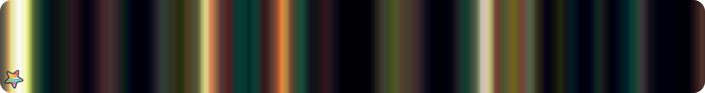 
    9. - `tatasz_pack_02_dark_05`  
    10. - `tatasz_pack_02_dark_06`  
    11. - `tatasz_pack_02_dark_08` 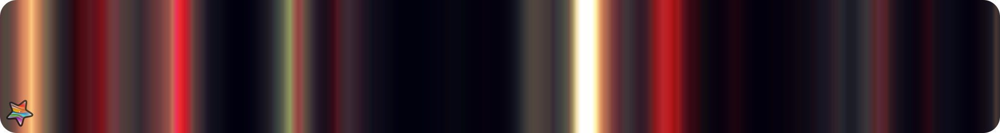 
    12. - `tatasz_pack_02_dark_09`  

 
 

- #   json
- ## File name: [**`F3H_LOCK_tatasz_pack_02_warmer.json`**](F3H_LOCK_tatasz_pack_02_warmer.json) _color keys_: **256**
    1. - `tatasz_pack_02_warmer_16`  
    2. - `tatasz_pack_02_warmer_18`  
    3. - `tatasz_pack_02_warmer_20`  
    4. - `tatasz_pack_02_warmer_22`  
    5. - `tatasz_pack_02_warmer_24`  
    6. - `tatasz_pack_02_warmer_25` 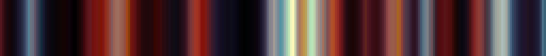 
    7. - `tatasz_pack_02_warmer_28`  
    8. - `tatasz_pack_02_warmer_03`  
    9. - `tatasz_pack_02_warmer_32`  
    11. - `tatasz_pack_02_warmer_36`  
    12. - `tatasz_pack_02_warmer_04`  
    13. - `tatasz_pack_02_warmer_43`  
    14. - `tatasz_pack_02_warmer_44`  
    15. - `tatasz_pack_02_warmer_46`  
    16. - `tatasz_pack_02_warmer_50`  
    17. - `tatasz_pack_02_warmer_07`  

 
 

- #   json
- ## File name: [**`F3H_LOCK_tatasz_pack_03.json`**](F3H_LOCK_tatasz_pack_03.json) _color keys_: **256**
    1. - `tatasz_pack_03_01`  
    2. - `tatasz_pack_03_10`  
    3. - `tatasz_pack_03_11`  
    4. - `tatasz_pack_03_12`  
    5. - `tatasz_pack_03_13`  
    6. - `tatasz_pack_03_14`  
    7. - `tatasz_pack_03_15`  
    8. - `tatasz_pack_03_16`  
    9. - `tatasz_pack_03_17`  
    10. - `tatasz_pack_03_18` 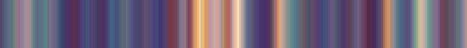 
    11. - `tatasz_pack_03_19`  
    12. - `tatasz_pack_03_2`  
    13. - `tatasz_pack_03_20`  
    14. - `tatasz_pack_03_03`  
    15. - `tatasz_pack_03_04`  
    16. - `tatasz_pack_03_05`  
    17. - `tatasz_pack_03_06`  
    18. - `tatasz_pack_03_07`  
    19. - `tatasz_pack_03_08`  
    20. - `tatasz_pack_03_09` 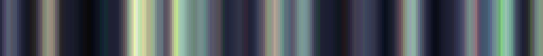 

 
 

- #   json
- ## File name: [**`F3H_LOCK_tatasz_pack_04_A.json`**](F3H_LOCK_tatasz_pack_04_A.json) _color keys_: **256**
    1. - `tatasz_pack_04_01`  
    2. - `tatasz_pack_04_02`  
    3. - `tatasz_pack_04_03`  
    4. - `tatasz_pack_04_04`  
    5. - `tatasz_pack_04_05`  
    6. - `tatasz_pack_04_06`  
    7. - `tatasz_pack_04_07`  
    8. - `tatasz_pack_04_08`  
    9. - `tatasz_pack_04_09`  
    10. - `tatasz_pack_04_10`  
    11. - `tatasz_pack_04_11`  
    12. - `tatasz_pack_04_12`  
    13. - `tatasz_pack_04_13`  
    14. - `tatasz_pack_04_14`  
    15. - `tatasz_pack_04_15`  
    16. - `tatasz_pack_04_16`  
    17. - `tatasz_pack_04_17`  
    18. - `tatasz_pack_04_18`  
    19. - `tatasz_pack_04_19`  
    20. - `tatasz_pack_04_20`  
    21. - `tatasz_pack_04_21`  
    22. - `tatasz_pack_04_22`  
    23. - `tatasz_pack_04_23`  
    24. - `tatasz_pack_04_24`  
    25. - `tatasz_pack_04_25`  
    26. - `tatasz_pack_04_26`  
    27. - `tatasz_pack_04_27`  
    28. - `tatasz_pack_04_28`  
    29. - `tatasz_pack_04_29`  
    30. - `tatasz_pack_04_30`  
    31. - `tatasz_pack_04_31`  
    32. - `tatasz_pack_04_32`  
    33. - `tatasz_pack_04_33`  
    34. - `tatasz_pack_04_34`  
    35. - `tatasz_pack_04_35`  
    36. - `tatasz_pack_04_36`  
    37. - `tatasz_pack_04_37`  
    38. - `tatasz_pack_04_38`  
    39. - `tatasz_pack_04_39`  
    40. - `tatasz_pack_04_40`  
    41. - `tatasz_pack_04_41`  
    42. - `tatasz_pack_04_42`  
    43. - `tatasz_pack_04_43`  
    44. - `tatasz_pack_04_44`  

 
 

- #   json
- ## File name: [**`F3H_LOCK_tatasz_pack_04_B.json`**](F3H_LOCK_tatasz_pack_04_B.json) _color keys_: **256**
    1. - `tatasz_pack_04_45`  
    2. - `tatasz_pack_04_46`  
    3. - `tatasz_pack_04_47`  
    4. - `tatasz_pack_04_48`  
    5. - `tatasz_pack_04_49` 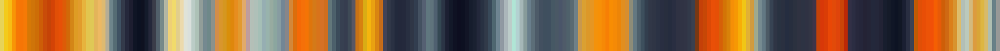 
    6. - `tatasz_pack_04_50`  
    7. - `tatasz_pack_04_51`  
    8. - `tatasz_pack_04_52`  
    9. - `tatasz_pack_04_53`  
    10. - `tatasz_pack_04_54`  
    11. - `tatasz_pack_04_55`  
    12. - `tatasz_pack_04_56`  
    13. - `tatasz_pack_04_57`  
    14. - `tatasz_pack_04_58`  
    15. - `tatasz_pack_04_59`  
    16. - `tatasz_pack_04_60`  
    17. - `tatasz_pack_04_61`  
    18. - `tatasz_pack_04_62`  
    19. - `tatasz_pack_04_63`  
    20. - `tatasz_pack_04_64`  
    21. - `tatasz_pack_04_65` 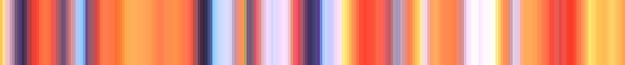 
    22. - `tatasz_pack_04_66`  
    23. - `tatasz_pack_04_67`  
    24. - `tatasz_pack_04_68`  
    25. - `tatasz_pack_04_69`  
    26. - `tatasz_pack_04_70`  
    27. - `tatasz_pack_04_71`  
    28. - `tatasz_pack_04_72`  
    29. - `tatasz_pack_04_73`  
    30. - `tatasz_pack_04_74`  
    31. - `tatasz_pack_04_75`  
    32. - `tatasz_pack_04_76`  
    33. - `tatasz_pack_04_77`  
    34. - `tatasz_pack_04_79`  
    35. - `tatasz_pack_04_80`  
    36. - `tatasz_pack_04_81`  
    37. - `tatasz_pack_04_82`  
    38. - `tatasz_pack_04_83`  
    39. - `tatasz_pack_04_84`  
    40. - `tatasz_pack_04_85`  
    41. - `tatasz_pack_04_86` 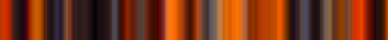 
    42. - `tatasz_pack_04_87`  
    43. - `tatasz_pack_04_88`  
    44. - `tatasz_pack_04_89`  
    45. - `tatasz_pack_04_90`  
    46. - `tatasz_pack_04_91`  
    47. - `tatasz_pack_04_92`  
    48. - `tatasz_pack_04_93`  
    49. - `tatasz_pack_04_94`  
    50. - `tatasz_pack_04_95`  
    51. - `tatasz_pack_04_96`  
    52. - `tatasz_pack_04_97`  
    53. - `tatasz_pack_04_98`  
    54. - `tatasz_pack_04_99`  

 
 
 
 

_Copyright (c) 2021 F stands for liFe_ 
