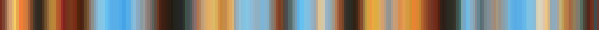

# F3H_LOCK_fardareismai_pack_01_A.json

 
 

- #   json
- ## File name: [**`F3H_LOCK_fardareismai_pack_01_A.json`**](../../F3H_LOCK_fardareismai_pack_01_A.json) _color keys_: **256**
    1. - `a_really_pleasing_red_thing`  
    2. - `a_warm_dark_place`  
    3. - `almost_all_sea_green`  
    4. - `almost_too_classic`  
    5. - `amber`  
    6. - `amigo`  
    7. - `anime`  
    8. - `arthropod_colors`  
    9. - `backlit`  
    10. - `barton`  
    11. - `barton_contrast`  
    12. - `beautiful_overexposure`  
    13. - `beige_and_grey`  
    14. - `bioluminescence`  
    15. - `blue_green_orange`  
    16. - `blue_orange_and_creamy`  
    17. - `blue_white_pink`  
    18. - `blue_and_dark_salmon`  
    19. - `blue_and_dust`  
    20. - `blue_and_green`  
    21. - `blue_and_orange_b`  
    22. - `blue_and_red`  
    23. - `cadet_and_cream`  
    24. - `cadet_and_olive`  
    25. - `cadet_and_orange`  
    26. - `cadet_and_red`  
    27. - `cave_crystals`  
    28. - `cave_flashlights`  
    29. - `city`  
    30. - `city_at_night`  
    31. - `clouds_and_icecream`  
    32. - `cyan_sienna_black`  
    33. - `cyan_goes_with_everything`  
    34. - `dark_blue_with_gold_and_orange`  
    35. - `desaturated_midtones`  
    36. - `desaturated_with_red`  
    37. - `disney_polaroid`  
    38. - `dusty_rose_and_lavander`  
    39. - `florence`  
    40. - `fuchsia_and_gold`  
    41. - `fuck_yeah_rainbows`  
    42. - `gold_and_cyan`  
    43. - `grey_salmon_cyan` 

 
 
 
 

_Copyright (c) 2021 F stands for liFe_ 
