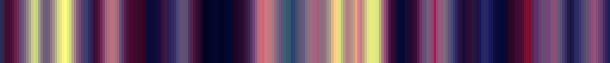

# F3H_LOCK_fardareismai_pack_01_B.json

 
 

- #   json
- ## File name: [**`F3H_LOCK_fardareismai_pack_01_B.json`**](../../F3H_LOCK_fardareismai_pack_01_B.json) _color keys_: **256**
    1. - `grey_and_red_forever`  
    2. - `grey_with_orange`  
    3. - `grey_with_shocks`  
    4. - `greyed_rainbow`  
    5. - `greygreen_with_pink`  
    6. - `hardcore`  
    7. - `high_contrast_banana`  
    8. - `high_contrast_fern`  
    9. - `i_hardly_ever_use_green`  
    10. - `ice_and_orange`  
    11. - `impressionism`  
    12. - `just_after_dawn_in_winter`  
    13. - `lavander_gold_cyan`  
    14. - `lectric`  
    15. - `library`  
    16. - `like_a_bomb_pop`  
    17. - `lime_cyan_orange`  
    18. - `lut_gholein`  
    19. - `mauve_and_cyan`  
    20. - `mint_orange_blue`  
    21. - `modern_orange`  
    22. - `monochrome_is_unimaginative`  
    23. - `mood_swings`  
    24. - `mostly_grey`  
    25. - `motherfucking_rainbow`  
    26. - `movie_posters`  
    27. - `muted_and_dark`  
    28. - `muted_but_wide_hued`  
    29. - `neonest_of_the_rainbows`  
    30. - `never_as_good`  
    31. - `nom_those_rainbows`  
    32. - `oil_painting`  
    33. - `oil_painting_at_night`  
    34. - `olive_and_sky`  
    35. - `opening_the_drapes`  
    36. - `orange_lime_aqua`  
    37. - `orange_and_dark_cyan`  
    38. - `orange_and_ff00ff`  
    39. - `orange_like_a_sunset`  
    40. - `paradiso`  
    41. - `pink_cyan_grey`  
    42. - `pink_cyan_white`  
    43. - `pink_royal_purple_cyan`  
    44. - `pink_yellow_white`  

 
 
 
 

_Copyright (c) 2021 F stands for liFe_ 
