# F3H_LOCK_fardareismai_pack_01_B.json
- #### THIS FILE IS ONLY INFORMATIVE and part of the Documentations

 

- #### Quick links

  - **FLAM3H™** [**UI_ICON_map H19.0 to H20.0**](../../../src/F3H_UI_ICON_H19_to_H20.md)
  - **FLAM3H™** [**UI_ICON_map H20.5 to H22.0 UP**](../../../src/F3H_UI_ICON_H205_to_H22_UP.md)
  - **FLAM3H™** [**PY_PARM_map H19.0 to H20.0**](../../../src/F3H_PY_PARM_H19_to_H20.md)
  - **FLAM3H™** [**PY_PARM_map H20.5 to H22.0 UP**](../../../src/F3H_PY_PARM_H205_to_H22_UP.md)

   

  - **FLAM3H™USD** [**UI_ICON_map**](../../../src/F3HUSD_UI_ICON.md)
  - **FLAM3H™USD** [**PY_PARM_map H19 to H20**](../../../src/F3HUSD_PY_PARM_H19_to_H20.md)
  - **FLAM3H™USD** [**PY_PARM_map H20.5 to H22 UP**](../../../src/F3HUSD_PY_PARM_H205_to_H22_UP.md)

   

    - [**FULL ICON SET**](../../../icons/README.md)
    - [**PALETTE PREVIEWS**](../../../__FLAM3H_palette_libs/README.md)

   

    - [**FLAME PRESETS**](../../../__FLAM3H_flame_libs/README.md)

 
 
 
 

# Contents

 
 

- #   json
- ## File name: [**`F3H_LOCK_fardareismai_pack_01_B.json`**](../../F3H_LOCK_fardareismai_pack_01_B.json) _color keys_: **256**
    1. - `grey_and_red_forever` [**`f3h_hex`**](https://github.com/alexnardini/FLAM3_for_SideFX_Houdini/blob/47b9fd38fcf0def532eba72d02d2eb11118d36c8/__FLAM3H_palette_libs/F3H_LOCK_fardareismai_pack_01_B.json#L2-L4)  
    2. - `grey_with_orange` [**`f3h_hex`**](https://github.com/alexnardini/FLAM3_for_SideFX_Houdini/blob/47b9fd38fcf0def532eba72d02d2eb11118d36c8/__FLAM3H_palette_libs/F3H_LOCK_fardareismai_pack_01_B.json#L5-L7)  
    3. - `grey_with_shocks` [**`f3h_hex`**](https://github.com/alexnardini/FLAM3_for_SideFX_Houdini/blob/47b9fd38fcf0def532eba72d02d2eb11118d36c8/__FLAM3H_palette_libs/F3H_LOCK_fardareismai_pack_01_B.json#L8-L10)  
    4. - `greyed_rainbow` [**`f3h_hex`**](https://github.com/alexnardini/FLAM3_for_SideFX_Houdini/blob/47b9fd38fcf0def532eba72d02d2eb11118d36c8/__FLAM3H_palette_libs/F3H_LOCK_fardareismai_pack_01_B.json#L11-L13) 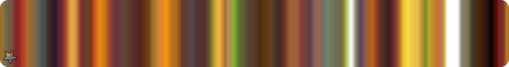 
    5. - `greygreen_with_pink` [**`f3h_hex`**](https://github.com/alexnardini/FLAM3_for_SideFX_Houdini/blob/47b9fd38fcf0def532eba72d02d2eb11118d36c8/__FLAM3H_palette_libs/F3H_LOCK_fardareismai_pack_01_B.json#L14-L16)  
    6. - `hardcore` [**`f3h_hex`**](https://github.com/alexnardini/FLAM3_for_SideFX_Houdini/blob/47b9fd38fcf0def532eba72d02d2eb11118d36c8/__FLAM3H_palette_libs/F3H_LOCK_fardareismai_pack_01_B.json#L17-L19) 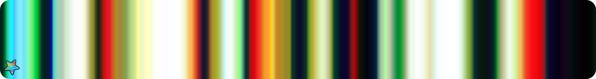 
    7. - `high_contrast_banana` [**`f3h_hex`**](https://github.com/alexnardini/FLAM3_for_SideFX_Houdini/blob/47b9fd38fcf0def532eba72d02d2eb11118d36c8/__FLAM3H_palette_libs/F3H_LOCK_fardareismai_pack_01_B.json#L20-L22)  
    8. - `high_contrast_fern` [**`f3h_hex`**](https://github.com/alexnardini/FLAM3_for_SideFX_Houdini/blob/47b9fd38fcf0def532eba72d02d2eb11118d36c8/__FLAM3H_palette_libs/F3H_LOCK_fardareismai_pack_01_B.json#L23-L25)  
    9. - `i_hardly_ever_use_green` [**`f3h_hex`**](https://github.com/alexnardini/FLAM3_for_SideFX_Houdini/blob/47b9fd38fcf0def532eba72d02d2eb11118d36c8/__FLAM3H_palette_libs/F3H_LOCK_fardareismai_pack_01_B.json#L26-L28)  
    10. - `ice_and_orange` [**`f3h_hex`**](https://github.com/alexnardini/FLAM3_for_SideFX_Houdini/blob/47b9fd38fcf0def532eba72d02d2eb11118d36c8/__FLAM3H_palette_libs/F3H_LOCK_fardareismai_pack_01_B.json#L29-L31)  
    11. - `impressionism` [**`f3h_hex`**](https://github.com/alexnardini/FLAM3_for_SideFX_Houdini/blob/47b9fd38fcf0def532eba72d02d2eb11118d36c8/__FLAM3H_palette_libs/F3H_LOCK_fardareismai_pack_01_B.json#L32-L34)  
    12. - `just_after_dawn_in_winter` [**`f3h_hex`**](https://github.com/alexnardini/FLAM3_for_SideFX_Houdini/blob/47b9fd38fcf0def532eba72d02d2eb11118d36c8/__FLAM3H_palette_libs/F3H_LOCK_fardareismai_pack_01_B.json#L35-L37)  
    13. - `lavander_gold_cyan` [**`f3h_hex`**](https://github.com/alexnardini/FLAM3_for_SideFX_Houdini/blob/47b9fd38fcf0def532eba72d02d2eb11118d36c8/__FLAM3H_palette_libs/F3H_LOCK_fardareismai_pack_01_B.json#L38-L40)  
    14. - `like_a_bomb_pop` [**`f3h_hex`**](https://github.com/alexnardini/FLAM3_for_SideFX_Houdini/blob/47b9fd38fcf0def532eba72d02d2eb11118d36c8/__FLAM3H_palette_libs/F3H_LOCK_fardareismai_pack_01_B.json#L41-L43) 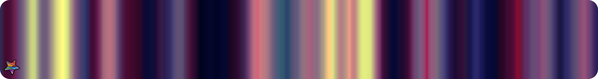 
    15. - `lime_cyan_orange` [**`f3h_hex`**](https://github.com/alexnardini/FLAM3_for_SideFX_Houdini/blob/47b9fd38fcf0def532eba72d02d2eb11118d36c8/__FLAM3H_palette_libs/F3H_LOCK_fardareismai_pack_01_B.json#L44-L46) 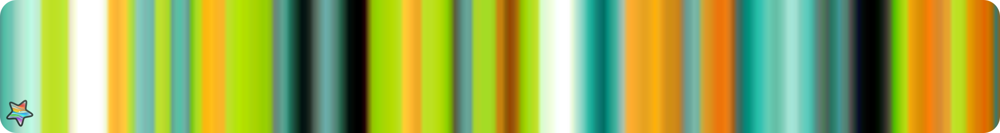 
    16. - `lut_gholein` [**`f3h_hex`**](https://github.com/alexnardini/FLAM3_for_SideFX_Houdini/blob/47b9fd38fcf0def532eba72d02d2eb11118d36c8/__FLAM3H_palette_libs/F3H_LOCK_fardareismai_pack_01_B.json#L47-L49) 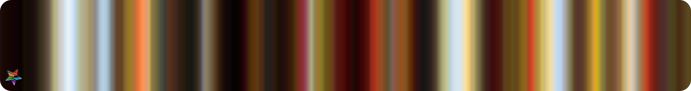 
    17. - `mauve_and_cyan` [**`f3h_hex`**](https://github.com/alexnardini/FLAM3_for_SideFX_Houdini/blob/47b9fd38fcf0def532eba72d02d2eb11118d36c8/__FLAM3H_palette_libs/F3H_LOCK_fardareismai_pack_01_B.json#L50-L52) 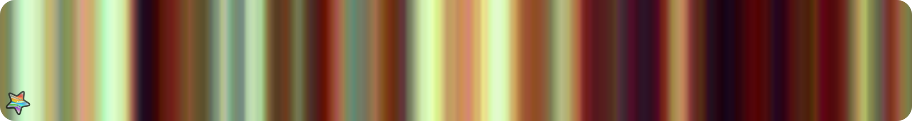 
    18. - `mint_orange_blue` [**`f3h_hex`**](https://github.com/alexnardini/FLAM3_for_SideFX_Houdini/blob/47b9fd38fcf0def532eba72d02d2eb11118d36c8/__FLAM3H_palette_libs/F3H_LOCK_fardareismai_pack_01_B.json#L53-L55)  
    19. - `modern_orange` [**`f3h_hex`**](https://github.com/alexnardini/FLAM3_for_SideFX_Houdini/blob/47b9fd38fcf0def532eba72d02d2eb11118d36c8/__FLAM3H_palette_libs/F3H_LOCK_fardareismai_pack_01_B.json#L56-L58)  
    20. - `monochrome_is_unimaginative` [**`f3h_hex`**](https://github.com/alexnardini/FLAM3_for_SideFX_Houdini/blob/47b9fd38fcf0def532eba72d02d2eb11118d36c8/__FLAM3H_palette_libs/F3H_LOCK_fardareismai_pack_01_B.json#L59-L61) 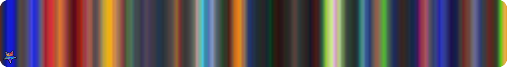 
    21. - `mood_swings` [**`f3h_hex`**](https://github.com/alexnardini/FLAM3_for_SideFX_Houdini/blob/47b9fd38fcf0def532eba72d02d2eb11118d36c8/__FLAM3H_palette_libs/F3H_LOCK_fardareismai_pack_01_B.json#L62-L64) 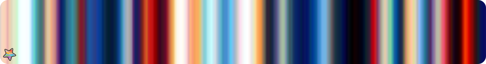 
    22. - `mostly_grey` [**`f3h_hex`**](https://github.com/alexnardini/FLAM3_for_SideFX_Houdini/blob/47b9fd38fcf0def532eba72d02d2eb11118d36c8/__FLAM3H_palette_libs/F3H_LOCK_fardareismai_pack_01_B.json#L65-L67)  
    23. - `motherfucking_rainbow` [**`f3h_hex`**](https://github.com/alexnardini/FLAM3_for_SideFX_Houdini/blob/47b9fd38fcf0def532eba72d02d2eb11118d36c8/__FLAM3H_palette_libs/F3H_LOCK_fardareismai_pack_01_B.json#L68-L70) 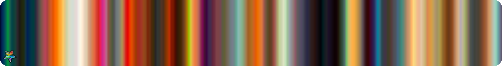 
    24. - `movie_posters` [**`f3h_hex`**](https://github.com/alexnardini/FLAM3_for_SideFX_Houdini/blob/47b9fd38fcf0def532eba72d02d2eb11118d36c8/__FLAM3H_palette_libs/F3H_LOCK_fardareismai_pack_01_B.json#L71-L73)  
    25. - `muted_and_dark` [**`f3h_hex`**](https://github.com/alexnardini/FLAM3_for_SideFX_Houdini/blob/47b9fd38fcf0def532eba72d02d2eb11118d36c8/__FLAM3H_palette_libs/F3H_LOCK_fardareismai_pack_01_B.json#L74-L76)  
    26. - `muted_but_wide_hued` [**`f3h_hex`**](https://github.com/alexnardini/FLAM3_for_SideFX_Houdini/blob/47b9fd38fcf0def532eba72d02d2eb11118d36c8/__FLAM3H_palette_libs/F3H_LOCK_fardareismai_pack_01_B.json#L77-L79) 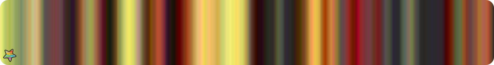 
    27. - `neonest_of_the_rainbows` [**`f3h_hex`**](https://github.com/alexnardini/FLAM3_for_SideFX_Houdini/blob/47b9fd38fcf0def532eba72d02d2eb11118d36c8/__FLAM3H_palette_libs/F3H_LOCK_fardareismai_pack_01_B.json#L80-L82) 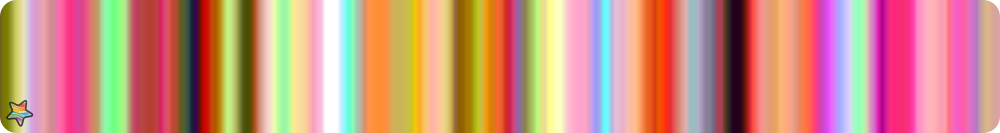 
    28. - `never_as_good` [**`f3h_hex`**](https://github.com/alexnardini/FLAM3_for_SideFX_Houdini/blob/47b9fd38fcf0def532eba72d02d2eb11118d36c8/__FLAM3H_palette_libs/F3H_LOCK_fardareismai_pack_01_B.json#L83-L85)  
    29. - `nom_those_rainbows` [**`f3h_hex`**](https://github.com/alexnardini/FLAM3_for_SideFX_Houdini/blob/47b9fd38fcf0def532eba72d02d2eb11118d36c8/__FLAM3H_palette_libs/F3H_LOCK_fardareismai_pack_01_B.json#L86-L88)  
    30. - `oil_painting` [**`f3h_hex`**](https://github.com/alexnardini/FLAM3_for_SideFX_Houdini/blob/47b9fd38fcf0def532eba72d02d2eb11118d36c8/__FLAM3H_palette_libs/F3H_LOCK_fardareismai_pack_01_B.json#L89-L91)  
    31. - `oil_painting_at_night` [**`f3h_hex`**](https://github.com/alexnardini/FLAM3_for_SideFX_Houdini/blob/47b9fd38fcf0def532eba72d02d2eb11118d36c8/__FLAM3H_palette_libs/F3H_LOCK_fardareismai_pack_01_B.json#L92-L94)  
    32. - `olive_and_sky` [**`f3h_hex`**](https://github.com/alexnardini/FLAM3_for_SideFX_Houdini/blob/47b9fd38fcf0def532eba72d02d2eb11118d36c8/__FLAM3H_palette_libs/F3H_LOCK_fardareismai_pack_01_B.json#L95-L97)  
    33. - `opening_the_drapes` [**`f3h_hex`**](https://github.com/alexnardini/FLAM3_for_SideFX_Houdini/blob/47b9fd38fcf0def532eba72d02d2eb11118d36c8/__FLAM3H_palette_libs/F3H_LOCK_fardareismai_pack_01_B.json#L98-L100)  
    34. - `orange_lime_aqua` [**`f3h_hex`**](https://github.com/alexnardini/FLAM3_for_SideFX_Houdini/blob/47b9fd38fcf0def532eba72d02d2eb11118d36c8/__FLAM3H_palette_libs/F3H_LOCK_fardareismai_pack_01_B.json#L101-L103) 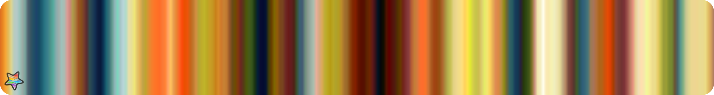 
    35. - `orange_and_dark_cyan` [**`f3h_hex`**](https://github.com/alexnardini/FLAM3_for_SideFX_Houdini/blob/47b9fd38fcf0def532eba72d02d2eb11118d36c8/__FLAM3H_palette_libs/F3H_LOCK_fardareismai_pack_01_B.json#L104-L106) 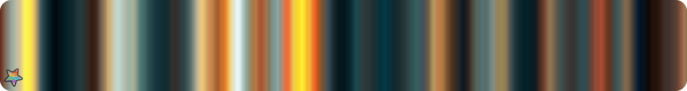 
    36. - `orange_and_ff00ff` [**`f3h_hex`**](https://github.com/alexnardini/FLAM3_for_SideFX_Houdini/blob/47b9fd38fcf0def532eba72d02d2eb11118d36c8/__FLAM3H_palette_libs/F3H_LOCK_fardareismai_pack_01_B.json#L107-L109) 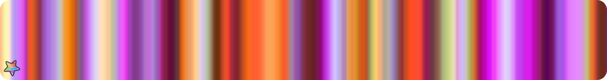 
    37. - `orange_like_a_sunset` [**`f3h_hex`**](https://github.com/alexnardini/FLAM3_for_SideFX_Houdini/blob/47b9fd38fcf0def532eba72d02d2eb11118d36c8/__FLAM3H_palette_libs/F3H_LOCK_fardareismai_pack_01_B.json#L110-L112)  
    38. - `paradiso` [**`f3h_hex`**](https://github.com/alexnardini/FLAM3_for_SideFX_Houdini/blob/47b9fd38fcf0def532eba72d02d2eb11118d36c8/__FLAM3H_palette_libs/F3H_LOCK_fardareismai_pack_01_B.json#L113-L115) 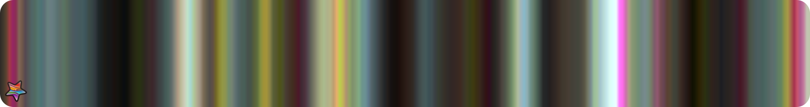 
    39. - `pink_cyan_grey` [**`f3h_hex`**](https://github.com/alexnardini/FLAM3_for_SideFX_Houdini/blob/47b9fd38fcf0def532eba72d02d2eb11118d36c8/__FLAM3H_palette_libs/F3H_LOCK_fardareismai_pack_01_B.json#L116-L118) 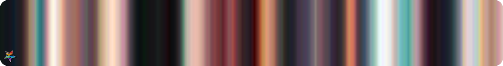 
    40. - `pink_cyan_white` [**`f3h_hex`**](https://github.com/alexnardini/FLAM3_for_SideFX_Houdini/blob/47b9fd38fcf0def532eba72d02d2eb11118d36c8/__FLAM3H_palette_libs/F3H_LOCK_fardareismai_pack_01_B.json#L119-L121)  
    41. - `pink_royal_purple_cyan` [**`f3h_hex`**](https://github.com/alexnardini/FLAM3_for_SideFX_Houdini/blob/47b9fd38fcf0def532eba72d02d2eb11118d36c8/__FLAM3H_palette_libs/F3H_LOCK_fardareismai_pack_01_B.json#L122-L124) 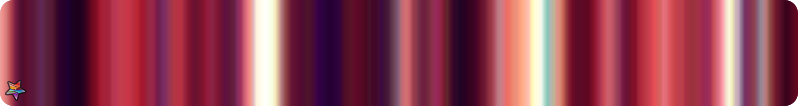 
    42. - `pink_yellow_white` [**`f3h_hex`**](https://github.com/alexnardini/FLAM3_for_SideFX_Houdini/blob/47b9fd38fcf0def532eba72d02d2eb11118d36c8/__FLAM3H_palette_libs/F3H_LOCK_fardareismai_pack_01_B.json#L125-L127) 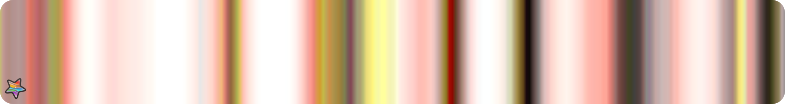 

 
 
 
 

_Copyright (c) 2021 F stands for liFe_ 
