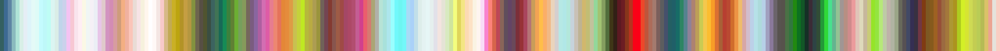

# F3H_LOCK_fardareismai_pack_02_A.json

 
 

- #   json
- ## File name: [**`F3H_LOCK_fardareismai_pack_02_A.json`**](../../F3H_LOCK_fardareismai_pack_02_A.json) _color keys_: **256**
    1. - `agnus_dei`  
    2. - `beige_with_colors`  
    3. - `black_yellow_teal_maroon`  
    4. - `black_and_cyan`  
    5. - `blue_green_red`  
    6. - `blue_and_orange_a`  
    7. - `brown_cyan_green`  
    8. - `brown_cyan_purple_coral`  
    9. - `brown_with_brights`  
    10. - `burgundy_and_flame`  
    11. - `burgundy_and_sea_green`  
    12. - `chromatic_aberration`  
    13. - `coral_and_moss`  
    14. - `cyan_and_orange`  
    15. - `cyan_and_pink`  
    16. - `cyan_and_plum`  
    17. - `cyan_and_warms`  
    18. - `cyanoburgundygrey`  
    19. - `dark_pink_cyan_purple`  
    20. - `dark_red_and_cyan`  
    21. - `dawn`  
    22. - `desaturated_green_and_purple`  
    23. - `encore`  
    24. - `evening_reflection`  
    25. - `garden_a`  
    26. - `garish`  
    27. - `gold_and_turquoise`  
    28. - `green_grey_pink`  
    29. - `green_and_pink`  
    30. - `grey_and_red`  
    31. - `high_contrast`  
    32. - `i_hate_spring`  
    33. - `kites`  
    34. - `lime_pink_orange`  
    35. - `melon_modern` 

 
 
 
 

_Copyright (c) 2021 F stands for liFe_ 
