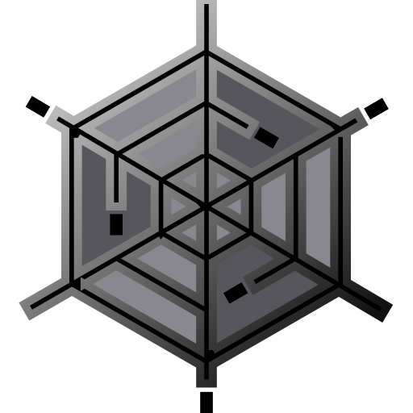
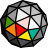

### FLAM3H™ (and FLAM3HUSD) icon set ###
- #### THIS FILE IS ONLY INFORMATIVE and part of the Documentations

</br>

Following is the full icon set that have been crafted and included with FLAM3H™ (and FLAM3HUSD) for easy find and review.<br>
It is an ongoing effort and they have been regularly updated and improved even tho this last set seem to be working well with different Houdini UI scales and color schemes.

They are already embedded inside each HDA and available in this repository for easy edit and review.

**Below each icon's image**,</br>
**you can find strings to use to call the desired icon within different places inside Houdini as long as the desired icon exist inside the extra files section of the asset**.</br>

**Each path is composed as follow:**</br>
`opdef` `:/` `__namespace__` `::` `__context__` `/` `__asset_name__` `?` `__icon_file_name__`

**In this document all icons'** `__asset_name__` **are set to:** `FLAM3H`</br>
**Change it as needed, unless it is a relative path like the DOC icon paths**.

</br>

**Note**: _The project logo and this icon set are NOT covered by the **CC BY-SA 4.0** license_.</br>
_They remain Copyright of (c) 2021 F stands for liFe (and their other respective owners), and may not be redistributed without permission_.


</br>
</br>
</br>
</br>


<p align="center">
  </p>
<b><p align="center">FLAM3H_DOC_icon.svg</p></b>
<p align="center">

<b>"Parameter Buttom" / "Action Button" icon</b>

```
opdef:/alexnardini::Sop/FLAM3H?FLAM3H_DOC_icon.svg
```
<b>Menu bookmark icon</b>

```
![opdef:/alexnardini::Sop/FLAM3H?FLAM3H_DOC_icon.svg] Label
```
<b>Doc icon</b>

```
[Icon:opdef:.?FLAM3H_DOC_icon.svg]
```
<b>Doc icon Small</b>

```
[Smallicon:opdef:.?FLAM3H_DOC_icon.svg]
```
<b>Doc icon Large</b>

```
[Largeicon:opdef:.?FLAM3H_DOC_icon.svg]
```
<p align="center">...</p></br/></br/></br/></br/></br/></br/></br/></br/>


<p align="center">
  </p>
<b><p align="center">FLAM3HUSD_DOC_icon.svg</p></b>
<p align="center">

<b>"Parameter Buttom" / "Action Button" icon</b>

```
opdef:/alexnardini::Sop/FLAM3H?FLAM3HUSD_DOC_icon.svg
```
<b>Menu bookmark icon</b>

```
![opdef:/alexnardini::Sop/FLAM3H?FLAM3HUSD_DOC_icon.svg] Label
```
<b>Doc icon</b>

```
[Icon:opdef:.?FLAM3HUSD_DOC_icon.svg]
```
<b>Doc icon Small</b>

```
[Smallicon:opdef:.?FLAM3HUSD_DOC_icon.svg]
```
<b>Doc icon Large</b>

```
[Largeicon:opdef:.?FLAM3HUSD_DOC_icon.svg]
```
<p align="center">...</p></br/></br/></br/></br/></br/></br/></br/></br/>


<p align="center">
  </p>
<b><p align="center">icon_actionButtonSVG.svg</p></b>
<p align="center">

<b>"Parameter Buttom" / "Action Button" icon</b>

```
opdef:/alexnardini::Sop/FLAM3H?FLAM3HUSD_DOC_icon.svg
```
<b>Menu bookmark icon</b>

```
![opdef:/alexnardini::Sop/FLAM3H?FLAM3HUSD_DOC_icon.svg] Label
```
<b>Doc icon</b>

```
[Icon:opdef:.?FLAM3HUSD_DOC_icon.svg]
```
<b>Doc icon Small</b>

```
[Smallicon:opdef:.?FLAM3HUSD_DOC_icon.svg]
```
<b>Doc icon Large</b>

```
[Largeicon:opdef:.?FLAM3HUSD_DOC_icon.svg]
```
<p align="center">...</p></br/></br/></br/></br/></br/></br/></br/></br/>


<p align="center">
  </p>
<b><p align="center">icon_AddDelIteratorSVG.svg (H21 and up only)</p></b>

<b>"Parameter Buttom" / "Action Button" icon</b>

```
opdef:/alexnardini::Sop/FLAM3H?icon_AddDelIteratorSVG.svg
```
<b>Menu bookmark icon</b>

```
![opdef:/alexnardini::Sop/FLAM3H?icon_AddDelIteratorSVG.svg] Label
```
<b>Doc icon</b>

```
[Icon:opdef:.?icon_AddDelIteratorSVG.svg]
```
<b>Doc icon Small</b>

```
[Smallicon:opdef:.?icon_AddDelIteratorSVG.svg]
```
<b>Doc icon Large</b>

```
[Largeicon:opdef:.?icon_AddDelIteratorSVG.svg]
```
<p align="center">...</p></br/></br/></br/></br/>


<p align="center">
  </p>
<b><p align="center">icon_bitbucketLogoSVG.svg</p></b></b>

<b>"Parameter Buttom" / "Action Button" icon</b>

```
opdef:/alexnardini::Sop/FLAM3H?icon_bitbucketLogoSVG.svg
```
<b>Menu bookmark icon</b>

```
![opdef:/alexnardini::Sop/FLAM3H?icon_bitbucketLogoSVG.svg] Label
```
<b>Doc icon</b>

```
[Icon:opdef:.?icon_bitbucketLogoSVG.svg]
```
<b>Doc icon Small</b>

```
[Smallicon:opdef:.?icon_bitbucketLogoSVG.svg]
```
<b>Doc icon Large</b>

```
[Largeicon:opdef:.?icon_bitbucketLogoSVG.svg]
```
<p align="center">...</p></br/></br/></br/></br/>


<p align="center">
  </p>
<b><p align="center">icon_cvex_compileSVG.svg</p></b>

<b>"Parameter Buttom" / "Action Button" icon</b>

```
opdef:/alexnardini::Sop/FLAM3H?icon_cvex_compileSVG.svg
```
<b>Menu bookmark icon</b>

```
![opdef:/alexnardini::Sop/FLAM3H?icon_cvex_compileSVG.svg] Label
```
<b>Doc icon</b>

```
[Icon:opdef:.?icon_cvex_compileSVG.svg]
```
<b>Doc icon Small</b>

```
[Smallicon:opdef:.?icon_cvex_compileSVG.svg]
```
<b>Doc icon Large</b>

```
[Largeicon:opdef:.?icon_cvex_compileSVG.svg]
```
<p align="center">...</p></br/></br/></br/></br/>


<p align="center">
  </p>
<b><p align="center">icon_F_docStarSVG.svg</p></b>
<b>"Parameter Buttom" / "Action Button" icon</b>

```
opdef:/alexnardini::Sop/FLAM3H?icon_F_docStarSVG.svg
```
<b>Menu bookmark icon</b>

```
![opdef:/alexnardini::Sop/FLAM3H?icon_F_docStarSVG.svg] Label
```
<b>Doc icon</b>

```
[Icon:opdef:.?icon_F_docStarSVG.svg]
```
<b>Doc icon Small</b>

```
[Smallicon:opdef:.?icon_F_docStarSVG.svg]
```
<b>Doc icon Large</b>

```
[Largeicon:opdef:.?icon_F_docStarSVG.svg]
```
<p align="center">...</p></br/></br/></br/></br/>


<p align="center">
  </p>
<b><p align="center">icon_ffHandlesEnabledSVG.svg</p></b>
<b>"Parameter Buttom" / "Action Button" icon</b>

```
opdef:/alexnardini::Sop/FLAM3H?icon_ffHandlesEnabledSVG.svg
```
<b>Menu bookmark icon</b>

```
![opdef:/alexnardini::Sop/FLAM3H?icon_ffHandlesEnabledSVG.svg] Label
```
<b>Doc icon</b>

```
[Icon:opdef:.?icon_ffHandlesEnabledSVG.svg]
```
<b>Doc icon Small</b>

```
[Smallicon:opdef:.?icon_ffHandlesEnabledSVG.svg]
```
<b>Doc icon Large</b>

```
[Largeicon:opdef:.?icon_ffHandlesEnabledSVG.svg]
```
<p align="center">...</p></br/></br/></br/></br/>


<p align="center">
  </p>
<b><p align="center">icon_FractoriumWebSVG.svg</p></b>
<b>"Parameter Buttom" / "Action Button" icon</b>

```
opdef:/alexnardini::Sop/FLAM3H?icon_FractoriumWebSVG.svg
```
<b>Menu bookmark icon</b>

```
![opdef:/alexnardini::Sop/FLAM3H?icon_FractoriumWebSVG.svg] Label
```
<b>Doc icon</b>

```
[Icon:opdef:.?icon_FractoriumWebSVG.svg]
```
<b>Doc icon Small</b>

```
[Smallicon:opdef:.?icon_FractoriumWebSVG.svg]
```
<b>Doc icon Large</b>

```
[Largeicon:opdef:.?icon_FractoriumWebSVG.svg]
```
<p align="center">...</p></br/></br/></br/></br/>


<p align="center">
  </p>
<b><p align="center">icon_FrameBlueSVG.svg</p></b>
<b>"Parameter Buttom" / "Action Button" icon</b>

```
opdef:/alexnardini::Sop/FLAM3H?icon_FrameBlueSVG.svg
```
<b>Menu bookmark icon</b>

```
![opdef:/alexnardini::Sop/FLAM3H?icon_FrameBlueSVG.svg] Label
```
<b>Doc icon</b>

```
[Icon:opdef:.?icon_FrameBlueSVG.svg]
```
<b>Doc icon Small</b>

```
[Smallicon:opdef:.?icon_FrameBlueSVG.svg]
```
<b>Doc icon Large</b>

```
[Largeicon:opdef:.?icon_FrameBlueSVG.svg]
```
<p align="center">...</p></br/></br/></br/></br/>


<p align="center">
  </p>
<b><p align="center">icon_FrameRedSVG.svg</p></b>
<b>"Parameter Buttom" / "Action Button" icon</b>

```
opdef:/alexnardini::Sop/FLAM3H?icon_FrameRedSVG.svg
```
<b>Menu bookmark icon</b>

```
![opdef:/alexnardini::Sop/FLAM3H?icon_FrameRedSVG.svg] Label
```
<b>Doc icon</b>

```
[Icon:opdef:.?icon_FrameRedSVG.svg]
```
<b>Doc icon Small</b>

```
[Smallicon:opdef:.?icon_FrameRedSVG.svg]
```
<b>Doc icon Large</b>

```
[Largeicon:opdef:.?icon_FrameRedSVG.svg]
```
<p align="center">...</p></br/></br/></br/></br/>


<p align="center">
  </p>
<b><p align="center">icon_geo_reloadSVG.svg</p></b>
<b>"Parameter Buttom" / "Action Button" icon</b>

```
opdef:/alexnardini::Sop/FLAM3H?icon_geo_reloadSVG.svg
```
<b>Menu bookmark icon</b>

```
![opdef:/alexnardini::Sop/FLAM3H?icon_geo_reloadSVG.svg] Label
```
<b>Doc icon</b>

```
[Icon:opdef:.?icon_geo_reloadSVG.svg]
```
<b>Doc icon Small</b>

```
[Smallicon:opdef:.?icon_geo_reloadSVG.svg]
```
<b>Doc icon Large</b>

```
[Largeicon:opdef:.?icon_geo_reloadSVG.svg]
```
<p align="center">...</p></br/></br/></br/></br/>


<p align="center">
  </p>
<b><p align="center">icon_optionCPSVG.svg</p></b>
<b>"Parameter Buttom" / "Action Button" icon</b>

```
opdef:/alexnardini::Sop/FLAM3H?icon_optionCPSVG.svg
```
<b>Menu bookmark icon</b>

```
![opdef:/alexnardini::Sop/FLAM3H?icon_optionCPSVG.svg] Label
```
<b>Doc icon</b>

```
[Icon:opdef:.?icon_optionCPSVG.svg]
```
<b>Doc icon Small</b>

```
[Smallicon:opdef:.?icon_optionCPSVG.svg]
```
<b>Doc icon Large</b>

```
[Largeicon:opdef:.?icon_optionCPSVG.svg]
```
<p align="center">...</p></br/></br/></br/></br/>

<p align="center">
  </p>
<b><p align="center">icon_optionDisabledSelIterSVG.svg</p></b>
<b>"Parameter Buttom" / "Action Button" icon</b>

```
opdef:/alexnardini::Sop/FLAM3H?icon_optionDisabledSelIterSVG.svg
```
<b>Menu bookmark icon</b>

```
![opdef:/alexnardini::Sop/FLAM3H?icon_optionDisabledSelIterSVG.svg] Label
```
<b>Doc icon</b>

```
[Icon:opdef:.?icon_optionDisabledSelIterSVG.svg]
```
<b>Doc icon Small</b>

```
[Smallicon:opdef:.?icon_optionDisabledSelIterSVG.svg]
```
<b>Doc icon Large</b>

```
[Largeicon:opdef:.?icon_optionDisabledSelIterSVG.svg]
```
<p align="center">...</p></br/></br/></br/></br/>


<p align="center">
  </p>
<b><p align="center">icon_optionDisabledSVG.svg</p></b>
<b>"Parameter Buttom" / "Action Button" icon</b>

```
opdef:/alexnardini::Sop/FLAM3H?icon_optionDisabledSVG.svg
```
<b>Menu bookmark icon</b>

```
![opdef:/alexnardini::Sop/FLAM3H?icon_optionDisabledSVG.svg] Label
```
<b>Doc icon</b>

```
[Icon:opdef:.?icon_optionDisabledSVG.svg]
```
<b>Doc icon Small</b>

```
[Smallicon:opdef:.?icon_optionDisabledSVG.svg]
```
<b>Doc icon Large</b>

```
[Largeicon:opdef:.?icon_optionDisabledSVG.svg]
```
<p align="center">...</p></br/></br/></br/></br/>


<p align="center">
  </p>
<b><p align="center">icon_optionDisabledZeroIterSVG.svg</p></b>
<b>"Parameter Buttom" / "Action Button" icon</b>

```
opdef:/alexnardini::Sop/FLAM3H?icon_optionDisabledZeroIterSVG.svg
```
<b>Menu bookmark icon</b>

```
![opdef:/alexnardini::Sop/FLAM3H?icon_optionDisabledZeroIterSVG.svg] Label
```
<b>Doc icon</b>

```
[Icon:opdef:.?icon_optionDisabledZeroIterSVG.svg]
```
<b>Doc icon Small</b>

```
[Smallicon:opdef:.?icon_optionDisabledZeroIterSVG.svg]
```
<b>Doc icon Large</b>

```
[Largeicon:opdef:.?icon_optionDisabledZeroIterSVG.svg]
```
<p align="center">...</p></br/></br/></br/></br/>


<p align="center">
  </p>
<b><p align="center">icon_optionEnabledSVG.svg</p></b>
<b>"Parameter Buttom" / "Action Button" icon</b>

```
opdef:/alexnardini::Sop/FLAM3H?icon_optionEnabledSVG.svg
```
<b>Menu bookmark icon</b>

```
![opdef:/alexnardini::Sop/FLAM3H?icon_optionEnabledSVG.svg] Label
```
<b>Doc icon</b>

```
[Icon:opdef:.?icon_optionEnabledSVG.svg]
```
<b>Doc icon Small</b>

```
[Smallicon:opdef:.?icon_optionEnabledSVG.svg]
```
<b>Doc icon Large</b>

```
[Largeicon:opdef:.?icon_optionEnabledSVG.svg]
```
<p align="center">...</p></br/></br/></br/></br/>

<p align="center">
  </p>
<b><p align="center">icon_optionEnabledMidSVG.svg</p></b>
<b>"Parameter Buttom" / "Action Button" icon</b>

```
opdef:/alexnardini::Sop/FLAM3H?icon_optionEnabledMidSVG.svg
```
<b>Menu bookmark icon</b>

```
![opdef:/alexnardini::Sop/FLAM3H?icon_optionEnabledMidSVG.svg] Label
```
<b>Doc icon</b>

```
[Icon:opdef:.?icon_optionEnabledMidSVG.svg]
```
<b>Doc icon Small</b>

```
[Smallicon:opdef:.?icon_optionEnabledMidSVG.svg]
```
<b>Doc icon Large</b>

```
[Largeicon:opdef:.?icon_optionEnabledMidSVG.svg]
```
<p align="center">...</p></br/></br/></br/></br/>


<p align="center">
  </p>
<b><p align="center">icon_optionF3CDisabledSVG.svg</p></b>
<b>"Parameter Buttom" / "Action Button" icon</b>

```
opdef:/alexnardini::Sop/FLAM3H?icon_optionF3CDisabledSVG.svg
```
<b>Menu bookmark icon</b>

```
![opdef:/alexnardini::Sop/FLAM3H?icon_optionF3CDisabledSVG.svg] Label
```
<b>Doc icon</b>

```
[Icon:opdef:.?icon_optionF3CDisabledSVG.svg]
```
<b>Doc icon Small</b>

```
[Smallicon:opdef:.?icon_optionF3CDisabledSVG.svg]
```
<b>Doc icon Large</b>

```
[Largeicon:opdef:.?icon_optionF3CDisabledSVG.svg]
```
<p align="center">...</p></br/></br/></br/></br/>


<p align="center">
  </p>
<b><p align="center">icon_optionF3CEnabledSVG.svg</p></b>
<b>"Parameter Buttom" / "Action Button" icon</b>

```
opdef:/alexnardini::Sop/FLAM3H?icon_optionF3CEnabledSVG.svg
```
<b>Menu bookmark icon</b>

```
![opdef:/alexnardini::Sop/FLAM3H?icon_optionF3CEnabledSVG.svg] Label
```
<b>Doc icon</b>

```
[Icon:opdef:.?icon_optionF3CEnabledSVG.svg]
```
<b>Doc icon Small</b>

```
[Smallicon:opdef:.?icon_optionF3CEnabledSVG.svg]
```
<b>Doc icon Large</b>

```
[Largeicon:opdef:.?icon_optionF3CEnabledSVG.svg]
```
<p align="center">...</p></br/></br/></br/></br/>


<p align="center">
  </p>
<b><p align="center">icon_optionFFDisabledSVG.svg</p></b>
<b>"Parameter Buttom" / "Action Button" icon</b>

```
opdef:/alexnardini::Sop/FLAM3H?icon_optionFFDisabledSVG.svg
```
<b>Menu bookmark icon</b>

```
![opdef:/alexnardini::Sop/FLAM3H?icon_optionFFDisabledSVG.svg] Label
```
<b>Doc icon</b>

```
[Icon:opdef:.?icon_optionFFDisabledSVG.svg]
```
<b>Doc icon Small</b>

```
[Smallicon:opdef:.?icon_optionFFDisabledSVG.svg]
```
<b>Doc icon Large</b>

```
[Largeicon:opdef:.?icon_optionFFDisabledSVG.svg]
```
<p align="center">...</p></br/></br/></br/></br/>


<p align="center">
  </p>
<b><p align="center">icon_optionFFEnabledSVG.svg</p></b>
<b>"Parameter Buttom" / "Action Button" icon</b>

```
opdef:/alexnardini::Sop/FLAM3H?icon_optionFFEnabledSVG.svg
```
<b>Menu bookmark icon</b>

```
![opdef:/alexnardini::Sop/FLAM3H?icon_optionFFEnabledSVG.svg] Label
```
<b>Doc icon</b>

```
[Icon:opdef:.?icon_optionFFEnabledSVG.svg]
```
<b>Doc icon Small</b>

```
[Smallicon:opdef:.?icon_optionFFEnabledSVG.svg]
```
<b>Doc icon Large</b>

```
[Largeicon:opdef:.?icon_optionFFEnabledSVG.svg]
```
<p align="center">...</p></br/></br/></br/></br/>


<p align="center">
  </p>
<b><p align="center">icon_optionFlameINEntrieSVG.svg</p></b>
<b>"Parameter Buttom" / "Action Button" icon</b>

```
opdef:/alexnardini::Sop/FLAM3H?icon_optionFlameINEntrieSVG.svg
```
<b>Menu bookmark icon</b>

```
![opdef:/alexnardini::Sop/FLAM3H?icon_optionFlameINEntrieSVG.svg] Label
```
<b>Doc icon</b>

```
[Icon:opdef:.?icon_optionFlameINEntrieSVG.svg]
```
<b>Doc icon Small</b>

```
[Smallicon:opdef:.?icon_optionFlameINEntrieSVG.svg]
```
<b>Doc icon Large</b>

```
[Largeicon:opdef:.?icon_optionFlameINEntrieSVG.svg]
```
<p align="center">...</p></br/></br/></br/></br/>


<p align="center">
  </p>
<b><p align="center">icon_optionFlameOUTEntrieSVG.svg</p></b>
<b>"Parameter Buttom" / "Action Button" icon</b>

```
opdef:/alexnardini::Sop/FLAM3H?icon_optionFlameOUTEntrieSVG.svg
```
<b>Menu bookmark icon</b>

```
![opdef:/alexnardini::Sop/FLAM3H?icon_optionFlameOUTEntrieSVG.svg] Label
```
<b>Doc icon</b>

```
[Icon:opdef:.?icon_optionFlameOUTEntrieSVG.svg]
```
<b>Doc icon Small</b>

```
[Smallicon:opdef:.?icon_optionFlameOUTEntrieSVG.svg]
```
<b>Doc icon Large</b>

```
[Largeicon:opdef:.?icon_optionFlameOUTEntrieSVG.svg]
```
<p align="center">...</p></br/></br/></br/></br/>


<p align="center">
  </p>
<b><p align="center">icon_optionPRIDEDisabledSVG.svg</p></b>
<b>"Parameter Buttom" / "Action Button" icon</b>

```
opdef:/alexnardini::Sop/FLAM3H?icon_optionPRIDEDisabledSVG.svg
```
<b>Menu bookmark icon</b>

```
![opdef:/alexnardini::Sop/FLAM3H?icon_optionPRIDEDisabledSVG.svg] Label
```
<b>Doc icon</b>

```
[Icon:opdef:.?icon_optionPRIDEDisabledSVG.svg]
```
<b>Doc icon Small</b>

```
[Smallicon:opdef:.?icon_optionPRIDEDisabledSVG.svg]
```
<b>Doc icon Large</b>

```
[Largeicon:opdef:.?icon_optionPRIDEDisabledSVG.svg]
```
<p align="center">...</p></br/></br/></br/></br/>


<p align="center">
  </p>
<b><p align="center">icon_optionRIPDisabledSVG.svg</p></b>
<b>"Parameter Buttom" / "Action Button" icon</b>

```
opdef:/alexnardini::Sop/FLAM3H?icon_optionRIPDisabledSVG.svg
```
<b>Menu bookmark icon</b>

```
![opdef:/alexnardini::Sop/FLAM3H?icon_optionRIPDisabledSVG.svg] Label
```
<b>Doc icon</b>

```
[Icon:opdef:.?icon_optionRIPDisabledSVG.svg]
```
<b>Doc icon Small</b>

```
[Smallicon:opdef:.?icon_optionRIPDisabledSVG.svg]
```
<b>Doc icon Large</b>

```
[Largeicon:opdef:.?icon_optionRIPDisabledSVG.svg]
```
<p align="center">...</p></br/></br/></br/></br/>


<p align="center">
  </p>
<b><p align="center">icon_optionRIPEnabledSVG.svg</p></b>
<b>"Parameter Buttom" / "Action Button" icon</b>

```
opdef:/alexnardini::Sop/FLAM3H?icon_optionRIPEnabledSVG.svg
```
<b>Menu bookmark icon</b>

```
![opdef:/alexnardini::Sop/FLAM3H?icon_optionRIPEnabledSVG.svg] Label
```
<b>Doc icon</b>

```
[Icon:opdef:.?icon_optionRIPEnabledSVG.svg]
```
<b>Doc icon Small</b>

```
[Smallicon:opdef:.?icon_optionRIPEnabledSVG.svg]
```
<b>Doc icon Large</b>

```
[Largeicon:opdef:.?icon_optionRIPEnabledSVG.svg]
```
<p align="center">...</p></br/></br/></br/></br/>


<p align="center">
  </p>
<b><p align="center">icon_optionStarBlueKwargsSVG.svg</p></b>
<b>"Parameter Buttom" / "Action Button" icon</b>

```
opdef:/alexnardini::Sop/FLAM3H?icon_optionStarBlueKwargsSVG.svg
```
<b>Menu bookmark icon</b>

```
![opdef:/alexnardini::Sop/FLAM3H?icon_optionStarBlueKwargsSVG.svg] Label
```
<b>Doc icon</b>

```
[Icon:opdef:.?icon_optionStarBlueKwargsSVG.svg]
```
<b>Doc icon Small</b>

```
[Smallicon:opdef:.?icon_optionStarBlueKwargsSVG.svg]
```
<b>Doc icon Large</b>

```
[Largeicon:opdef:.?icon_optionStarBlueKwargsSVG.svg]
```
<p align="center">...</p></br/></br/></br/></br/>


<p align="center">
  </p>
<b><p align="center">icon_optionStarBlueSVG.svg</p></b>
<b>"Parameter Buttom" / "Action Button" icon</b>

```
opdef:/alexnardini::Sop/FLAM3H?icon_optionStarBlueSVG.svg
```
<b>Menu bookmark icon</b>

```
![opdef:/alexnardini::Sop/FLAM3H?icon_optionStarBlueSVG.svg] Label
```
<b>Doc icon</b>

```
[Icon:opdef:.?icon_optionStarBlueSVG.svg]
```
<b>Doc icon Small</b>

```
[Smallicon:opdef:.?icon_optionStarBlueSVG.svg]
```
<b>Doc icon Large</b>

```
[Largeicon:opdef:.?icon_optionStarBlueSVG.svg]
```
<p align="center">...</p></br/></br/></br/></br/>


<p align="center">
  </p>
<b><p align="center">icon_optionStarOrangeSVG.svg</p></b>
<b>"Parameter Buttom" / "Action Button" icon</b>

```
opdef:/alexnardini::Sop/FLAM3H?icon_optionStarOrangeSVG.svg
```
<b>Menu bookmark icon</b>

```
![opdef:/alexnardini::Sop/FLAM3H?icon_optionStarOrangeSVG.svg] Label
```
<b>Doc icon</b>

```
[Icon:opdef:.?icon_optionStarOrangeSVG.svg]
```
<b>Doc icon Small</b>

```
[Smallicon:opdef:.?icon_optionStarOrangeSVG.svg]
```
<b>Doc icon Large</b>

```
[Largeicon:opdef:.?icon_optionStarOrangeSVG.svg]
```
<p align="center">...</p></br/></br/></br/></br/>


<p align="center">
  </p>
<b><p align="center">icon_optionStarRedHighSVG.svg</p></b>
<b>"Parameter Buttom" / "Action Button" icon</b>

```
opdef:/alexnardini::Sop/FLAM3H?icon_optionStarRedHighSVG.svg
```
<b>Menu bookmark icon</b>

```
![opdef:/alexnardini::Sop/FLAM3H?icon_optionStarRedHighSVG.svg] Label
```
<b>Doc icon</b>

```
[Icon:opdef:.?icon_optionStarRedHighSVG.svg]
```
<b>Doc icon Small</b>

```
[Smallicon:opdef:.?icon_optionStarRedHighSVG.svg]
```
<b>Doc icon Large</b>

```
[Largeicon:opdef:.?icon_optionStarRedHighSVG.svg]
```
<p align="center">...</p></br/></br/></br/></br/>


<p align="center">
  </p>
<b><p align="center">icon_optionStarRedSVG.svg</p></b>
<b>"Parameter Buttom" / "Action Button" icon</b>

```
opdef:/alexnardini::Sop/FLAM3H?icon_optionStarRedSVG.svg
```
<b>Menu bookmark icon</b>

```
![opdef:/alexnardini::Sop/FLAM3H?icon_optionStarRedSVG.svg] Label
```
<b>Doc icon</b>

```
[Icon:opdef:.?icon_optionStarRedSVG.svg]
```
<b>Doc icon Small</b>

```
[Smallicon:opdef:.?icon_optionStarRedSVG.svg]
```
<b>Doc icon Large</b>

```
[Largeicon:opdef:.?icon_optionStarRedSVG.svg]
```
<p align="center">...</p></br/></br/></br/></br/>


<p align="center">
  </p>
<b><p align="center">icon_optionStarWhiteKwargsSVG.svg</p></b>
<b>"Parameter Buttom" / "Action Button" icon</b>

```
opdef:/alexnardini::Sop/FLAM3H?icon_optionStarWhiteKwargsSVG.svg
```
<b>Menu bookmark icon</b>

```
![opdef:/alexnardini::Sop/FLAM3H?icon_optionStarWhiteKwargsSVG.svg] Label
```
<b>Doc icon</b>

```
[Icon:opdef:.?icon_optionStarWhiteKwargsSVG.svg]
```
<b>Doc icon Small</b>

```
[Smallicon:opdef:.?icon_optionStarWhiteKwargsSVG.svg]
```
<b>Doc icon Large</b>

```
[Largeicon:opdef:.?icon_optionStarWhiteKwargsSVG.svg]
```
<p align="center">...</p></br/></br/></br/></br/>


<p align="center">
  </p>
<b><p align="center">icon_optionStarWhitePBHSVG.svg</p></b>
<b>"Parameter Buttom" / "Action Button" icon</b>

```
opdef:/alexnardini::Sop/FLAM3H?icon_optionStarWhitePBHSVG.svg
```
<b>Menu bookmark icon</b>

```
![opdef:/alexnardini::Sop/FLAM3H?icon_optionStarWhitePBHSVG.svg] Label
```
<b>Doc icon</b>

```
[Icon:opdef:.?icon_optionStarWhitePBHSVG.svg]
```
<b>Doc icon Small</b>

```
[Smallicon:opdef:.?icon_optionStarWhitePBHSVG.svg]
```
<b>Doc icon Large</b>

```
[Largeicon:opdef:.?icon_optionStarWhitePBHSVG.svg]
```
<p align="center">...</p></br/></br/></br/></br/>


<p align="center">
  </p>
<b><p align="center">icon_optionStarWhitePBSVG.svg</p></b>
<b>"Parameter Buttom" / "Action Button" icon</b>

```
opdef:/alexnardini::Sop/FLAM3H?icon_optionStarWhitePBSVG.svg
```
<b>Menu bookmark icon</b>

```
![opdef:/alexnardini::Sop/FLAM3H?icon_optionStarWhitePBSVG.svg] Label
```
<b>Doc icon</b>

```
[Icon:opdef:.?icon_optionStarWhitePBSVG.svg]
```
<b>Doc icon Small</b>

```
[Smallicon:opdef:.?icon_optionStarWhitePBSVG.svg]
```
<b>Doc icon Large</b>

```
[Largeicon:opdef:.?icon_optionStarWhitePBSVG.svg]
```
<p align="center">...</p></br/></br/></br/></br/>


<p align="center">
  </p>
<b><p align="center">icon_optionStarWhiteSVG.svg</p></b>
<b>"Parameter Buttom" / "Action Button" icon</b>

```
opdef:/alexnardini::Sop/FLAM3H?icon_optionStarWhiteSVG.svg
```
<b>Menu bookmark icon</b>

```
![opdef:/alexnardini::Sop/FLAM3H?icon_optionStarWhiteSVG.svg] Label
```
<b>Doc icon</b>

```
[Icon:opdef:.?icon_optionStarWhiteSVG.svg]
```
<b>Doc icon Small</b>

```
[Smallicon:opdef:.?icon_optionStarWhiteSVG.svg]
```
<b>Doc icon Large</b>

```
[Largeicon:opdef:.?icon_optionStarWhiteSVG.svg]
```
<p align="center">...</p></br/></br/></br/></br/>


<p align="center">
  </p>
<b><p align="center">icon_optionStarWhiteXFVIZOFFSVG.svg</p></b>
<b>"Parameter Buttom" / "Action Button" icon</b>

```
opdef:/alexnardini::Sop/FLAM3H?icon_optionStarWhiteXFVIZOFFSVG.svg
```
<b>Menu bookmark icon</b>

```
![opdef:/alexnardini::Sop/FLAM3H?icon_optionStarWhiteXFVIZOFFSVG.svg] Label
```
<b>Doc icon</b>

```
[Icon:opdef:.?icon_optionStarWhiteXFVIZOFFSVG.svg]
```
<b>Doc icon Small</b>

```
[Smallicon:opdef:.?icon_optionStarWhiteXFVIZOFFSVG.svg]
```
<b>Doc icon Large</b>

```
[Largeicon:opdef:.?icon_optionStarWhiteXFVIZOFFSVG.svg]
```
<p align="center">...</p></br/></br/></br/></br/>


<p align="center">
  </p>
<b><p align="center">icon_optionStarWhiteXFVIZSVG.svg</p></b>
<b>"Parameter Buttom" / "Action Button" icon</b>

```
opdef:/alexnardini::Sop/FLAM3H?icon_optionStarWhiteXFVIZSVG.svg
```
<b>Menu bookmark icon</b>

```
![opdef:/alexnardini::Sop/FLAM3H?icon_optionStarWhiteXFVIZSVG.svg] Label
```
<b>Doc icon</b>

```
[Icon:opdef:.?icon_optionStarWhiteXFVIZSVG.svg]
```
<b>Doc icon Small</b>

```
[Smallicon:opdef:.?icon_optionStarWhiteXFVIZSVG.svg]
```
<b>Doc icon Large</b>

```
[Largeicon:opdef:.?icon_optionStarWhiteXFVIZSVG.svg]
```
<p align="center">...</p></br/></br/></br/></br/>


<p align="center">
  </p>
<b><p align="center">icon_optionStarWhiteXFVIZSOLOSVG.svg</p></b>
<b>"Parameter Buttom" / "Action Button" icon</b>

```
opdef:/alexnardini::Sop/FLAM3H?icon_optionStarWhiteXFVIZSOLOSVG.svg
```
<b>Menu bookmark icon</b>

```
![opdef:/alexnardini::Sop/FLAM3H?icon_optionStarWhiteXFVIZSOLOSVG.svg] Label
```
<b>Doc icon</b>

```
[Icon:opdef:.?icon_optionStarWhiteXFVIZSOLOSVG.svg]
```
<b>Doc icon Small</b>

```
[Smallicon:opdef:.?icon_optionStarWhiteXFVIZSOLOSVG.svg]
```
<b>Doc icon Large</b>

```
[Largeicon:opdef:.?icon_optionStarWhiteXFVIZSOLOSVG.svg]
```
<p align="center">...</p></br/></br/></br/></br/>


<p align="center">
  </p>
<b><p align="center">icon_optionStarYellowOrangeSVG.svg</p></b>
<b>"Parameter Buttom" / "Action Button" icon</b>

```
opdef:/alexnardini::Sop/FLAM3H?icon_optionStarYellowOrangeSVG.svg
```
<b>Menu bookmark icon</b>

```
![opdef:/alexnardini::Sop/FLAM3H?icon_optionStarYellowOrangeSVG.svg] Label
```
<b>Doc icon</b>

```
[Icon:opdef:.?icon_optionStarYellowOrangeSVG.svg]
```
<b>Doc icon Small</b>

```
[Smallicon:opdef:.?icon_optionStarYellowOrangeSVG.svg]
```
<b>Doc icon Large</b>

```
[Largeicon:opdef:.?icon_optionStarYellowOrangeSVG.svg]
```
<p align="center">...</p></br/></br/></br/></br/>


<p align="center">
  </p>
<b><p align="center">icon_optionStarYellowSVG.svg (unused)</p>
<b>"Parameter Buttom" / "Action Button" icon</b>

```
opdef:/alexnardini::Sop/FLAM3H?icon_optionStarYellowSVG.svg
```
<b>Menu bookmark icon</b>

```
![opdef:/alexnardini::Sop/FLAM3H?icon_optionStarYellowSVG.svg] Label
```
<b>Doc icon</b>

```
[Icon:opdef:.?icon_optionStarYellowSVG.svg]
```
<b>Doc icon Small</b>

```
[Smallicon:opdef:.?icon_optionStarYellowSVG.svg]
```
<b>Doc icon Large</b>

```
[Largeicon:opdef:.?icon_optionStarYellowSVG.svg]
```
<p align="center">...</p></br/></br/></br/></br/>


<p align="center">
  </p>
<b><p align="center">icon_rendererKarmaPropertiesSVG.svg</p></b>
<b>"Parameter Buttom" / "Action Button" icon</b>

```
opdef:/alexnardini::Sop/FLAM3H?icon_rendererKarmaPropertiesSVG.svg
```
<b>Menu bookmark icon</b>

```
![opdef:/alexnardini::Sop/FLAM3H?icon_rendererKarmaPropertiesSVG.svg] Label
```
<b>Doc icon</b>

```
[Icon:opdef:.?icon_rendererKarmaPropertiesSVG.svg]
```
<b>Doc icon Small</b>

```
[Smallicon:opdef:.?icon_rendererKarmaPropertiesSVG.svg]
```
<b>Doc icon Large</b>

```
[Largeicon:opdef:.?icon_rendererKarmaPropertiesSVG.svg]
```
<p align="center">...</p></br/></br/></br/></br/>


<p align="center">
  </p>
<b><p align="center">icon_rendererMenuSVG.svg</p></b>
<b>"Parameter Buttom" / "Action Button" icon</b>

```
opdef:/alexnardini::Sop/FLAM3H?icon_rendererMenuSVG.svg
```
<b>Menu bookmark icon</b>

```
![opdef:/alexnardini::Sop/FLAM3H?icon_rendererMenuSVG.svg]
```
<b>Doc icon</b>

```
[Icon:opdef:.?icon_rendererMenuSVG.svg]
```
<b>Doc icon Small</b>

```
[Smallicon:opdef:.?icon_rendererMenuSVG.svg]
```
<b>Doc icon Large</b>

```
[Largeicon:opdef:.?icon_rendererMenuSVG.svg]
```
<p align="center">...</p></br/></br/></br/></br/>


<p align="center">
  </p>
<b><p align="center">icon_TagOBlueMenuBigSVG.svg</p></b>
<b>"Parameter Buttom" / "Action Button" icon</b>

```
opdef:/alexnardini::Sop/FLAM3H?icon_TagOBlueMenuBigSVG.svg
```
<b>Menu bookmark icon</b>

```
![opdef:/alexnardini::Sop/FLAM3H?icon_TagOBlueMenuBigSVG.svg] Label
```
<b>Doc icon</b>

```
[Icon:opdef:.?icon_TagOBlueMenuBigSVG.svg]
```
<b>Doc icon Small</b>

```
[Smallicon:opdef:.?icon_TagOBlueMenuBigSVG.svg]
```
<b>Doc icon Large</b>

```
[Largeicon:opdef:.?icon_TagOBlueMenuBigSVG.svg]
```
<p align="center">...</p></br/></br/></br/></br/>


<p align="center">
  </p>
<b><p align="center">icon_TagOBlueMenuMidSVG.svg</p></b>
<b>"Parameter Buttom" / "Action Button" icon</b>

```
opdef:/alexnardini::Sop/FLAM3H?icon_TagOBlueMenuMidSVG.svg
```
<b>Menu bookmark icon</b>

```
![opdef:/alexnardini::Sop/FLAM3H?icon_TagOBlueMenuMidSVG.svg] Label
```
<b>Doc icon</b>

```
[Icon:opdef:.?icon_TagOBlueMenuMidSVG.svg]
```
<b>Doc icon Small</b>

```
[Smallicon:opdef:.?icon_TagOBlueMenuMidSVG.svg]
```
<b>Doc icon Large</b>

```
[Largeicon:opdef:.?icon_TagOBlueMenuMidSVG.svg]
```
<p align="center">...</p></br/></br/></br/></br/>


<p align="center">
  </p>
<b><p align="center">icon_TagOBlueMenuSmallSVG.svg</p></b>
<b>"Parameter Buttom" / "Action Button" icon</b>

```
opdef:/alexnardini::Sop/FLAM3H?icon_TagOBlueMenuSmallSVG.svg
```
<b>Menu bookmark icon</b>

```
![opdef:/alexnardini::Sop/FLAM3H?icon_TagOBlueMenuSmallSVG.svg] Label
```
<b>Doc icon</b>

```
[Icon:opdef:.?icon_TagOBlueMenuSmallSVG.svg]
```
<b>Doc icon Small</b>

```
[Smallicon:opdef:.?icon_TagOBlueMenuSmallSVG.svg]
```
<b>Doc icon Large</b>

```
[Largeicon:opdef:.?icon_TagOBlueMenuSmallSVG.svg]
```
<p align="center">...</p></br/></br/></br/></br/>


<p align="center">
  </p>
<b><p align="center">icon_TagOBlueSVG_disabled.svg</p></b>
<b>"Parameter Buttom" / "Action Button" icon</b>

```
opdef:/alexnardini::Sop/FLAM3H?icon_TagOBlueSVG_disabled.svg
```
<b>Menu bookmark icon</b>

```
![opdef:/alexnardini::Sop/FLAM3H?icon_TagOBlueSVG_disabled.svg] Label
```
<b>Doc icon</b>

```
[Icon:opdef:.?icon_TagOBlueSVG_disabled.svg]
```
<b>Doc icon Small</b>

```
[Smallicon:opdef:.?icon_TagOBlueSVG_disabled.svg]
```
<b>Doc icon Large</b>

```
[Largeicon:opdef:.?icon_TagOBlueSVG_disabled.svg]
```
<p align="center">...</p></br/></br/></br/></br/>


<p align="center">
  </p>
<b><p align="center">icon_TagOBlueSVG.svg</p></b>
<b>"Parameter Buttom" / "Action Button" icon</b>

```
opdef:/alexnardini::Sop/FLAM3H?icon_TagOBlueSVG.svg
```
<b>Menu bookmark icon</b>

```
![opdef:/alexnardini::Sop/FLAM3H?icon_TagOBlueSVG.svg] Label
```
<b>Doc icon</b>

```
[Icon:opdef:.?icon_TagOBlueSVG.svg]
```
<b>Doc icon Small</b>

```
[Smallicon:opdef:.?icon_TagOBlueSVG.svg]
```
<b>Doc icon Large</b>

```
[Largeicon:opdef:.?icon_TagOBlueSVG.svg]
```
<p align="center">...</p></br/></br/></br/></br/>

<p align="center">
  </p>
<b><p align="center">icon_TagORedOffSVG.svg</p></b>
<b>"Parameter Buttom" / "Action Button" icon</b>

```
opdef:/alexnardini::Sop/FLAM3H?icon_TagORedOffSVG.svg
```
<b>Menu bookmark icon</b>

```
![opdef:/alexnardini::Sop/FLAM3H?icon_TagORedOffSVG.svg] Label
```
<b>Doc icon</b>

```
[Icon:opdef:.?icon_TagORedOffSVG.svg]
```
<b>Doc icon Small</b>

```
[Smallicon:opdef:.?icon_TagORedOffSVG.svg]
```
<b>Doc icon Large</b>

```
[Largeicon:opdef:.?icon_TagORedOffSVG.svg]
```
<p align="center">...</p></br/></br/></br/></br/>


<p align="center">
  </p>
<b><p align="center">icon_TagORedSVG_disabled.svg</p></b>
<b>"Parameter Buttom" / "Action Button" icon</b>

```
opdef:/alexnardini::Sop/FLAM3H?icon_TagORedSVG_disabled.svg
```
<b>Menu bookmark icon</b>

```
![opdef:/alexnardini::Sop/FLAM3H?icon_TagORedSVG_disabled.svg] Label
```
<b>Doc icon</b>

```
[Icon:opdef:.?icon_TagORedSVG_disabled.svg]
```
<b>Doc icon Small</b>

```
[Smallicon:opdef:.?icon_TagORedSVG_disabled.svg]
```
<b>Doc icon Large</b>

```
[Largeicon:opdef:.?icon_TagORedSVG_disabled.svg]
```
<p align="center">...</p></br/></br/></br/></br/>


<p align="center">
  </p>
<b><p align="center">icon_TagORedSVG.svg</p></b>
<b>"Parameter Buttom" / "Action Button" icon</b>

```
opdef:/alexnardini::Sop/FLAM3H?icon_TagORedSVG.svg
```
<b>Menu bookmark icon</b>

```
![opdef:/alexnardini::Sop/FLAM3H?icon_TagORedSVG.svg] Label
```
<b>Doc icon</b>

```
[Icon:opdef:.?icon_TagORedSVG.svg]
```
<b>Doc icon Small</b>

```
[Smallicon:opdef:.?icon_TagORedSVG.svg]
```
<b>Doc icon Large</b>

```
[Largeicon:opdef:.?icon_TagORedSVG.svg]
```
<p align="center">...</p></br/></br/></br/></br/>


<p align="center">
  </p>
<b><p align="center">icon_TagOSVG.svg</p></b>
<b>"Parameter Buttom" / "Action Button" icon</b>

```
opdef:/alexnardini::Sop/FLAM3H?icon_TagOSVG.svg
```
<b>Menu bookmark icon</b>

```
![opdef:/alexnardini::Sop/FLAM3H?icon_TagOSVG.svg] Label
```
<b>Doc icon</b>

```
[Icon:opdef:.?icon_TagOSVG.svg]
```
<b>Doc icon Small</b>

```
[Smallicon:opdef:.?icon_TagOSVG.svg]
```
<b>Doc icon Large</b>

```
[Largeicon:opdef:.?icon_TagOSVG.svg]
```
<p align="center">...</p></br/></br/></br/></br/>


<p align="center">
  </p>
<b><p align="center">icon_xfHandlesDisabledSVG.svg</p></b>
<b>"Parameter Buttom" / "Action Button" icon</b>

```
opdef:/alexnardini::Sop/FLAM3H?icon_xfHandlesDisabledSVG.svg
```
<b>Menu bookmark icon</b>

```
![opdef:/alexnardini::Sop/FLAM3H?icon_xfHandlesDisabledSVG.svg] Label
```
<b>Doc icon</b>

```
[Icon:opdef:.?icon_xfHandlesDisabledSVG.svg]
```
<b>Doc icon Small</b>

```
[Smallicon:opdef:.?icon_xfHandlesDisabledSVG.svg]
```
<b>Doc icon Large</b>

```
[Largeicon:opdef:.?icon_xfHandlesDisabledSVG.svg]
```
<p align="center">...</p></br/></br/></br/></br/>


<p align="center">
  </p>
<b><p align="center">icon_xfHandlesEnabledSVG.svg</p></b>
<b>"Parameter Buttom" / "Action Button" icon</b>

```
opdef:/alexnardini::Sop/FLAM3H?icon_xfHandlesEnabledSVG.svg
```
<b>Menu bookmark icon</b>

```
![opdef:/alexnardini::Sop/FLAM3H?icon_xfHandlesEnabledSVG.svg] Label
```
<b>Doc icon</b>

```
[Icon:opdef:.?icon_xfHandlesEnabledSVG.svg]
```
<b>Doc icon Small</b>

```
[Smallicon:opdef:.?icon_xfHandlesEnabledSVG.svg]
```
<b>Doc icon Large</b>

```
[Largeicon:opdef:.?icon_xfHandlesEnabledSVG.svg]
```
<p align="center">...</p></br/></br/></br/></br/>


<p align="center">
  </p>
<b><p align="center">icon_xfHandlesEnabledMPIDXSVG.svg</p></b>
<b>"Parameter Buttom" / "Action Button" icon</b>

```
opdef:/alexnardini::Sop/FLAM3H?icon_xfHandlesEnabledMPIDXSVG.svg
```
<b>Menu bookmark icon</b>

```
![opdef:/alexnardini::Sop/FLAM3H?icon_xfHandlesEnabledMPIDXSVG.svg] Label
```
<b>Doc icon</b>

```
[Icon:opdef:.?icon_xfHandlesEnabledMPIDXSVG.svg]
```
<b>Doc icon Small</b>

```
[Smallicon:opdef:.?icon_xfHandlesEnabledMPIDXSVG.svg]
```
<b>Doc icon Large</b>

```
[Largeicon:opdef:.?icon_xfHandlesEnabledMPIDXSVG.svg]
```
<p align="center">...</p></br/></br/></br/></br/>


<p align="center">
  </p>
<b><p align="center">icon_youtube_red_play.svg</p></b>
<b>"Parameter Buttom" / "Action Button" icon</b>

```
opdef:/alexnardini::Sop/FLAM3H?icon_youtube_red_play.svg
```
<b>Menu bookmark icon</b>

```
![opdef:/alexnardini::Sop/FLAM3H?icon_youtube_red_play.svg] Label
```
<b>Doc icon</b>

```
[Icon:opdef:.?icon_youtube_red_play.svg]
```
<b>Doc icon Small</b>

```
[Smallicon:opdef:.?icon_youtube_red_play.svg]
```
<b>Doc icon Large</b>

```
[Largeicon:opdef:.?icon_youtube_red_play.svg]
```
<p align="center">...</p></br/></br/></br/></br/>


<p align="center">
  </p>
<b><p align="center">icon_GithubBlackSVG.svg</p></b>
<b>"Parameter Buttom" / "Action Button" icon</b>

```
opdef:/alexnardini::Sop/FLAM3H?icon_GithubBlackSVG.svg
```
<b>Menu bookmark icon</b>

```
![opdef:/alexnardini::Sop/FLAM3H?icon_GithubBlackSVG.svg] Label
```
<b>Doc icon</b>

```
[Icon:opdef:.?icon_GithubBlackSVG.svg]
```
<b>Doc icon Small</b>

```
[Smallicon:opdef:.?icon_GithubBlackSVG.svg]
```
<b>Doc icon Large</b>

```
[Largeicon:opdef:.?icon_GithubBlackSVG.svg]
```
<p align="center">...</p></br/></br/></br/></br/>


<p align="center">
  </p>
<b><p align="center">icon_GithubWhiteSVG.svg</p></b>
<b>"Parameter Buttom" / "Action Button" icon</b>

```
opdef:/alexnardini::Sop/FLAM3H?icon_GithubWhiteSVG.svg
```
<b>Menu bookmark icon</b>

```
![opdef:/alexnardini::Sop/FLAM3H?icon_GithubWhiteSVG.svg] Label
```
<b>Doc icon</b>

```
[Icon:opdef:.?icon_GithubWhiteSVG.svg]
```
<b>Doc icon Small</b>

```
[Smallicon:opdef:.?icon_GithubWhiteSVG.svg]
```
<b>Doc icon Large</b>

```
[Largeicon:opdef:.?icon_GithubWhiteSVG.svg]
```
<p align="center">...</p></br/></br/></br/></br/>


<p align="center">
  </p>
<b><p align="center">icon_InstagramSVG.svg</p></b>
<b>"Parameter Buttom" / "Action Button" icon</b>

```
opdef:/alexnardini::Sop/FLAM3H?icon_InstagramSVG.svg
```
<b>Menu bookmark icon</b>

```
![opdef:/alexnardini::Sop/FLAM3H?icon_InstagramSVG.svg] Label
```
<b>Doc icon</b>

```
[Icon:opdef:.?icon_InstagramSVG.svg]
```
<b>Doc icon Small</b>

```
[Smallicon:opdef:.?icon_InstagramSVG.svg]
```
<b>Doc icon Large</b>

```
[Largeicon:opdef:.?icon_InstagramSVG.svg]
```
<p align="center">...</p></br/></br/></br/></br/>


<p align="center">
  </p>
<b><p align="center">icon_SierpinskyDefSVG.svg</p></b>
<b>"Parameter Buttom" / "Action Button" icon</b>

```
opdef:/alexnardini::Sop/FLAM3H?icon_SierpinskyDefSVG.svg
```
<b>Menu bookmark icon</b>

```
![opdef:/alexnardini::Sop/FLAM3H?icon_SierpinskyDefSVG.svg] Label
```
<b>Doc icon</b>

```
[Icon:opdef:.?icon_SierpinskyDefSVG.svg]
```
<b>Doc icon Small</b>

```
[Smallicon:opdef:.?icon_SierpinskyDefSVG.svg]
```
<b>Doc icon Large</b>

```
[Largeicon:opdef:.?icon_SierpinskyDefSVG.svg]
```
<p align="center">...</p></br/></br/></br/></br/>


<p align="center">
  </p>
<b><p align="center">icon_StarSwapCyanSVG.svg</p></b>
<b>"Parameter Buttom" / "Action Button" icon</b>

```
opdef:/alexnardini::Sop/FLAM3H?icon_StarSwapCyanSVG.svg
```
<b>Menu bookmark icon</b>

```
![opdef:/alexnardini::Sop/FLAM3H?icon_StarSwapCyanSVG.svg] Label
```
<b>Doc icon</b>

```
[Icon:opdef:.?icon_StarSwapCyanSVG.svg]
```
<b>Doc icon Small</b>

```
[Smallicon:opdef:.?icon_StarSwapCyanSVG.svg]
```
<b>Doc icon Large</b>

```
[Largeicon:opdef:.?icon_StarSwapCyanSVG.svg]
```
<p align="center">...</p></br/></br/></br/></br/>


<p align="center">
  </p>
<b><p align="center">icon_StarSwapCyanMidSVG.svg (unused)</p>
<b>"Parameter Buttom" / "Action Button" icon</b>

```
opdef:/alexnardini::Sop/FLAM3H?icon_StarSwapCyanMidSVG.svg
```
<b>Menu bookmark icon</b>

```
![opdef:/alexnardini::Sop/FLAM3H?icon_StarSwapCyanMidSVG.svg] Label
```
<b>Doc icon</b>

```
[Icon:opdef:.?icon_StarSwapCyanMidSVG.svg]
```
<b>Doc icon Small</b>

```
[Smallicon:opdef:.?icon_StarSwapCyanMidSVG.svg]
```
<b>Doc icon Large</b>

```
[Largeicon:opdef:.?icon_StarSwapCyanMidSVG.svg]
```
<p align="center">...</p></br/></br/></br/></br/>


<p align="center">
  </p>
<b><p align="center">icon_StarSwapCyanSmallSVG.svg</p></b>
<b>"Parameter Buttom" / "Action Button" icon</b>

```
opdef:/alexnardini::Sop/FLAM3H?icon_StarSwapCyanSmallSVG.svg
```
<b>Menu bookmark icon</b>

```
![opdef:/alexnardini::Sop/FLAM3H?icon_StarSwapCyanSmallSVG.svg] Label
```
<b>Doc icon</b>

```
[Icon:opdef:.?icon_StarSwapCyanSmallSVG.svg]
```
<b>Doc icon Small</b>

```
[Smallicon:opdef:.?icon_StarSwapCyanSmallSVG.svg]
```
<b>Doc icon Large</b>

```
[Largeicon:opdef:.?icon_StarSwapCyanSmallSVG.svg]
```
<p align="center">...</p></br/></br/></br/></br/>


<p align="center">
  </p>
<b><p align="center">icon_StarSwapCyanSmallXFVIZOFFSVG.svg</p></b>
<b>"Parameter Buttom" / "Action Button" icon</b>

```
opdef:/alexnardini::Sop/FLAM3H?icon_StarSwapCyanSmallXFVIZOFFSVG.svg
```
<b>Menu bookmark icon</b>

```
![opdef:/alexnardini::Sop/FLAM3H?icon_StarSwapCyanSmallXFVIZOFFSVG.svg] Label
```
<b>Doc icon</b>

```
[Icon:opdef:.?icon_StarSwapCyanSmallXFVIZOFFSVG.svg]
```
<b>Doc icon Small</b>

```
[Smallicon:opdef:.?icon_StarSwapCyanSmallXFVIZOFFSVG.svg]
```
<b>Doc icon Large</b>

```
[Largeicon:opdef:.?icon_StarSwapCyanSmallXFVIZOFFSVG.svg]
```
<p align="center">...</p></br/></br/></br/></br/>


<p align="center">
  </p>
<b><p align="center">icon_StarSwapCyanSmallXFVIZSVG.svg</p></b>
<b>"Parameter Buttom" / "Action Button" icon</b>

```
opdef:/alexnardini::Sop/FLAM3H?icon_StarSwapCyanSmallXFVIZSVG.svg
```
<b>Menu bookmark icon</b>

```
![opdef:/alexnardini::Sop/FLAM3H?icon_StarSwapCyanSmallXFVIZSVG.svg] Label
```
<b>Doc icon</b>

```
[Icon:opdef:.?icon_StarSwapCyanSmallXFVIZSVG.svg]
```
<b>Doc icon Small</b>

```
[Smallicon:opdef:.?icon_StarSwapCyanSmallXFVIZSVG.svg]
```
<b>Doc icon Large</b>

```
[Largeicon:opdef:.?icon_StarSwapCyanSmallXFVIZSVG.svg]
```
<p align="center">...</p></br/></br/></br/></br/>


<p align="center">
  </p>
<b><p align="center">icon_StarSwapCyanSmallXFVIZSOLOSVG.svg</p></b>
<b>"Parameter Buttom" / "Action Button" icon</b>

```
opdef:/alexnardini::Sop/FLAM3H?icon_StarSwapCyanSmallXFVIZSOLOSVG.svg
```
<b>Menu bookmark icon</b>

```
![opdef:/alexnardini::Sop/FLAM3H?icon_StarSwapCyanSmallXFVIZSOLOSVG.svg] Label
```
<b>Doc icon</b>

```
[Icon:opdef:.?icon_StarSwapCyanSmallXFVIZSOLOSVG.svg]
```
<b>Doc icon Small</b>

```
[Smallicon:opdef:.?icon_StarSwapCyanSmallXFVIZSOLOSVG.svg]
```
<b>Doc icon Large</b>

```
[Largeicon:opdef:.?icon_StarSwapCyanSmallXFVIZSOLOSVG.svg]
```
<p align="center">...</p></br/></br/></br/></br/>


<p align="center">
  </p>
<b><p align="center">icon_StarSwapRedCopyPasteAffineSVG.svg</p></b>
<b>"Parameter Buttom" / "Action Button" icon</b>

```
opdef:/alexnardini::Sop/FLAM3H?icon_StarSwapRedCopyPasteAffineSVG.svg
```
<b>Menu bookmark icon</b>

```
![opdef:/alexnardini::Sop/FLAM3H?icon_StarSwapRedCopyPasteAffineSVG.svg] Label
```
<b>Doc icon</b>

```
[Icon:opdef:.?icon_StarSwapRedCopyPasteAffineSVG.svg]
```
<b>Doc icon Small</b>

```
[Smallicon:opdef:.?icon_StarSwapRedCopyPasteAffineSVG.svg]
```
<b>Doc icon Large</b>

```
[Largeicon:opdef:.?icon_StarSwapRedCopyPasteAffineSVG.svg]
```
<p align="center">...</p></br/></br/></br/></br/>


<p align="center">
  </p>
<b><p align="center">icon_StarSwapRedCopyPasteAffineFFSVG.svg</p></b>
<b>"Parameter Buttom" / "Action Button" icon</b>

```
opdef:/alexnardini::Sop/FLAM3H?icon_StarSwapRedCopyPasteAffineFFSVG.svg
```
<b>Menu bookmark icon</b>

```
![opdef:/alexnardini::Sop/FLAM3H?icon_StarSwapRedCopyPasteAffineFFSVG.svg] Label
```
<b>Doc icon</b>

```
[Icon:opdef:.?icon_StarSwapRedCopyPasteAffineFFSVG.svg]
```
<b>Doc icon Small</b>

```
[Smallicon:opdef:.?icon_StarSwapRedCopyPasteAffineFFSVG.svg]
```
<b>Doc icon Large</b>

```
[Largeicon:opdef:.?icon_StarSwapRedCopyPasteAffineFFSVG.svg]
```
<p align="center">...</p></br/></br/></br/></br/>


<p align="center">
  </p>
<b><p align="center">icon_StarSwapRedCopyPasteEntrieFFOffSVG.svg</p></b>
<b>"Parameter Buttom" / "Action Button" icon</b>

```
opdef:/alexnardini::Sop/FLAM3H?icon_StarSwapRedCopyPasteEntrieFFOffSVG.svg
```
<b>Menu bookmark icon</b>

```
![opdef:/alexnardini::Sop/FLAM3H?icon_StarSwapRedCopyPasteEntrieFFOffSVG.svg] Label
```
<b>Doc icon</b>

```
[Icon:opdef:.?icon_StarSwapRedCopyPasteEntrieFFOffSVG.svg]
```
<b>Doc icon Small</b>

```
[Smallicon:opdef:.?icon_StarSwapRedCopyPasteEntrieFFOffSVG.svg]
```
<b>Doc icon Large</b>

```
[Largeicon:opdef:.?icon_StarSwapRedCopyPasteEntrieFFOffSVG.svg]
```
<p align="center">...</p></br/></br/></br/></br/>


<p align="center">
  </p>
<b><p align="center">icon_StarSwapRedCopyPasteEntrieFFSVG.svg</p></b>
<b>"Parameter Buttom" / "Action Button" icon</b>

```
opdef:/alexnardini::Sop/FLAM3H?icon_StarSwapRedCopyPasteEntrieFFSVG.svg
```
<b>Menu bookmark icon</b>

```
![opdef:/alexnardini::Sop/FLAM3H?icon_StarSwapRedCopyPasteEntrieFFSVG.svg] Label
```
<b>Doc icon</b>

```
[Icon:opdef:.?icon_StarSwapRedCopyPasteEntrieFFSVG.svg]
```
<b>Doc icon Small</b>

```
[Smallicon:opdef:.?icon_StarSwapRedCopyPasteEntrieFFSVG.svg]
```
<b>Doc icon Large</b>

```
[Largeicon:opdef:.?icon_StarSwapRedCopyPasteEntrieFFSVG.svg]
```
<p align="center">...</p></br/></br/></br/></br/>


<p align="center">
  </p>
<b><p align="center">icon_StarSwapRedCopyPasteEntrieSVG.svg</p></b>
<b>"Parameter Buttom" / "Action Button" icon</b>

```
opdef:/alexnardini::Sop/FLAM3H?icon_StarSwapRedCopyPasteEntrieSVG.svg
```
<b>Menu bookmark icon</b>

```
![opdef:/alexnardini::Sop/FLAM3H?icon_StarSwapRedCopyPasteEntrieSVG.svg] Label
```
<b>Doc icon</b>

```
[Icon:opdef:.?icon_StarSwapRedCopyPasteEntrieSVG.svg]
```
<b>Doc icon Small</b>

```
[Smallicon:opdef:.?icon_StarSwapRedCopyPasteEntrieSVG.svg]
```
<b>Doc icon Large</b>

```
[Largeicon:opdef:.?icon_StarSwapRedCopyPasteEntrieSVG.svg]
```
<p align="center">...</p></br/></br/></br/></br/>


<p align="center">
  </p>
<b><p align="center">icon_StarSwapRedCopyPasteFFSVG.svg</p></b>
<b>"Parameter Buttom" / "Action Button" icon</b>

```
opdef:/alexnardini::Sop/FLAM3H?icon_StarSwapRedCopyPasteFFSVG.svg
```
<b>Menu bookmark icon</b>

```
![opdef:/alexnardini::Sop/FLAM3H?icon_StarSwapRedCopyPasteFFSVG.svg] Label
```
<b>Doc icon</b>

```
[Icon:opdef:.?icon_StarSwapRedCopyPasteFFSVG.svg]
```
<b>Doc icon Small</b>

```
[Smallicon:opdef:.?icon_StarSwapRedCopyPasteFFSVG.svg]
```
<b>Doc icon Large</b>

```
[Largeicon:opdef:.?icon_StarSwapRedCopyPasteFFSVG.svg]
```
<p align="center">...</p></br/></br/></br/></br/>


<p align="center">
  </p>
<b><p align="center">icon_StarSwapRedCopyPasteInfosSVG.svg</p></b>
<b>"Parameter Buttom" / "Action Button" icon</b>

```
opdef:/alexnardini::Sop/FLAM3H?icon_StarSwapRedCopyPasteInfosSVG.svg
```
<b>Menu bookmark icon</b>

```
![opdef:/alexnardini::Sop/FLAM3H?icon_StarSwapRedCopyPasteInfosSVG.svg] Label
```
<b>Doc icon</b>

```
[Icon:opdef:.?icon_StarSwapRedCopyPasteInfosSVG.svg]
```
<b>Doc icon Small</b>

```
[Smallicon:opdef:.?icon_StarSwapRedCopyPasteInfosSVG.svg]
```
<b>Doc icon Large</b>

```
[Largeicon:opdef:.?icon_StarSwapRedCopyPasteInfosSVG.svg]
```
<p align="center">...</p></br/></br/></br/></br/>


<p align="center">
  </p>
<b><p align="center">icon_StarSwapRedCopyPasteSVG.svg</p></b>
<b>"Parameter Buttom" / "Action Button" icon</b>

```
opdef:/alexnardini::Sop/FLAM3H?icon_StarSwapRedCopyPasteSVG.svg
```
<b>Menu bookmark icon</b>

```
![opdef:/alexnardini::Sop/FLAM3H?icon_StarSwapRedCopyPasteSVG.svg] Label
```
<b>Doc icon</b>

```
[Icon:opdef:.?icon_StarSwapRedCopyPasteSVG.svg]
```
<b>Doc icon Small</b>

```
[Smallicon:opdef:.?icon_StarSwapRedCopyPasteSVG.svg]
```
<b>Doc icon Large</b>

```
[Largeicon:opdef:.?icon_StarSwapRedCopyPasteSVG.svg]
```
<p align="center">...</p></br/></br/></br/></br/>


<p align="center">
  </p>
<b><p align="center">icon_StarSwapRedCopyPasteZeroWSVG.svg</p></b>
<b>"Parameter Buttom" / "Action Button" icon</b>

```
opdef:/alexnardini::Sop/FLAM3H?icon_StarSwapRedCopyPasteZeroWSVG.svg
```
<b>Menu bookmark icon</b>

```
![opdef:/alexnardini::Sop/FLAM3H?icon_StarSwapRedCopyPasteZeroWSVG.svg] Label
```
<b>Doc icon</b>

```
[Icon:opdef:.?icon_StarSwapRedCopyPasteZeroWSVG.svg]
```
<b>Doc icon Small</b>

```
[Smallicon:opdef:.?icon_StarSwapRedCopyPasteZeroWSVG.svg]
```
<b>Doc icon Large</b>

```
[Largeicon:opdef:.?icon_StarSwapRedCopyPasteZeroWSVG.svg]
```
<p align="center">...</p></br/></br/></br/></br/>


<p align="center">
  </p>
<b><p align="center">icon_StarSwapRedSVG.svg</p></b>
<b>"Parameter Buttom" / "Action Button" icon</b>

```
opdef:/alexnardini::Sop/FLAM3H?icon_StarSwapRedSVG.svg
```
<b>Menu bookmark icon</b>

```
![opdef:/alexnardini::Sop/FLAM3H?icon_StarSwapRedSVG.svg] Label
```
<b>Doc icon</b>

```
[Icon:opdef:.?icon_StarSwapRedSVG.svg]
```
<b>Doc icon Small</b>

```
[Smallicon:opdef:.?icon_StarSwapRedSVG.svg]
```
<b>Doc icon Large</b>

```
[Largeicon:opdef:.?icon_StarSwapRedSVG.svg]
```
<p align="center">...</p></br/></br/></br/></br/>


<p align="center">
  </p>
<p align="center">iconSVG.svg</p></b>
<b>"Parameter Buttom" / "Action Button" icon</b>

```
opdef:/alexnardini::Sop/FLAM3H?iconSVG.svg
```
<b>Menu bookmark icon</b>

```
![opdef:/alexnardini::Sop/FLAM3H?iconSVG.svg] Label
```
<b>Doc icon</b>

```
[Icon:opdef:.?iconSVG.svg]
```
<b>Doc icon Small</b>

```
[Smallicon:opdef:.?iconSVG.svg]
```
<b>Doc icon Large</b>

```
[Largeicon:opdef:.?iconSVG.svg]
```
<p align="center">...</p></br/></br/></br/></br/>


<p align="center">
  </p>
<b><p align="center">icon_WhiteStarSVG.svg</p></b>
<b>"Parameter Buttom" / "Action Button" icon</b>

```
opdef:/alexnardini::Sop/FLAM3H?icon_WhiteStarSVG.svg
```
<b>Menu bookmark icon</b>

```
![opdef:/alexnardini::Sop/FLAM3H?icon_WhiteStarSVG.svg] Label
```
<b>Doc icon</b>

```
[Icon:opdef:.?icon_WhiteStarSVG.svg]
```
<b>Doc icon Small</b>

```
[Smallicon:opdef:.?icon_WhiteStarSVG.svg]
```
<b>Doc icon Large</b>

```
[Largeicon:opdef:.?icon_WhiteStarSVG.svg]
```
<p align="center">...</p></br/></br/></br/></br/>


<p align="center">
  </p>
<b><p align="center">icon_WhiteSVG_disabled.svg</p></b>
<b>"Parameter Buttom" / "Action Button" icon</b>

```
opdef:/alexnardini::Sop/FLAM3H?icon_WhiteSVG_disabled.svg
```
<b>Menu bookmark icon</b>

```
![opdef:/alexnardini::Sop/FLAM3H?icon_WhiteSVG_disabled.svg] Label
```
<b>Doc icon</b>

```
[Icon:opdef:.?icon_WhiteSVG_disabled.svg]
```
<b>Doc icon Small</b>

```
[Smallicon:opdef:.?icon_WhiteSVG_disabled.svg]
```
<b>Doc icon Large</b>

```
[Largeicon:opdef:.?icon_WhiteSVG_disabled.svg]
```
<p align="center">...</p></br/></br/></br/></br/>


<p align="center">
  </p>
<b><p align="center">icon_WhiteSVG.svg</p></b>
<b>"Parameter Buttom" / "Action Button" icon</b>

```
opdef:/alexnardini::Sop/FLAM3H?icon_WhiteSVG.svg
```
<b>Menu bookmark icon</b>

```
![opdef:/alexnardini::Sop/FLAM3H?icon_WhiteSVG.svg] Label
```
<b>Doc icon</b>

```
[Icon:opdef:.?icon_WhiteSVG.svg]
```
<b>Doc icon Small</b>

```
[Smallicon:opdef:.?icon_WhiteSVG.svg]
```
<b>Doc icon Large</b>

```
[Largeicon:opdef:.?icon_WhiteSVG.svg]
```
<p align="center">...</p></br/></br/></br/></br/>
