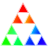

### FLAM3H icons set

Following are all the icons that have been crafted and included into FLAM3H for easy find and review. 
It is an ongoing effort and they have been regularly updated and improved even tho this last set seem to be working well with different Houdini UI scales and color schemes.

  

FLAM3H_DOC_icon.svg

.

  

FLAM3H_DOC_tag.svg

.

  

FLAM3H_iconSVG.svg (unused)

.

  

icon_bitbucketLogoSVG.svg

.

  

icon_cvex_compileSVG.svg

.

  

icon_DocSVG.svg (unused)

.

  

icon_F_docStarSVG.svg

.

  

icon_FrameBlueSVG.svg

.

  

icon_FrameRedSVG.svg

.

  

icon_geo_reloadSVG.svg

.

  

icon_optionCPSVG.svg

.

  

icon_optionDisabledSVG.svg

.

  

icon_optionDisabledZeroIterSVG.svg

.

  

icon_optionEnabledSVG.svg

.

  

icon_optionF3CDisabledSVG.svg

.

  

icon_optionF3CEnabledSVG.svg

.

  

icon_optionFFDisabledSVG.svg

.

  

icon_optionFFEnabledSVG.svg

.

  

icon_optionFlameINEntrieSVG.svg

.

  

icon_optionFlameOUTEntrieSVG.svg

.

  

icon_optionPRIDEDisabledSVG.svg

.

  

icon_optionRIPDisabledSVG.svg

.

  

icon_optionRIPEnabledSVG.svg

.

  

icon_optionStarBlueKwargsSVG.svg

.

  

icon_optionStarBlueSVG.svg

.

  

icon_optionStarOrangeSVG.svg

.

  

icon_optionStarRedHighSVG.svg

.

  

icon_optionStarRedSVG.svg (unused)

.

  

icon_optionStarWhiteKwargsSVG.svg

.

  

icon_optionStarWhitePBHSVG.svg

.

  

icon_optionStarWhitePBSVG.svg

.

  

icon_optionStarWhiteSVG.svg

.

  

icon_optionStarYellowOrangeSVG.svg

.

  

icon_optionStarYellowSVG.svg (unused)

.

  

icon_TagOBlueSVG_disabled.svg

.

  

icon_TagOBlueSVG.svg

.

  

icon_TagORedSVG_disabled.svg

.

  

icon_TagORedSVG.svg

.

  

icon_TagOSVG.svg

.

  

icon_youtube_red_play.svg

.

  

iconGithub.svg

.

  

iconGithubWhiteSVG.svg

.

  

iconInstagramSVG.svg

.

  

iconPrideSVG.svg (unused)

.

  

iconSierpinskyDefSVG.svg

.

  

iconStarSwapCyanSVG.svg

.

  

iconStarSwapRedCopyPasteEntrieFFSVG.svg

.

  

iconStarSwapRedCopyPasteEntrieSVG.svg

.

  

iconStarSwapRedCopyPasteFFSVG.svg

.

  

iconStarSwapRedCopyPasteInfosSVG.svg

.

  

iconStarSwapRedCopyPasteSVG.svg

.

  

iconStarSwapRedCopyPasteZeroWSVG.svg

.

  

iconStarSwapRedSVG.svg

.

  

iconSVG.svg

.

  

iconWhiteStarSVG.svg

.

  

iconWhiteSVG_disabled.svg

.

  

iconWhiteSVG.svg

.

