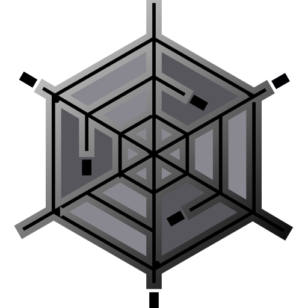

```python
#   Title:      FLAM3H™USD. Render FLAM3H™ fractal Flame in Solaris using Karma: UI ICON MAP
#   Author:     F stands for liFe ( made in Italy )
#   date:       September 2025, Last revised June 2026
#   License:    GPL, CC BY-SA 4.0
#   Copyright:  (c) 2023 F stands for liFe
#
#   Name:       F3HUSD_UI_ICON
#
#   Comment:    List of all the UI parameters with ICONS associated with
#               and the command string they are called from and from where.
#
#               THIS IS ONLY INFORMATIVE AND FOR EASY FIND INSTEAD OF
#               NAVIGATING THE PARAMETERS INSIDE THE OTL TYPE PROPERTIES WINDOW.
```

</br>
</br>

# FLAM3H™USD -> UI_ICON_map

- ### Houdini versions:  `H19 to H21 UP`
- ### Contents
    - _List of all the UI parameters with ICONS associated with and the command string they are called from and from where_.

- #### THIS FILE IS ONLY INFORMATIVE and part of the Documentations

</br>
</br>

- #### Quick links

    - **FLAM3H™USD** [**PY_PARM_map H19 to H20**](F3HUSD_PY_PARM_H19_to_H20.md)
    - **FLAM3H™USD** [**PY_PARM_map H20.5 to H21 UP**](F3HUSD_PY_PARM_H205_to_H21_UP.md)

    </br>

    - **FLAM3H™** [**UI_ICON_map H19.0 to H20.0**](F3H_UI_ICON_H19_to_H20.md)
    - **FLAM3H™** [**UI_ICON_map H20.5 to H21.0 UP**](F3H_UI_ICON_H205_to_H21_UP.md)
    - **FLAM3H™** [**PY_PARM_map H19.0 to H20.0**](F3H_PY_PARM_H19_to_H20.md)
    - **FLAM3H™** [**PY_PARM_map H20.5 to H21.0 UP**](F3H_PY_PARM_H205_to_H21_UP.md)

    </br>

    - [**FULL ICON set**](../icons/README.md)

</br>
</br>
</br>
</br>

# Contents

<br>

_FLAM3H™USD system utilities._

</br>

| Tab | Parameter name | Houdini version |
|:---|:---|---:|
| **SYS** | `sys_help` | `from H19` |

###  Button icon
<p align="left"></p>

```
opdef:/alexnardini::Lop/FLAM3HUSD?icon_F_docStarSVG.svg
```

</br>
</br>
</br>

| Tab | Parameter name | Houdini version |
|:---|:---|---:|
| **SYS** | `sys_reframe` | `from H19` |

###  Button icon
<p align="left"></p>

```
opdef:/alexnardini::Lop/FLAM3HUSD?icon_FrameRedSVG.svg
```

</br>
</br>
</br>

| Tab | Parameter name | Houdini version |
|:---|:---|---:|
| **SYS** | `flam3hpath` | `from H19` |

###  Action Button icon 
<p align="left"></p>

```
opdef:/alexnardini::Lop/FLAM3HUSD?icon_optionFlameINEntrieSVG.svg
```

</br>
</br>
</br>
</br>
</br>
</br>
</br>
</br>
</br>
</br>


_Here you will play with the main settings of FLAM3HUSD._

</br>

| Tab | Parameter name | Houdini version |
|:---|:---|---:|
| **PREFS** | `icon_error` | `from H19` |

###  Button icon
<p align="left"></p>

```
opdef:/alexnardini::Lop/FLAM3HUSD?icon_optionStarWarningSVG.svg
```

</br>
</br>
</br>

| Tab | Parameter name | Houdini version |
|:---|:---|---:|
| **PREFS** | `icon_tip` | `from H19` |

###  Button icon
<p align="left"></p>

```
opdef:/alexnardini::Lop/FLAM3HUSD?icon_optionStarBlueSVG.svg
```

</br>
</br>
</br>

| Tab | Parameter name | Houdini version |
|:---|:---|---:|
| **PREFS** | `rndtype` | `from H19` |

###  Action Button icon 
<p align="left"></p>

```
opdef:/alexnardini::Lop/FLAM3HUSD?icon_rendererMenuSVG.svg
```

</br>
</br>
</br>

| Tab | Parameter name | Houdini version |
|:---|:---|---:|
| **PREFS** | `vptype` | `from H19` |

###  Menu icons
<p align="left"></p>
Token: 0

```
![opdef:/alexnardini::Sop/FLAM3H?icon_optionStarWhiteSVG.svg]Points                          
```

</br>
</br>
</br>

| Tab | Parameter name | Houdini version |
|:---|:---|---:|
| **PREFS** | `vpptsize` | `from H19` |

###  Action Button icon 
<p align="left"></p>

```
opdef:/alexnardini::Lop/FLAM3HUSD?icon_optionStarWhiteSVG.svg
```

</br>
</br>
</br>

| Tab | Parameter name | Houdini version |
|:---|:---|---:|
| **PREFS** | `widths` | `from H19` |

###  Action Button icon 
<p align="left"></p>

```
opdef:/alexnardini::Lop/FLAM3HUSD?icon_optionStarWhiteSVG.svg
```

</br>
</br>
</br>

| Tab | Parameter name | Houdini version |
|:---|:---|---:|
| **PREFS** | `widths_xf_viz` | `from H19.5` |

###  Action Button icon 
<p align="left"></p>

```
opdef:/alexnardini::Lop/FLAM3HUSD?icon_optionStarWhiteSVG.svg
```

</br>
</br>
</br>


| Tab | Parameter name | Houdini version |
|:---|:---|---:|
| **PREFS** | `pxsamples_cpu` | `from H19` |

###  Action Button icon 
<p align="left"></p>

```
opdef:/alexnardini::Lop/FLAM3HUSD?icon_rendererKarmaPropertiesSVG.svg
```

</br>
</br>
</br>

| Tab | Parameter name | Houdini version |
|:---|:---|---:|
| **PREFS** | `pxsamples_xpu` | `from H21` |

###  Action Button icon 
<p align="left"></p>

```
opdef:/alexnardini::Lop/FLAM3HUSD?icon_rendererKarmaPropertiesSVG.svg
```

</br>
</br>
</br>

| Tab | Parameter name | Houdini version |
|:---|:---|---:|
| **PREFS** | `use_f3h_shader` | `from H19` |

###  Action Button icon 
<p align="left"></p>

```
opdef:/alexnardini::Lop/FLAM3HUSD?icon_rendererKarmaPropertiesSVG.svg
```

</br>
</br>
</br>
</br>
</br>
</br>
</br>
</br>
</br>
</br>


_Here you will find informations about FLAM3H™USD._

</br>

| Tab | Parameter name | Houdini version |
|:---|:---|---:|
| **PREFS** | `icon_about_error` | `from H19` |

###  Button icon
<p align="left"></p>

```
opdef:/alexnardini::Lop/FLAM3HUSD?icon_optionStarWarningToolSVG.svg
```

</br>
</br>
</br>

| Tab | Parameter name | Houdini version |
|:---|:---|---:|
| **PREFS** | `icon_about` | `from H19` |

###  Button icon
<p align="left"></p>

```
opdef:/alexnardini::Lop/FLAM3HUSD?icon_optionStarBlueToolSVG.svg
```

</br>
</br>
</br>

| Tab | Parameter name | Houdini version | FLAM3H™ version |
|:---|:---|---:|---:|
| **ABOUT** | `icon_f3h_links` | `from H19` | `v1.x` `v2.x` |

###  Button icon
<p align="left"></p>

```
opdef:/alexnardini::Lop/FLAM3HUSD?icon_optionStarBlueSVG.svg
```

</br>
</br>
</br>

| Tab | Parameter name | Houdini version | FLAM3H™ version |
|:---|:---|---:|---:|
| **ABOUT** | `flam3homepage` | `from H19` | `v1.x` `v2.x` |

###  Action Button icon 
<p align="left"></p>

```
opdef:/alexnardini::Lop/FLAM3HUSD?iconSVGB.svg
```

</br>
</br>
</br>

| Tab | Parameter name | Houdini version | FLAM3H™ version |
|:---|:---|---:|---:|
| **ABOUT** | `flam3github` | `from H19` | `v1.x` `v2.x` |

###  Action Button icon 
<p align="left"></p>

```
opdef:/alexnardini::Lop/FLAM3HUSD?icon_GithubBlackSVG.svg
```

</br>
</br>
</br>

| Tab | Parameter name | Houdini version | FLAM3H™ version |
|:---|:---|---:|---:|
| **ABOUT** | `flam3insta` | `from H19` | `v1.x` `v2.x` |

###  Action Button icon 
<p align="left"></p>

```
opdef:/alexnardini::Lop/FLAM3HUSD?icon_InstagramSVG.svg
```

</br>
</br>
</br>

| Tab | Parameter name | Houdini version | FLAM3H™ version |
|:---|:---|---:|---:|
| **ABOUT** | `flam3youtube` | `from H19` | `v1.x` `v2.x` |

###  Action Button icon 
<p align="left"></p>

```
opdef:/alexnardini::Lop/FLAM3HUSD?icon_youtube_red_play.svg
```

</br>
</br>
</br>

| Tab | Parameter name | Houdini version | FLAM3H™ version |
|:---|:---|---:|---:|
| **ABOUT** | `icon_f3_links` | `from H19` | `v1.x` `v2.x` |

###  Button icon
<p align="left"></p>

```
opdef:/alexnardini::Lop/FLAM3HUSD?icon_optionStarBlueSVG.svg
```

</br>
</br>
</br>

| Tab | Parameter name | Houdini version | FLAM3H™ version |
|:---|:---|---:|---:|
| **ABOUT** | `tffa_pdf` | `from H19` | `v1.x` `v2.x` |

###  Action Button icon 
<p align="left"></p>

```
opdef:/alexnardini::Lop/FLAM3HUSD?icon_WhiteSVG.svg
```

</br>
</br>
</br>

| Tab | Parameter name | Houdini version | FLAM3H™ version |
|:---|:---|---:|---:|
| **ABOUT** | `tffa_flam3github` | `from H19` | `v1.x` `v2.x` |

###  Action Button icon 
<p align="left"></p>

```
opdef:/alexnardini::Lop/FLAM3HUSD?icon_GithubWhiteSVG.svg
```

</br>
</br>
</br>

| Tab | Parameter name | Houdini version | FLAM3H™ version |
|:---|:---|---:|---:|
| **ABOUT** | `fract_git` | `from H19` | `v1.x` `v2.x` |

###  Action Button icon 
<p align="left"></p>

```
opdef:/alexnardini::Lop/FLAM3HUSD?icon_GithubBlueSVG.svg
```

</br>
</br>
</br>

| Tab | Parameter name | Houdini version | FLAM3H™ version |
|:---|:---|---:|---:|
| **ABOUT** | `fract_web` | `from H19` | `v1.x` `v2.x` |

###  Action Button icon 
<p align="left"></p>

```
opdef:/alexnardini::Lop/FLAM3HUSD?icon_FractoriumWebSVG.svg
```
