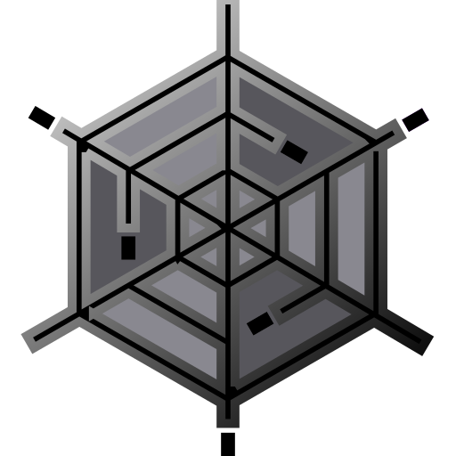

```python
#   Title:      FLAM3H™. SideFX Houdini FLAM3: UI ICON MAP
#   Author:     F stands for liFe ( made in Italy )
#   date:       September 2025, Last revised February 2026
#   License:    GPL, CC BY-SA 4.0
#   Copyright:  (c) 2021 F stands for liFe
#
#   Name:       FLAM3H__UI_ICON_MAP
#
#   Comment:    List of all the UI parameters with ICONS associated with
#               and the command string they are called from and from where.
#
#               THIS IS ONLY INFORMATIVE AND FOR EASY FIND INSTEAD OF
#               NAVIGATING THE PARAMETERS INSIDE THE OTL TYPE PROPERTIES WINDOW.
```
**Note**: _The project logo and the icon set are NOT covered by the **CC BY-SA 4.0** license_.</br>
_They remain Copyright of (c) 2021 F stands for liFe (and their other respective owners), and may not be redistributed without permission_.

- #### THIS FILE IS ONLY INFORMATIVE and part of the Documentations
- #### Houdini versions:  `H19 to H20`

</br>
</br>

#### Quick links

- **FLAM3H™** [**UI_PARM_map H19 to H20**](py_flam3__UI_PARM_map_H19_to_H20.md)
- **FLAM3H™** [**UI_PARM_map H20.5 to H21 UP**](py_flam3__UI_PARM_map_H205_to_H21_UP.md)
- **FLAM3H™** [**UI_ICON_map H20.5 to H21 UP**](FLAM3H__UI_ICON_map_H205_to_H21_UP.md)

</br>

- **FLAM3HUSD** [**UI_ICON_map**](FLAM3HUSD__UI_ICON_map.md)
- **FLAM3HUSD** [**UI_PARM_map H21 UP**](py_flam3usd__UI_PARM_map_H21_UP.md)
- **FLAM3HUSD** [**UI_PARM_map H19 to H20.5**](py_flam3usd__UI_PARM_map_H19_to_H205.md)

</br>

- [**FULL ICON set**](../icons/README.md)

</br>
</br>
</br>
</br>

# FLAM3H™ -> UI_ICON_map
- ### Contents
    - _List of all the UI parameters with ICONS associated with and the command string they are called from and from where_.

</br>
</br>
</br>
</br>

_Parameters to define the quality of the fractal Flame algorithm solution._

</br>

| Tab | Parameter name | Houdini version |
|:---|:---|---:|
| **GLOBAL** | `icon_iter_off` | `from H19 to H20` |

###  Button icon
<p align="left"></p>

```
opdef:/alexnardini::Sop/FLAM3H?icon_optionDisabledZeroIterSVG.svg
```

</br>
</br>
</br>

| Tab | Parameter name | Houdini version |
|:---|:---|---:|
| **GLOBAL** | `ptcount_presets_off` | `from H19 to H20` |

###  Menu icons
<p align="left"></p>

Token: 0
```
![opdef:/alexnardini::Sop/FLAM3H?icon_optionDisabledZeroIterSVG.svg]
```
Token: 1
```
![opdef:/alexnardini::Sop/FLAM3H?icon_optionDisabledZeroIterSVG.svg]1 Billion
```

</br>
</br>
</br>

| Tab | Parameter name | Houdini version |
|:---|:---|---:|
| **GLOBAL** | `icon_iter` | `from H19 to H20` |

###  Button icon
<p align="left"></p>

```
opdef:/alexnardini::Sop/FLAM3H?icon_optionStarBlueSVG.svg
```

</br>
</br>
</br>

| Tab | Parameter name | Houdini version |
|:---|:---|---:|
| **GLOBAL** | `ptcount_presets` | `from H19 to H20` |

###  Menu icons
This menu icon set is built on demand from the py_flam3__x_x.py HDA python module (_where x_x is the python module version_).
```python
menu = kwargs['node'].hdaModule().flam3.flam3h_iterator_utils(kwargs).menu_global_density()
return menu
```

</br>
</br>

The pre-built icons menu python lists being used:

</br>
</br>

<p align="left">


</p>

```python
MENU_DENSITY: list = [-1, '', 1, '![opdef:/alexnardini::Sop/FLAM3H?icon_optionStarWhiteSVG.svg]...', 2, '![opdef:/alexnardini::Sop/FLAM3H?icon_StarSwapCyanSmallSVG.svg]1M', 3, '![opdef:/alexnardini::Sop/FLAM3H?icon_StarSwapCyanSmallSVG.svg]2M', 4, '![opdef:/alexnardini::Sop/FLAM3H?icon_StarSwapCyanSmallSVG.svg]5M', 5, '![opdef:/alexnardini::Sop/FLAM3H?icon_StarSwapCyanSmallSVG.svg]15M', 6, '![opdef:/alexnardini::Sop/FLAM3H?icon_optionEnabledMidSVG.svg]25M', 7, '![opdef:/alexnardini::Sop/FLAM3H?icon_optionEnabledMidSVG.svg]50M', 8, '![opdef:/alexnardini::Sop/FLAM3H?icon_optionEnabledMidSVG.svg]100M', 9, '![opdef:/alexnardini::Sop/FLAM3H?icon_optionEnabledMidSVG.svg]150M', 10, '![opdef:/alexnardini::Sop/FLAM3H?icon_optionEnabledMidSVG.svg]250M', 11, '![opdef:/alexnardini::Sop/FLAM3H?icon_optionStarRedHighSVG.svg]500M', 12, '![opdef:/alexnardini::Sop/FLAM3H?icon_optionStarRedHighSVG.svg]750M', 13, '![opdef:/alexnardini::Sop/FLAM3H?icon_optionStarRedHighSVG.svg]1 Billion', 14, '']
```

</br>
</br>

<p align="left">


</p>

```python
MENU_DENSITY_XFVIZ_OFF: list = [-1, '', 1, '![opdef:/alexnardini::Sop/FLAM3H?icon_optionStarWhiteXFVIZOFFSVG.svg]...', 2, '![opdef:/alexnardini::Sop/FLAM3H?icon_StarSwapCyanSmallXFVIZOFFSVG.svg]1M', 3, '![opdef:/alexnardini::Sop/FLAM3H?icon_StarSwapCyanSmallXFVIZOFFSVG.svg]2M', 4, '![opdef:/alexnardini::Sop/FLAM3H?icon_StarSwapCyanSmallXFVIZOFFSVG.svg]5M', 5, '![opdef:/alexnardini::Sop/FLAM3H?icon_StarSwapCyanSmallSVG.svg]15M', 6, '![opdef:/alexnardini::Sop/FLAM3H?icon_optionEnabledMidSVG.svg]25M', 7, '![opdef:/alexnardini::Sop/FLAM3H?icon_optionEnabledMidSVG.svg]50M', 8, '![opdef:/alexnardini::Sop/FLAM3H?icon_optionEnabledMidSVG.svg]100M', 9, '![opdef:/alexnardini::Sop/FLAM3H?icon_optionEnabledMidSVG.svg]150M', 10, '![opdef:/alexnardini::Sop/FLAM3H?icon_optionEnabledMidSVG.svg]250M', 11, '![opdef:/alexnardini::Sop/FLAM3H?icon_optionStarRedHighSVG.svg]500M', 12, '![opdef:/alexnardini::Sop/FLAM3H?icon_optionStarRedHighSVG.svg]750M', 13, '![opdef:/alexnardini::Sop/FLAM3H?icon_optionStarRedHighSVG.svg]1 Billion', 14, '']
```

</br>
</br>

<p align="left">


</p>

```python
MENU_DENSITY_XFVIZ_ON: list = [-1, '', 1, '![opdef:/alexnardini::Sop/FLAM3H?icon_optionStarWhiteXFVIZSVG.svg]...', 2, '![opdef:/alexnardini::Sop/FLAM3H?icon_StarSwapCyanSmallXFVIZSVG.svg]1M', 3, '![opdef:/alexnardini::Sop/FLAM3H?icon_StarSwapCyanSmallXFVIZSVG.svg]2M', 4, '![opdef:/alexnardini::Sop/FLAM3H?icon_StarSwapCyanSmallXFVIZSVG.svg]5M', 5, '![opdef:/alexnardini::Sop/FLAM3H?icon_StarSwapCyanSmallSVG.svg]15M', 6, '![opdef:/alexnardini::Sop/FLAM3H?icon_optionEnabledMidSVG.svg]25M', 7, '![opdef:/alexnardini::Sop/FLAM3H?icon_optionEnabledMidSVG.svg]50M', 8, '![opdef:/alexnardini::Sop/FLAM3H?icon_optionEnabledMidSVG.svg]100M', 9, '![opdef:/alexnardini::Sop/FLAM3H?icon_optionEnabledMidSVG.svg]150M', 10, '![opdef:/alexnardini::Sop/FLAM3H?icon_optionEnabledMidSVG.svg]250M', 11, '![opdef:/alexnardini::Sop/FLAM3H?icon_optionStarRedHighSVG.svg]500M', 12, '![opdef:/alexnardini::Sop/FLAM3H?icon_optionStarRedHighSVG.svg]750M', 13, '![opdef:/alexnardini::Sop/FLAM3H?icon_optionStarRedHighSVG.svg]1 Billion', 14, '']
```

</br>
</br>

<p align="left">


</p>

```python
MENU_DENSITY_XFVIZ_ON_SOLO: list = [-1, '', 1, '![opdef:/alexnardini::Sop/FLAM3H?icon_optionStarWhiteXFVIZSOLOSVG.svg]...', 2, '![opdef:/alexnardini::Sop/FLAM3H?icon_StarSwapCyanSmallXFVIZSOLOSVG.svg]1M', 3, '![opdef:/alexnardini::Sop/FLAM3H?icon_StarSwapCyanSmallXFVIZSOLOSVG.svg]2M', 4, '![opdef:/alexnardini::Sop/FLAM3H?icon_StarSwapCyanSmallXFVIZSOLOSVG.svg]5M', 5, '![opdef:/alexnardini::Sop/FLAM3H?icon_StarSwapCyanSmallSVG.svg]15M', 6, '![opdef:/alexnardini::Sop/FLAM3H?icon_optionEnabledMidSVG.svg]25M', 7, '![opdef:/alexnardini::Sop/FLAM3H?icon_optionEnabledMidSVG.svg]50M', 8, '![opdef:/alexnardini::Sop/FLAM3H?icon_optionEnabledMidSVG.svg]100M', 9, '![opdef:/alexnardini::Sop/FLAM3H?icon_optionEnabledMidSVG.svg]150M', 10, '![opdef:/alexnardini::Sop/FLAM3H?icon_optionEnabledMidSVG.svg]250M', 11, '![opdef:/alexnardini::Sop/FLAM3H?icon_optionStarRedHighSVG.svg]500M', 12, '![opdef:/alexnardini::Sop/FLAM3H?icon_optionStarRedHighSVG.svg]750M', 13, '![opdef:/alexnardini::Sop/FLAM3H?icon_optionStarRedHighSVG.svg]1 Billion', 14, '']
```

</br>
</br>

###  Action Button icon 
<p align="left"></p>

```
opdef:/alexnardini::Sop/FLAM3H?icon_optionStarWhiteSVG.svg
```

</br>
</br>
</br>
</br>
</br>
</br>
</br>
</br>
</br>
</br>

_Tools available to enhance and speed up the workflow.<br>
I keep changing and adding functionalities, it is still a work in progress, but thus far, this most recent configuration has been successful._

</br>

| Tab | Parameter name | Houdini version |
|:---|:---|---:|
| **SYS** | `sys_help` | `from H19 to H20` |

###  Button icon
<p align="left"></p>

```
opdef:/alexnardini::Sop/FLAM3H?icon_F_docStarSVG.svg
```

</br>
</br>
</br>

| Tab | Parameter name | Houdini version |
|:---|:---|---:|
| **SYS** | `iterlist` | `from H19 to H20` |

###  Menu icons
This menu icon set is built on demand from the py_flam3__x_x.py HDA python module (_where x_x is the python module version_).
```python
menu = kwargs['node'].hdaModule().flam3.flam3h_iterator_utils(kwargs).menu_select_iterator()
return menu
```
</br>
</br>

The pre-built icons menu python lists being used:

</br>
</br>

<p align="left">


</p>

```python
SEL_ITER_BOOKMARK_ACTIVE_AND_WEIGHT: tuple[tuple[str, str], tuple[str, str]] = ((FLAM3H_ICON_STAR_FLAME_ITER_ACTV, FLAM3H_ICON_COPY_PASTE), (FLAM3H_ICON_STAR_FLAME_ITER_ACTV_XFVIZ, FLAM3H_ICON_COPY_PASTE_XFVIZ))
```
FLAM3H_ICON_STAR_FLAME_ITER_ACTV
```python
'![opdef:/alexnardini::Sop/FLAM3H?icon_optionStarYellowOrangeSVG.svg]'
```
FLAM3H_ICON_COPY_PASTE
```python
'![opdef:/alexnardini::Sop/FLAM3H?icon_StarSwapRedCopyPasteSVG.svg]'
```
FLAM3H_ICON_STAR_FLAME_ITER_ACTV_XFVIZ
```python
'![opdef:/alexnardini::Sop/FLAM3H?icon_optionStarYellowOrange_xfVizSVG.svg]'
```
FLAM3H_ICON_COPY_PASTE_XFVIZ
```python
'![opdef:/alexnardini::Sop/FLAM3H?icon_StarSwapRedCopyPaste_xfVizSVG.svg]'
```

</br>
</br>

<p align="left">


</p>

```python
SEL_ITER_BOOKMARK_ACTIVE_AND_WEIGHT_ZERO: tuple[tuple[str, str], tuple[str, str]] = ((FLAM3H_ICON_STAR_EMPTY_OPACITY, FLAM3H_ICON_COPY_PASTE_ENTRIE_ZERO), (FLAM3H_ICON_STAR_EMPTY_OPACITY_XFVIZ, FLAM3H_ICON_COPY_PASTE_ENTRIE_ZERO_XFVIZ))
```
FLAM3H_ICON_STAR_EMPTY_OPACITY
```python
'![opdef:/alexnardini::Sop/FLAM3H?icon_optionDisabledZeroIterSVG.svg]'
```
FLAM3H_ICON_COPY_PASTE_ENTRIE_ZERO
```python
'![opdef:/alexnardini::Sop/FLAM3H?icon_StarSwapRedCopyPasteZeroWSVG.svg]'
```
FLAM3H_ICON_STAR_EMPTY_OPACITY_XFVIZ
```python
'![opdef:/alexnardini::Sop/FLAM3H?icon_optionDisabledZeroIter_xfVizSVG.svg]'
```
FLAM3H_ICON_COPY_PASTE_ENTRIE_ZERO_XFVIZ
```python
'![opdef:/alexnardini::Sop/FLAM3H?icon_StarSwapRedCopyPasteZeroW_xfVizSVG.svg]'
```

</br>
</br>

<p align="left">


</p>

```python
SEL_ITER_BOOKMARK_OFF: tuple[tuple[str, str], tuple[str, str]] = ((FLAM3H_ICON_STAR_EMPTY, FLAM3H_ICON_COPY_PASTE_ENTRIE_ITER_OFF_MARKED), (FLAM3H_ICON_STAR_EMPTY_XFVIZ, FLAM3H_ICON_COPY_PASTE_ENTRIE_ITER_OFF_MARKED_XFVIZ))
```
FLAM3H_ICON_STAR_EMPTY
```python
'![opdef:/alexnardini::Sop/FLAM3H?icon_optionDisabledSVG.svg]'
```
FLAM3H_ICON_COPY_PASTE_ENTRIE_ITER_OFF_MARKED
```python
'![opdef:/alexnardini::Sop/FLAM3H?icon_optionDisabledSelIterSVG.svg]'
```
FLAM3H_ICON_STAR_EMPTY_XFVIZ
```python
'![opdef:/alexnardini::Sop/FLAM3H?icon_optionDisabled_xfVizSVG.svg]'
```
FLAM3H_ICON_COPY_PASTE_ENTRIE_ITER_OFF_MARKED_XFVIZ
```python
'![opdef:/alexnardini::Sop/FLAM3H?icon_optionDisabledSelIter_xfVizSVG.svg]'
```

</br>
</br>

<p align="left"></p>

```python
MENU_ZERO_ITERATORS: list = [0, "![opdef:/alexnardini::Sop/FLAM3H?icon_optionStarBlueSVG.svg]  ZERO ITERATORS\n -> Please, create at least one iterator or load an IN flame file first.", 1, ""]
```

</br>
</br>
</br>

| Tab | Parameter name | Houdini version |
|:---|:---|---:|
| **SYS** | `doff_no_iterators` | `from H19 to H20` |

###  Button icon
<p align="left"></p>

```
opdef:/alexnardini::Sop/FLAM3H?icon_optionDisabledZeroIterSVG.svg
```

</br>
</br>
</br>

| Tab | Parameter name | Houdini version |
|:---|:---|---:|
| **SYS** | `doff_sysdisabled` | `from H19 to H20` |

###  Button icon
<p align="left"></p>

```
opdef:/alexnardini::Sop/FLAM3H?icon_optionFFDisabledSVG.svg
```

</br>
</br>
</br>

| Tab | Parameter name | Houdini version |
|:---|:---|---:|
| **SYS** | `doff_sysenabled` | `from H19 to H20` |

###  Button icon
<p align="left"></p>

```
opdef:/alexnardini::Sop/FLAM3H?icon_optionFFEnabledSVG.svg
```

</br>
</br>
</br>

| Tab | Parameter name | Houdini version |
|:---|:---|---:|
| **SYS** | `rip_no_iterators` | `from H19 to H20` |

###  Button icon
<p align="left"></p>

```
opdef:/alexnardini::Sop/FLAM3H?icon_optionDisabledZeroIterSVG.svg
```

</br>
</br>
</br>

| Tab | Parameter name | Houdini version |
|:---|:---|---:|
| **SYS** | `rip_disabled` | `from H19 to H20` |

###  Button icon
<p align="left"></p>

```
opdef:/alexnardini::Sop/FLAM3H?icon_optionRIPDisabledSVG.svg
```

</br>
</br>
</br>

| Tab | Parameter name | Houdini version |
|:---|:---|---:|
| **SYS** | `rip_enabled` | `from H19 to H20` |

###  Button icon
<p align="left"></p>

```
opdef:/alexnardini::Sop/FLAM3H?icon_optionRIPEnabledSVG.svg
```

</br>
</br>
</br>

| Tab | Parameter name | Houdini version |
|:---|:---|---:|
| **SYS** | `f3c_no_iterators` | `from H19 to H20` |

###  Button icon
<p align="left"></p>

```
opdef:/alexnardini::Sop/FLAM3H?icon_optionDisabledZeroIterSVG.svg
```

</br>
</br>
</br>

| Tab | Parameter name | Houdini version |
|:---|:---|---:|
| **SYS** | `f3c_chaotica` | `from H19 to H20` |

###  Button icon
<p align="left"></p>

```
opdef:/alexnardini::Sop/FLAM3H?icon_optionF3CDisabledSVG.svg
```

</br>
</br>
</br>

| Tab | Parameter name | Houdini version |
|:---|:---|---:|
| **SYS** | `f3c_apophysis` | `from H19 to H20` |

###  Button icon
<p align="left"></p>

```
opdef:/alexnardini::Sop/FLAM3H?icon_optionF3CEnabledSVG.svg
```

</br>
</br>
</br>

| Tab | Parameter name | Houdini version |
|:---|:---|---:|
| **SYS** | `xfviz_no_iterators` | `from H19 to H20` |

###  Button icon
<p align="left"></p>

```
opdef:/alexnardini::Sop/FLAM3H?icon_optionDisabledZeroIterSVG.svg
```

</br>
</br>
</br>

| Tab | Parameter name | Houdini version |
|:---|:---|---:|
| **SYS** | `xfviz_off` | `from H19 to H20` |

###  Button icon
<p align="left"></p>

```
opdef:/alexnardini::Sop/FLAM3H?icon_xfHandlesDisabledSVG.svg
```

</br>
</br>
</br>

| Tab | Parameter name | Houdini version |
|:---|:---|---:|
| **SYS** | `xfviz_on` | `from H19 to H20` |

###  Button icon
<p align="left"></p>

```
opdef:/alexnardini::Sop/FLAM3H?icon_xfHandlesEnabledSVG.svg
```

</br>
</br>
</br>

| Tab | Parameter name | Houdini version |
|:---|:---|---:|
| **SYS** | `xfviz_on_solo` | `from H19 to H20` |

###  Button icon
<p align="left"></p>

```
opdef:/alexnardini::Sop/FLAM3H?icon_xfHandlesEnabledMPIDXSVG.svg
```

</br>
</br>
</br>

| Tab | Parameter name | Houdini version |
|:---|:---|---:|
| **SYS** | `xfvizff_on_solo` | `from H19 to H20` |

###  Button icon
<p align="left"></p>

```
opdef:/alexnardini::Sop/FLAM3H?icon_ffHandlesEnabledSVG.svg
```

</br>
</br>
</br>

| Tab | Parameter name | Houdini version |
|:---|:---|---:|
| **SYS** | `sys_out_sensorviz` | `from H19 to H20` |

###  Button icon
<p align="left"></p>

```
opdef:/alexnardini::Sop/FLAM3H?icon_TagORedSVG.svg
```

</br>
</br>
</br>

| Tab | Parameter name | Houdini version |
|:---|:---|---:|
| **SYS** | `sys_out_sensorviz_off` | `from H19 to H20` |

###  Button icon
<p align="left"></p>

```
opdef:/alexnardini::Sop/FLAM3H?icon_TagORedOffSVG.svg
```

</br>
</br>
</br>

| Tab | Parameter name | Houdini version |
|:---|:---|---:|
| **SYS** | `sys_tag_disabled` | `from H19 to H20` |

###  Button icon
<p align="left"></p>

```
opdef:/alexnardini::Sop/FLAM3H?icon_optionDisabledZeroIterSVG.svg
```

</br>
</br>
</br>

| Tab | Parameter name | Houdini version |
|:---|:---|---:|
| **SYS** | `sys_tag_off` | `from H19 to H20` |

###  Button icon
<p align="left"></p>

```
opdef:/alexnardini::Sop/FLAM3H?icon_TagOBlueSVG_disabled.svg
```

</br>
</br>
</br>

| Tab | Parameter name | Houdini version |
|:---|:---|---:|
| **SYS** | `sys_tag` | `from H19 to H20` |

###  Button icon
<p align="left"></p>

```
opdef:/alexnardini::Sop/FLAM3H?icon_TagOBlueSVG.svg
```

</br>
</br>
</br>

| Tab | Parameter name | Houdini version |
|:---|:---|---:|
| **SYS** | `tagsize` | `from H19 to H20` |

###  Menu icons
<p align="left"></p>
Token: 0

```
![opdef:/alexnardini::Sop/FLAM3H?icon_TagOBlueMenuSmallSVG.svg] sml
```
<p align="left"></p>
Token: 1

```
![opdef:/alexnardini::Sop/FLAM3H?icon_TagOBlueMenuMidSVG.svg] Mid
```
<p align="left"></p>
Token: 2

```
![opdef:/alexnardini::Sop/FLAM3H?icon_TagOBlueMenuBigSVG.svg] BIG
```

</br>
</br>
</br>

| Tab | Parameter name | Houdini version |
|:---|:---|---:|
| **SYS** | `loaddef` | `from H19 to H20` |

###  Button icon
<p align="left"></p>

```
opdef:/alexnardini::Sop/FLAM3H?icon_SierpinskyDefSVG.svg
```

</br>
</br>
</br>

| Tab | Parameter name | Houdini version |
|:---|:---|---:|
| **SYS** | `frameview` | `from H19 to H20` |

###  Button icon
<p align="left"></p>

```
opdef:/alexnardini::Sop/FLAM3H?icon_FrameBlueSVG.svg
```

</br>
</br>
</br>

| Tab | Parameter name | Houdini version |
|:---|:---|---:|
| **SYS** | `frameviewsensor` | `from H19 to H20` |

###  Button icon
<p align="left"></p>

```
opdef:/alexnardini::Sop/FLAM3H?icon_FrameRedSVG.svg
```

</br>
</br>
</br>

| Tab | Parameter name | Houdini version |
|:---|:---|---:|
| **SYS** | `sys_palettepresets_disabled` | `from H19 to H20` |

###  Action Button icon 
<p align="left"></p>

```
opdef:/alexnardini::Sop/FLAM3H?icon_optionDisabledZeroIterSVG.svg
```

</br>
</br>
</br>

| Tab | Parameter name | Houdini version |
|:---|:---|---:|
| **SYS** | `sys_palettepresets_off` | `from H19 to H20` |

###  Menu icons
This menu icon set is built on demand from the py_flam3__x_x.py HDA python module (_where x_x is the python module version_).
```python
menu = kwargs['node'].hdaModule().flam3.flam3h_palette_utils(kwargs).menu_cp_presets_empty()
return menu
```
Menu entries icon:</br>
_The following are icons being used on demand based on the menu python script needs._
<p align="left"></p>

```python
'![opdef:/alexnardini::Sop/FLAM3H?icon_optionPRIDEDisabledSVG.svg]'
```

</br>
</br>

The pre-built icons menu python lists being used:

</br>
</br>

<p align="left">
</p>

```python
MENU_PRESETS_EMPTY: list = [-1, '![opdef:/alexnardini::Sop/FLAM3H?icon_optionDisabledZeroIterSVG.svg]  Empty     ']
```

</br>
</br>

<p align="left">
</p>

```python
MENU_PRESETS_SAVEONE: list = [-1, '![opdef:/alexnardini::Sop/FLAM3H?icon_optionStarBlueSVG.svg]  Save to create this file     ']
```

</br>
</br>

<p align="left">
</p>

```python
MENU_PRESETS_INVALID: list = [-1, '![opdef:/alexnardini::Sop/FLAM3H?icon_optionStarWarningSVG.svg]  Invalid file path     ']
```

</br>
</br>

###  Action Button icon 
<p align="left"></p>

```
opdef:/alexnardini::Sop/FLAM3H?icon_optionPRIDEDisabledSVG.svg
```

</br>
</br>
</br>

| Tab | Parameter name | Houdini version |
|:---|:---|---:|
| **SYS** | `sys_palettepresets` | `from H19 to H20` |

###  Menu icons
This menu icon set is built on demand from the py_flam3__x_x.py HDA python module (_where x_x is the python module version_).
```python
menu = kwargs['node'].hdaModule().flam3.flam3h_palette_utils(kwargs).menu_cp_presets()
return menu
```
Menu entries icon:</br>
_The following are icons being used on demand based on the menu python script needs._
<p align="left"></p>

```python
'![opdef:/alexnardini::Sop/FLAM3H?icon_optionCPSVG.svg]'
```

</br>
</br>

###  Action Button icon 
<p align="left"></p>

```
opdef:/alexnardini::Sop/FLAM3H?icon_optionCPSVG.svg
```

</br>
</br>
</br>

| Tab | Parameter name | Houdini version |
|:---|:---|---:|
| **SYS** | `sys_inpresets_disabled` | `from H19 to H20` |

###  Menu icons
This menu icon set is built on demand from the py_flam3__x_x.py HDA python module (_where x_x is the python module version_).
```python
menu = kwargs['node'].hdaModule().flam3.in_flame_utils(kwargs).menu_in_presets_empty()
return menu
```
Menu entries icon:</br>
_The following are icons being used on demand based on the menu python script needs._
<p align="left"></p>

```python
'![opdef:/alexnardini::Sop/FLAM3H?icon_WhiteSVG_disabled.svg]'
```

</br>
</br>

The pre-built icons menu python lists being used:

</br>
</br>

<p align="left">
</p>

```python
MENU_PRESETS_EMPTY: list = [-1, '![opdef:/alexnardini::Sop/FLAM3H?icon_optionDisabledZeroIterSVG.svg]  Empty     ']
```

</br>
</br>

<p align="left">
</p>

```python
MENU_ZERO_ITERATORS_PRESETS_INVALID: list = [-1, '![opdef:/alexnardini::Sop/FLAM3H?icon_optionStarWarningSVG.svg]  ZERO ITERATORS\n -> Invalid file path. Please, create at least one iterator or load a valid IN flame file first.']
```

```python
MENU_PRESETS_INVALID: list = [-1, '![opdef:/alexnardini::Sop/FLAM3H?icon_optionStarWarningSVG.svg]  Invalid file path     ']
```

```python
MENU_PRESETS_INVALID_CB: list = [-1, '![opdef:/alexnardini::Sop/FLAM3H?icon_optionStarWarningSVG.svg]  [CLIPBOARD] Invalid file path     ']
```

</br>
</br>

<p align="left">
</p>

```python
MENU_IN_PRESETS_EMPTY_CB: list = [-1, '![opdef:/alexnardini::Sop/FLAM3H?icon_optionStarWhiteSVG.svg]  [CLIPBOARD]     ']
```

</br>
</br>

###  Action Button icon 
<p align="left"></p>

```
opdef:/alexnardini::Sop/FLAM3H?icon_WhiteSVG_disabled.svg
```

</br>
</br>
</br>

| Tab | Parameter name | Houdini version |
|:---|:---|---:|
| **SYS** | `sys_inpresets` | `from H19 to H20` |

###  Menu icons
This menu icon set is built on demand from the py_flam3__x_x.py HDA python module (_where x_x is the python module version_).
```python
menu = kwargs['node'].hdaModule().flam3.in_flame_utils(kwargs).menu_in_presets()
return menu
```
Menu entries icon:</br>
_The following are icons being used on demand based on the menu python script needs._
<p align="left"></p>

```python
'![opdef:/alexnardini::Sop/FLAM3H?icon_optionFlameINEntrieSVG.svg]'
```

<p align="left"></p>

```python
'![opdef:/alexnardini::Sop/FLAM3H?icon_optionStarWhiteSVG.svg]'
```

</br>
</br>

###  Action Button icon 
<p align="left"></p>

```
opdef:/alexnardini::Sop/FLAM3H?icon_WhiteSVG.svg
```

</br>
</br>
</br>

| Tab | Parameter name | Houdini version |
|:---|:---|---:|
| **SYS** | `sys_outpresets_disabled` | `from H19 to H20` |

###  Action Button icon 
<p align="left"></p>

```
opdef:/alexnardini::Sop/FLAM3H?icon_optionDisabledZeroIterSVG.svg
```

</br>
</br>
</br>

| Tab | Parameter name | Houdini version |
|:---|:---|---:|
| **SYS** | `sys_outpresets` | `from H19 to H20` |

###  Menu icons
This menu icon set is built on demand from the py_flam3__x_x.py HDA python module (_where x_x is the python module version_).
```python
menu = kwargs['node'].hdaModule().flam3.out_flame_utils(kwargs).menu_out_contents_presets()
return menu
```
Menu entries icon:</br>
_The following are icons being used on demand based on the menu python script needs._
<p align="left"></p>

```python
'![opdef:/alexnardini::Sop/FLAM3H?icon_optionFlameOUTEntrieSVG.svg]'
```

</br>
</br>

The pre-built icons menu python lists being used:


<p align="left">
</p>

```python
MENU_PRESETS_EMPTY: list = [-1, '![opdef:/alexnardini::Sop/FLAM3H?icon_optionDisabledZeroIterSVG.svg]  Empty     ']
```

</br>
</br>

<p align="left">
</p>

```python
MENU_PRESETS_SAVEONE: list = [-1, '![opdef:/alexnardini::Sop/FLAM3H?icon_optionStarBlueSVG.svg]  Save to create this file     ']
```

</br>
</br>

<p align="left">
</p>

```python
MENU_PRESETS_INVALID: list = [-1, '![opdef:/alexnardini::Sop/FLAM3H?icon_optionStarWarningSVG.svg]  Invalid file path     ']
```

</br>
</br>

###  Action Button icon 
<p align="left"></p>

```
opdef:/alexnardini::Sop/FLAM3H?icon_WhiteStarSVG.svg
```


</br>
</br>
</br>
</br>
</br>
</br>
</br>
</br>
</br>
</br>

_This is where you’ll spend the majority of your time, along with the FF Tab.<br>
Here you will create your fractal Flame logic.<br>Since every parameter has the same name inside, if you have ever used Apophysis, Fractorium, or other fractal Flame editors, you will almost immediately feel at home. The logic you will operate with will be the same._

</br>

| Tab | Parameter name | Houdini version |
|:---|:---|---:|
| **FLAME** | `prmpastesel_#` | `from H19 to H20` |

###  Menu icons
This menu icon set is built on demand from the py_flam3__x_x.py HDA python module (_where x_x is the python module version_).
```python
menu = kwargs['node'].hdaModule().flam3.flam3h_iterator_utils(kwargs).menu_copypaste()
return menu
```
Menu entries icon:</br>
_The following are icons being used on demand based on the menu python script needs._
<p align="left"></p>

```python
'![opdef:/alexnardini::Sop/FLAM3H?icon_StarSwapRedCopyPasteSVG.svg]'
```
<p align="left"></p>

```python
'![opdef:/alexnardini::Sop/FLAM3H?icon_StarSwapRedCopyPasteEntrieSVG.svg]'
```
<p align="left"></p>

```python
'![opdef:/alexnardini::Sop/FLAM3H?icon_StarSwapRedCopyPasteZeroWSVG.svg]'
```
<p align="left"></p>

```python
'![opdef:/alexnardini::Sop/FLAM3H?icon_optionStarBlueSVG.svg]'
```
</br>
</br>

The pre-built icons menu python lists being used:

</br>
</br>

<p align="left"></p>

```python
MENU_ITER_COPY_PASTE_DELETED_MARKED: list = [ 0, "![opdef:/alexnardini::Sop/FLAM3H?icon_optionStarWarningSVG.svg]  DELETED: Marked iterator's node has been deleted.\n-> Mark another iterator first.", 1, "" ]
```


```python
MENU_ITER_COPY_PASTE_REMOVED: list = [0, '![opdef:/alexnardini::Sop/FLAM3H?icon_optionStarWarningSVG.svg]  REMOVED: The marked iterator has been removed.\n-> Mark an existing iterator instead.', 1, '']
```

</br>
</br>

<p align="left"></p>

```python
MENU_ITER_COPY_PASTE_EMPTY: list = [0, '![opdef:/alexnardini::Sop/FLAM3H?icon_StarSwapRedCopyPasteSVG.svg]  Please, mark an iterator first.', 1, '']
```

</br>
</br>

###  Action Button icon 
<p align="left"></p>

```
opdef:/alexnardini::Sop/FLAM3H?icon_StarSwapRedCopyPasteSVG.svg
```

</br>
</br>
</br>

| Tab | Parameter name | Houdini version |
|:---|:---|---:|
| **FLAME** | `doiter_disabled_#` | `from H19 to H20` |

###  Button icon
<p align="left"></p>

```
opdef:/alexnardini::Sop/FLAM3H?icon_optionDisabledSVG.svg
```

</br>
</br>
</br>

| Tab | Parameter name | Houdini version |
|:---|:---|---:|
| **FLAME** | `doiter_#` | `from H19 to H20` |

###  Button icon
<p align="left"></p>

```
opdef:/alexnardini::Sop/FLAM3H?icon_optionStarYellowOrangeSVG.svg
```

</br>
</br>
</br>

| Tab | Parameter name | Houdini version |
|:---|:---|---:|
| **FLAME** | `xfviz_off_#` | `from H19 to H20` |

###  Button icon
<p align="left"></p>

```
opdef:/alexnardini::Sop/FLAM3H?icon_xfHandlesDisabledSVG.svg
```

</br>
</br>
</br>

| Tab | Parameter name | Houdini version |
|:---|:---|---:|
| **FLAME** | `xfviz_on_#` | `from H19 to H20` |

###  Button icon
<p align="left"></p>

```
opdef:/alexnardini::Sop/FLAM3H?icon_xfHandlesEnabledMPIDXSVG.svg
```

</br>
</br>
</br>

| Tab | Parameter name | Houdini version |
|:---|:---|---:|
| **FLAME** | `xaos_#` | `from H19 to H20` |

###  Action Button icon 
<p align="left"></p>

```
opdef:/alexnardini::Sop/FLAM3H?icon_optionStarBlueKwargsSVG.svg
```

</br>
</br>
</br>

| Tab | Parameter name | Houdini version |
|:---|:---|---:|
| **FLAME** | `preblurtype_#` | `from H19 to H20` |

###  Menu icons
This menu icon set is built on demand from the py_flam3__x_x.py HDA python module (_where x_x is the python module version_).
```python
menu = kwargs['node'].hdaModule().flam3.flam3h_iterator_utils(kwargs).menu_T_pb()
return menu
```
Menu entries icon:</br>
_The following are icons being used on demand based on the menu python script needs._
<p align="left"></p>

```python
'![opdef:/alexnardini::Sop/FLAM3H?icon_optionDisabledZeroIterSVG.svg]'
```
<p align="left"></p>

```python
'![opdef:/alexnardini::Sop/FLAM3H?icon_optionStarWhitePBSVG.svg]'
```

</br>
</br>
</br>

| Tab | Parameter name | Houdini version |
|:---|:---|---:|
| **FLAME** | `pre1type_#`, `pre2type_#`, `p1type_#` | `from H19 to H20` |

###  Menu icons
This menu icon set is built on demand from the py_flam3__x_x.py HDA python module (_where x_x is the python module version_).
```python
menu = kwargs['node'].hdaModule().flam3.flam3h_iterator_utils(kwargs).menu_T_PP()
return menu
```
Menu entries icon:</br>
_The following are icons being used on demand based on the menu python script needs._
<p align="left"></p>

```python
'![opdef:/alexnardini::Sop/FLAM3H?icon_optionDisabledZeroIterSVG.svg]'
```
<p align="left"></p>

```python
'![opdef:/alexnardini::Sop/FLAM3H?icon_optionStarWhitePBSVG.svg]'
```
<p align="left"></p>

```python
'![opdef:/alexnardini::Sop/FLAM3H?icon_optionStarWhitePBHSVG.svg]'
```

</br>
</br>
</br>

| Tab | Parameter name | Houdini version |
|:---|:---|---:|
| **FLAME** | `pre2weight_#` | `from H19 to H20` |

###  Action Button icon 
<p align="left"></p>

```
opdef:/alexnardini::Sop/FLAM3H?icon_optionStarWhiteKwargsSVG.svg
```

</br>
</br>
</br>

| Tab | Parameter name | Houdini version |
|:---|:---|---:|
| **FLAME** | `v1type_#`, `v2type_#`, `v3type_#`, `v4type_#` | `from H19 to H20` |

###  Menu icons
This menu icon set is built on demand from the py_flam3__x_x.py HDA python module (_where x_x is the python module version_).
```python
menu = kwargs['node'].hdaModule().flam3.flam3h_iterator_utils(kwargs).menu_T()
return menu
```
Menu entries icon:</br>
_The following are icons being used on demand based on the menu python script needs._
<p align="left"></p>

```python
'![opdef:/alexnardini::Sop/FLAM3H?icon_optionDisabledZeroIterSVG.svg]'
```
<p align="left"></p>

```python
'![opdef:/alexnardini::Sop/FLAM3H?icon_optionEnabledSVG.svg]'
```
<p align="left"></p>

```python
'![opdef:/alexnardini::Sop/FLAM3H?icon_StarSwapRedSVG.svg]'
```
<p align="left"></p>

```python
'![opdef:/alexnardini::Sop/FLAM3H?icon_StarSwapCyanSVG.svg]'
```

</br>
</br>
</br>

| Tab | Parameter name | Houdini version |
|:---|:---|---:|
| **FLAME** | `scl_#` | `from H19 to H20` |

###  Action Button icon 
<p align="left"></p>

```
opdef:/alexnardini::Sop/FLAM3H?icon_StarSwapRedCopyPasteAffineSVG.svg
```

</br>
</br>
</br>

| Tab | Parameter name | Houdini version |
|:---|:---|---:|
| **FLAME** | `ang_#` | `from H19 to H20` |

###  Action Button icon 
<p align="left"></p>

```
opdef:/alexnardini::Sop/FLAM3H?icon_optionStarWhiteKwargsSVG.svg
```

</br>
</br>
</br>

| Tab | Parameter name | Houdini version |
|:---|:---|---:|
| **FLAME** | `pscl_#` | `from H19 to H20` |

###  Action Button icon 
<p align="left"></p>

```
opdef:/alexnardini::Sop/FLAM3H?icon_StarSwapRedCopyPasteAffineSVG.svg
```

</br>
</br>
</br>

| Tab | Parameter name | Houdini version |
|:---|:---|---:|
| **FLAME** | `pang_#` | `from H19 to H20` |

###  Action Button icon 
<p align="left"></p>

```
opdef:/alexnardini::Sop/FLAM3H?icon_optionStarWhiteKwargsSVG.svg
```

</br>
</br>
</br>
</br>
</br>
</br>
</br>
</br>
</br>
</br>

_Iterators like Final Flame (FF) or finalXform function like camera lenses.<br>
It allows for a great deal of creative experimentation by taking the combined result of all the iterators inside the FLAME Tab and applying further modifications to that result._

</br>

| Tab | Parameter name | Houdini version |
|:---|:---|---:|
| **FF** | `doff_disabled` | `from H19 to H20` |

###  Button icon
<p align="left"></p>

```
opdef:/alexnardini::Sop/FLAM3H?icon_optionFFDisabledSVG.svg
```

</br>
</br>
</br>

| Tab | Parameter name | Houdini version |
|:---|:---|---:|
| **FF** | `doff_enabled` | `from H19 to H20` |

###  Button icon
<p align="left"></p>

```
opdef:/alexnardini::Sop/FLAM3H?icon_optionFFEnabledSVG.svg
```

</br>
</br>
</br>

| Tab | Parameter name | Houdini version |
|:---|:---|---:|
| **FF** | `xfvizff_off` | `from H19 to H20` |

###  Button icon
<p align="left"></p>

```
opdef:/alexnardini::Sop/FLAM3H?icon_xfHandlesDisabledSVG.svg
```

</br>
</br>
</br>

| Tab | Parameter name | Houdini version |
|:---|:---|---:|
| **FF** | `xfvizff_on` | `from H19 to H20` |

###  Button icon
<p align="left"></p>

```
opdef:/alexnardini::Sop/FLAM3H?icon_ffHandlesEnabledSVG.svg
```

</br>
</br>
</br>

| Tab | Parameter name | Houdini version |
|:---|:---|---:|
| **FF** | `ffprmpastesel` | `from H19 to H20` |

###  Menu icons
This menu icon set is built on demand from the py_flam3__x_x.py HDA python module (_where x_x is the python module version_).
```python
menu = kwargs['node'].hdaModule().flam3.flam3h_iterator_utils(kwargs).menu_copypaste_FF()
return menu
```
Menu entries icon:</br>
_The following are icons being used on demand based on the menu python script needs._
<p align="left"></p>

```python
'![opdef:/alexnardini::Sop/FLAM3H?icon_StarSwapRedCopyPasteFFSVG.svg]'
```
<p align="left"></p>

```python
'![opdef:/alexnardini::Sop/FLAM3H?icon_StarSwapRedCopyPasteEntrieFFSVG.svg]'
```
<p align="left"></p>

```python
'![opdef:/alexnardini::Sop/FLAM3H?icon_StarSwapRedCopyPasteEntrieFFOffSVG.svg]'
```

</br>
</br>

The pre-built icons menu python lists being used:

</br>
</br>

<p align="left"></p>

```python
MENU_FF_COPY_PASTE_EMPTY: list = [-1, '![opdef:/alexnardini::Sop/FLAM3H?icon_StarSwapRedCopyPasteFFSVG.svg]  Please, mark the FF first.', 0, '']
```

</br>
</br>

<p align="left"></p>

```python
MENU_FF_COPY_PASTE_SELECT: list = [0, '![opdef:/alexnardini::Sop/FLAM3H?icon_optionStarBlueSVG.svg]  FF: MARKED\n-> Select a different FLAM3H™ node to paste those FF values.', 1, '']
```

</br>
</br>

###  Action Button icon 
<p align="left"></p>

```
opdef:/alexnardini::Sop/FLAM3H?icon_StarSwapRedCopyPasteFFSVG.svg
```

</br>
</br>
</br>

| Tab | Parameter name | Houdini version |
|:---|:---|---:|
| **FF** | `ffpre1type`, `ffp1type`, `ffp2type` | `from H19 to H20` |

###  Menu icons
This menu icon set is built on demand from the py_flam3__x_x.py HDA python module (_where x_x is the python module version_).
```python
menu = kwargs['node'].hdaModule().flam3.flam3h_iterator_utils(kwargs).menu_T_PP(True)
return menu
```
Menu entries icon:</br>
_The following are icons being used on demand based on the menu python script needs._
<p align="left"></p>

```python
'![opdef:/alexnardini::Sop/FLAM3H?icon_optionDisabledZeroIterSVG.svg]'
```
<p align="left"></p>

```python
'![opdef:/alexnardini::Sop/FLAM3H?icon_optionStarWhitePBSVG.svg]'
```
<p align="left"></p>

```python
'![opdef:/alexnardini::Sop/FLAM3H?icon_optionStarWhitePBHSVG.svg]'
```

</br>
</br>
</br>

| Tab | Parameter name | Houdini version |
|:---|:---|---:|
| **FF** | `ffv1type`, `ffv2type` | `from H19 to H20` |

###  Menu icons
This menu icon set is built on demand from the py_flam3__x_x.py HDA python module (_where x_x is the python module version_).
```python
menu = kwargs['node'].hdaModule().flam3.flam3h_iterator_utils(kwargs).menu_T(True)
return menu
```
Menu entries icon:</br>
_The following are icons being used on demand based on the menu python script needs._
<p align="left"></p>

```python
'![opdef:/alexnardini::Sop/FLAM3H?icon_optionDisabledZeroIterSVG.svg]'
```
<p align="left"></p>

```python
'![opdef:/alexnardini::Sop/FLAM3H?icon_optionEnabledSVG.svg]'
```
<p align="left"></p>

```python
'![opdef:/alexnardini::Sop/FLAM3H?icon_StarSwapRedSVG.svg]'
```
<p align="left"></p>

```python
'![opdef:/alexnardini::Sop/FLAM3H?icon_StarSwapCyanSVG.svg]'
```

</br>
</br>
</br>

| Tab | Parameter name | Houdini version |
|:---|:---|---:|
| **FF** | `ffp2weight` | `from H19 to H20` |

###  Action Button icon 
<p align="left"></p>

```
opdef:/alexnardini::Sop/FLAM3H?icon_optionStarWhiteKwargsSVG.svg
```

</br>
</br>
</br>

| Tab | Parameter name | Houdini version |
|:---|:---|---:|
| **FF** | `ffscl` | `from H19 to H20` |

###  Action Button icon 
<p align="left"></p>

```
opdef:/alexnardini::Sop/FLAM3H?icon_StarSwapRedCopyPasteAffineFFSVG.svg
```

</br>
</br>
</br>

| Tab | Parameter name | Houdini version |
|:---|:---|---:|
| **FF** | `ffang` | `from H19 to H20` |

###  Action Button icon 
<p align="left"></p>

```
opdef:/alexnardini::Sop/FLAM3H?icon_optionStarWhiteKwargsSVG.svg
```

</br>
</br>
</br>

| Tab | Parameter name | Houdini version |
|:---|:---|---:|
| **FF** | `ffpscl` | `from H19 to H20` |

###  Action Button icon 
<p align="left"></p>

```
opdef:/alexnardini::Sop/FLAM3H?icon_StarSwapRedCopyPasteAffineFFSVG.svg
```

</br>
</br>
</br>

| Tab | Parameter name | Houdini version |
|:---|:---|---:|
| **FF** | `ffpang` | `from H19 to H20` |

###  Action Button icon 
<p align="left"></p>

```
opdef:/alexnardini::Sop/FLAM3H?icon_optionStarWhiteKwargsSVG.svg
```

<br>
<br>
<br>
<br>
<br>
<br>
<br>
<br>
<br>
<br>

_The palette colors used in a successful fractal Flame are crucial.<br>
In addition to playing with the shader parameters for each iterator, fractal Flames can be transformed into something truly unique by trying out various color schemes._

</br>

| Tab | Parameter name | Houdini version |
|:---|:---|---:|
| **CP** | `hsv` | `from H19 to H20` |

###  Action Button icon 
<p align="left"></p>

```
opdef:/alexnardini::Sop/FLAM3H?icon_optionStarWhiteSVG.svg
```

</br>
</br>
</br>

| Tab | Parameter name | Houdini version |
|:---|:---|---:|
| **CP** | `palettehsv` | `from H19 to H20` |

###  Action Button icon 
<p align="left"></p>

```
opdef:/alexnardini::Sop/FLAM3H?icon_optionStarWhiteSVG.svg
```

</br>
</br>
</br>

| Tab | Parameter name | Houdini version |
|:---|:---|---:|
| **CP** | `cp_bases` | `from H20.5` |

###  Menu icons
<p align="left">( This menu uses icons from the Houdini icon library )</p>
<br/><br/>

Token: 0

```
![CHANNELS_linear] linear
```
<p align="left">Houdini DOC icon path for reference</p>

```
[Icon:CHANNELS/linear]
```
<br/><br/>
Token: 1

```
![CHANNELS_constant] constant
```
<p align="left">Houdini DOC icon path for reference</p>

```
[Icon:CHANNELS/constant]
```
<br/><br/>
Token: 2

```
![CHANNELS_ease] cubic
```
<p align="left">Houdini DOC icon path for reference</p>

```
[Icon:CHANNELS/ease]
```
<br/><br/>
Token: 3

```
![CHANNELS_bezier] bezier
```
<p align="left">Houdini DOC icon path for reference</p>

```
[Icon:CHANNELS/bezier]
```
<br/><br/>
Token: 4

```
![CHANNELS_b_spline] bspline
```
<p align="left">Houdini DOC icon path for reference</p>

```
[Icon:CHANNELS/b_spline]
```
<br/><br/>
Token: 5

```
![CHANNELS_hermite] hermite
```
<p align="left">Houdini DOC icon path for reference</p>

```
[Icon:CHANNELS/hermite]
```

</br>
</br>
</br>

| Tab | Parameter name | Houdini version |
|:---|:---|---:|
| **CP** | `cp_lookupsamples` | `from H19 to H20` |

###  Menu icons
<p align="left"></p>
Token: 256

```
![opdef:/alexnardini::Sop/FLAM3H?icon_optionStarWhiteSVG.svg]256
```
<p align="left"></p>
Token: 512

```
![opdef:/alexnardini::Sop/FLAM3H?icon_optionEnabledSVG.svg]512
```
<p align="left"></p>
Token: 1024

```
![opdef:/alexnardini::Sop/FLAM3H?icon_optionStarRedHighSVG.svg]1024     
```

</br>
</br>
</br>

| Tab | Parameter name | Houdini version |
|:---|:---|---:|
| **CP** | `palette` | `from H19 to H20` |

###  Action Button icon 
<p align="left"></p>

```
opdef:/alexnardini::Sop/FLAM3H?icon_optionStarWhiteKwargsSVG.svg
```

</br>
</br>
</br>

| Tab | Parameter name | Houdini version |
|:---|:---|---:|
| **CP** | `palettename` | `from H19 to H20` |

###  Action Button icon 
<p align="left"></p>

```
opdef:/alexnardini::Sop/FLAM3H?icon_WhiteStarSVG.svg
```

</br>
</br>
</br>

| Tab | Parameter name | Houdini version |
|:---|:---|---:|
| **CP** | `palettepresets_off` | `from H19 to H20` |

###  Menu icons
This menu icon set is built on demand from the py_flam3__x_x.py HDA python module (_where x_x is the python module version_).
```python
menu = kwargs['node'].hdaModule().flam3.flam3h_palette_utils(kwargs).menu_cp_presets_empty()
return menu
```
Menu entries icon:</br>
_The following are icons being used on demand based on the menu python script needs._
<p align="left"></p>

```python
'![opdef:/alexnardini::Sop/FLAM3H?icon_optionPRIDEDisabledSVG.svg]'
```

</br>
</br>

The pre-built icons menu python lists being used:

</br>
</br>

<p align="left">
</p>

```python
MENU_PRESETS_EMPTY: list = [-1, '![opdef:/alexnardini::Sop/FLAM3H?icon_optionDisabledZeroIterSVG.svg]  Empty     ']
```

</br>
</br>

<p align="left">
</p>

```python
MENU_PRESETS_SAVEONE: list = [-1, '![opdef:/alexnardini::Sop/FLAM3H?icon_optionStarBlueSVG.svg]  Save to create this file     ']
```

</br>
</br>

<p align="left">
</p>

```python
MENU_PRESETS_INVALID: list = [-1, '![opdef:/alexnardini::Sop/FLAM3H?icon_optionStarWarningSVG.svg]  Invalid file path     ']
```

</br>
</br>

###  Action Button icon 
<p align="left"></p>

```
opdef:/alexnardini::Sop/FLAM3H?icon_optionPRIDEDisabledSVG.svg
```

</br>
</br>
</br>

| Tab | Parameter name | Houdini version |
|:---|:---|---:|
| **CP** | `palettepresets` | `from H19 to H20` |

###  Menu icons
This menu icon set is built on demand from the py_flam3__x_x.py HDA python module (_where x_x is the python module version_).
```python
menu = kwargs['node'].hdaModule().flam3.flam3h_palette_utils(kwargs).menu_cp_presets()
return menu
```
Menu entries icon:</br>
_The following are icons being used on demand based on the menu python script needs._
<p align="left"></p>

```python
'![opdef:/alexnardini::Sop/FLAM3H?icon_optionCPSVG.svg]'
```

</br>
</br>

###  Action Button icon 
<p align="left"></p>

```
opdef:/alexnardini::Sop/FLAM3H?icon_optionCPSVG.svg
```

<br>
<br>
<br>
<br>
<br>
<br>
<br>
<br>
<br>
<br>

_Flame fractal moton blur._<br>
_When animating your fractal Flame, turning this on will compute a proper temporal motion blur._

</br>
</br>
</br>

| Tab | Parameter name | Houdini version |
|:---|:---|---:|
| **MB** | `domb` | `from H19 to H20` |

###  Action Button icon 
<p align="left"></p>

```
opdef:/alexnardini::Sop/FLAM3H?icon_optionStarWhiteSVG.svg
```

<br>
<br>
<br>
<br>
<br>
<br>
<br>
<br>
<br>
<br>


_The IN tab allows users to import and manage pre-existing fractal Flame files into FLAM3H™._</br>
_This feature is essential for reloading saved Flames,_</br>
_exploring shared Flame designs, or modifying existing structures._</br>
_It is a native Flame fractal file format containing transformation parameters, gradients, and rendering settings._

</br>

| Tab | Parameter name | Houdini version |
|:---|:---|---:|
| **IN** | `inpresets_disabled` | `from H19 to H20` |

###  Menu icons
This menu icon set is built on demand from the py_flam3__x_x.py HDA python module (_where x_x is the python module version_).
```python
menu = kwargs['node'].hdaModule().flam3.in_flame_utils(kwargs).menu_in_presets_empty()
return menu
```
Menu entries icon:</br>
_The following are icons being used on demand based on the menu python script needs._
<p align="left"></p>

```python
'![opdef:/alexnardini::Sop/FLAM3H?icon_WhiteSVG_disabled.svg]'
```

</br>
</br>

The pre-built icons menu python lists being used:

</br>
</br>

<p align="left">
</p>

```python
MENU_PRESETS_EMPTY: list = [-1, '![opdef:/alexnardini::Sop/FLAM3H?icon_optionDisabledZeroIterSVG.svg]  Empty     ']
```

</br>
</br>

<p align="left">
</p>

```python
MENU_ZERO_ITERATORS_PRESETS_INVALID: list = [-1, '![opdef:/alexnardini::Sop/FLAM3H?icon_optionStarWarningSVG.svg]  ZERO ITERATORS\n -> Invalid file path. Please, create at least one iterator or load a valid IN flame file first.']
```

```python
MENU_PRESETS_INVALID: list = [-1, '![opdef:/alexnardini::Sop/FLAM3H?icon_optionStarWarningSVG.svg]  Invalid file path     ']
```

```python
MENU_PRESETS_INVALID_CB: list = [-1, '![opdef:/alexnardini::Sop/FLAM3H?icon_optionStarWarningSVG.svg]  [CLIPBOARD] Invalid file path     ']
```

</br>
</br>

<p align="left">
</p>

```python
MENU_IN_PRESETS_EMPTY_CB: list = [-1, '![opdef:/alexnardini::Sop/FLAM3H?icon_optionStarWhiteSVG.svg]  [CLIPBOARD]     ']
```

</br>
</br>

###  Action Button icon 
<p align="left"></p>

```
opdef:/alexnardini::Sop/FLAM3H?icon_WhiteSVG_disabled.svg
```

</br>
</br>
</br>

| Tab | Parameter name | Houdini version |
|:---|:---|---:|
| **IN** | `inpresets` | `from H19 to H20` |

###  Menu icons
This menu icon set is built on demand from the py_flam3__x_x.py HDA python module (_where x_x is the python module version_).
```python
menu = kwargs['node'].hdaModule().flam3.in_flame_utils(kwargs).menu_in_presets()
return menu
```
Menu entries icon:</br>
_The following are icons being used on demand based on the menu python script needs._
<p align="left"></p>

```python
'![opdef:/alexnardini::Sop/FLAM3H?icon_optionFlameINEntrieSVG.svg]'
```

<p align="left"></p>

```python
'![opdef:/alexnardini::Sop/FLAM3H?icon_optionStarWhiteSVG.svg]'
```

</br>
</br>

###  Action Button icon 
<p align="left"></p>

```
opdef:/alexnardini::Sop/FLAM3H?icon_WhiteSVG.svg
```

</br>
</br>
</br>

| Tab | Parameter name | Houdini version |
|:---|:---|---:|
| **IN** | `in_f3h_affine` | `from H19 to H20` |

###  Action Button icon 
<p align="left"></p>

```
opdef:/alexnardini::Sop/FLAM3H?icon_optionStarWhiteKwargsSVG.svg
```

</br>
</br>
</br>

| Tab | Parameter name | Houdini version |
|:---|:---|---:|
| **IN** | `propertiescp` | `from H19 to H20` |

###  Action Button icon 
<p align="left"></p>

```
opdef:/alexnardini::Sop/FLAM3H?icon_optionStarWhiteSVG.svg
```

</br>
</br>
</br>

| Tab | Parameter name | Houdini version |
|:---|:---|---:|
| **IN** | `icon_in_infos` | `from H19 to H20` |

###  Button icon
<p align="left"></p>

```
opdef:/alexnardini::Sop/FLAM3H?icon_optionStarBlueSVG.svg
```

</br>
</br>
</br>

| Tab | Parameter name | Houdini version |
|:---|:---|---:|
| **IN** | `cprendervals` | `from H19 to H20` |

###  Button icon
<p align="left"></p>

```
opdef:/alexnardini::Sop/FLAM3H?icon_StarSwapRedCopyPasteInfosSVG.svg
```

</br>
</br>
</br>

| Tab | Parameter name | Houdini version |
|:---|:---|---:|
| **IN** | `icon_in_infos_sensor` | `from H19 to H20` |

###  Button icon
<p align="left"></p>

```
opdef:/alexnardini::Sop/FLAM3H?icon_StarSwapRedCopyPasteAffineSVG.svg
```

</br>
</br>
</br>

| Tab | Parameter name | Houdini version |
|:---|:---|---:|
| **IN** | `icon_in_infos_render` | `from H19 to H20` |

###  Button icon
<p align="left"></p>

```
opdef:/alexnardini::Sop/FLAM3H?icon_StarSwapRedCopyPasteAffineSVG.svg
```

<br>
<br>
<br>
<br>
<br>
<br>
<br>
<br>
<br>
<br>

_The OUT tab provides options to export your current fractal Flame work,_</br>
_preserving all necessary data for future editing, sharing or rendering._</br>
_It ensures your creative progress is safely stored in standard format_</br>
_compatible with other Flame tools and rendering engines._</br>
_It is a native Flame fractal file format containing transformation parameters, gradients, and rendering settings._

</br>

| Tab | Parameter name | Houdini version |
|:---|:---|---:|
| **OUT** | `outname` | `from H19 to H20` |

###  Action Button icon 
<p align="left"></p>

```
opdef:/alexnardini::Sop/FLAM3H?icon_WhiteStarSVG.svg
```

</br>
</br>
</br>

| Tab | Parameter name | Houdini version |
|:---|:---|---:|
| **OUT** | `outpresets` | `from H19 to H20` |

###  Menu icons
This menu icon set is built on demand from the py_flam3__x_x.py HDA python module (_where x_x is the python module version_).
```python
menu = kwargs['node'].hdaModule().flam3.out_flame_utils(kwargs).menu_out_contents_presets()
return menu
```
Menu entries icon:</br>
_The following are icons being used on demand based on the menu python script needs._
<p align="left"></p>

```python
'![opdef:/alexnardini::Sop/FLAM3H?icon_optionFlameOUTEntrieSVG.svg]'
```

</br>
</br>

The pre-built icons menu python lists being used:


<p align="left">
</p>

```python
MENU_PRESETS_EMPTY: list = [-1, '![opdef:/alexnardini::Sop/FLAM3H?icon_optionDisabledZeroIterSVG.svg]  Empty     ']
```

</br>
</br>

<p align="left">
</p>

```python
MENU_PRESETS_SAVEONE: list = [-1, '![opdef:/alexnardini::Sop/FLAM3H?icon_optionStarBlueSVG.svg]  Save to create this file     ']
```

</br>
</br>

<p align="left">
</p>

```python
MENU_PRESETS_INVALID: list = [-1, '![opdef:/alexnardini::Sop/FLAM3H?icon_optionStarWarningSVG.svg]  Invalid file path     ']
```

</br>
</br>

###  Action Button icon 
<p align="left"></p>

```
opdef:/alexnardini::Sop/FLAM3H?icon_optionStarBlueKwargsSVG.svg
```

</br>
</br>
</br>

| Tab | Parameter name | Houdini version |
|:---|:---|---:|
| **OUT** | `outedit` | `from H19 to H20` |

###  Action Button icon 
<p align="left"></p>

```
opdef:/alexnardini::Sop/FLAM3H?icon_optionStarWhiteKwargsSVG.svg
```

</br>
</br>
</br>

| Tab | Parameter name | Houdini version |
|:---|:---|---:|
| **OUT** | `out_sensorviz_disabled` | `from H19 to H20` |

###  Button icon
<p align="left"></p>

```
opdef:/alexnardini::Sop/FLAM3H?icon_TagORedSVG_disabled.svg
```

</br>
</br>
</br>

| Tab | Parameter name | Houdini version |
|:---|:---|---:|
| **OUT** | `out_sensorviz` | `from H19 to H20` |

###  Button icon
<p align="left"></p>

```
opdef:/alexnardini::Sop/FLAM3H?icon_TagORedSVG.svg
```

</br>
</br>
</br>

| Tab | Parameter name | Houdini version |
|:---|:---|---:|
| **OUT** | `out_sensorviz_off` | `from H19 to H20` |

###  Button icon
<p align="left"></p>

```
opdef:/alexnardini::Sop/FLAM3H?icon_TagORedOffSVG.svg
```

</br>
</br>
</br>

| Tab | Parameter name | Houdini version |
|:---|:---|---:|
| **OUT** | `outcprendervals` | `from H19 to H20` |

###  Button icon
<p align="left"></p>

```
opdef:/alexnardini::Sop/FLAM3H?icon_StarSwapRedCopyPasteInfosSVG.svg
```

</br>
</br>
</br>

| Tab | Parameter name | Houdini version |
|:---|:---|---:|
| **OUT** | `icon_f3h_cc_defaults_copy` | `from H19 to H20` |

###  Button icon
<p align="left"></p>

```
opdef:/alexnardini::Sop/FLAM3H?icon_optionStarWhiteSVG.svg
```

</br>
</br>
</br>

| Tab | Parameter name | Houdini version |
|:---|:---|---:|
| **OUT** | `icon_f3h_cc_modified_reset` | `from H19 to H20` |

###  Button icon
<p align="left"></p>

```
opdef:/alexnardini::Sop/FLAM3H?icon_optionStarRedSVG.svg
```

</br>
</br>
</br>

| Tab | Parameter name | Houdini version |
|:---|:---|---:|
| **OUT** | `icon_f3h_cc_curves` (_hidden_), `icon_f3h_cc_overall`, `icon_f3h_cc_red`, `icon_f3h_cc_green`, `icon_f3h_cc_blue` | `from H19 to H20` |

###  Button icon
<p align="left"></p>

```
opdef:/alexnardini::Sop/FLAM3H?icon_optionStarBlueSVG.svg
```

<br>
<br>
<br>
<br>
<br>
<br>
<br>
<br>
<br>
<br>


_The Preferences tab allows users to customize global settings for FLAM3H™,</br>
enabling a more tailored and efficient creative workflow._</br>
_These preferences affect how the software behaves and appears but do not directly impact the visual characteristics of individual fractal Flames._

</br>

| Tab | Parameter name | Houdini version |
|:---|:---|---:|
| **PREFS** | `xm` | `from H19 to H20` |

###  Menu icons
<p align="left"></p>
Token: 0

```
![opdef:/alexnardini::Sop/FLAM3H?icon_optionStarWhiteSVG.svg]xaos TO             
```

</br>
</br>
</br>

| Tab | Parameter name | Houdini version |
|:---|:---|---:|
| **PREFS** | `ptcount` | `from H19 to H20` |

###  Action Button icon 
<p align="left"></p>

```
opdef:/alexnardini::Sop/FLAM3H?icon_optionStarWhiteSVG.svg
```


</br>
</br>
</br>

| Tab | Parameter name | Houdini version |
|:---|:---|---:|
| **PREFS** | `vptype` | `from H19 to H20` |

###  Menu icons
<p align="left"></p>
Token: 0

```
![opdef:/alexnardini::Sop/FLAM3H?icon_optionStarWhiteSVG.svg]Points                     
```

</br>
</br>
</br>

| Tab | Parameter name | Houdini version |
|:---|:---|---:|
| **PREFS** | `vpptsize` | `from H19 to H20` |

###  Action Button icon 

<p align="left"></p>

```
opdef:/alexnardini::Sop/FLAM3H?icon_optionStarWhiteSVG.svg
```

</br>
</br>
</br>

| Tab | Parameter name | Houdini version |
|:---|:---|---:|
| **PREFS** | `vpww` | `from H19 to H20` |

###  Action Button icon 
<p align="left"></p>

```
opdef:/alexnardini::Sop/FLAM3H?icon_optionStarWhiteSVG.svg
```

</br>
</br>
</br>

| Tab | Parameter name | Houdini version |
|:---|:---|---:|
| **PREFS** | `icon_custom_6` _(hidden)_ | `from H19 to H20` |

###  Button icon
<p align="left"></p>

```
opdef:/alexnardini::Sop/FLAM3H?icon_optionStarBlueSVG.svg
```

</br>
</br>
</br>

| Tab | Parameter name | Houdini version |
|:---|:---|---:|
| **PREFS** | `icon_custom_5` _(hidden)_ | `from H19 to H20` |

###  Button icon
<p align="left"></p>

```
opdef:/alexnardini::Sop/FLAM3H?icon_optionStarBlueSVG.svg
```

</br>
</br>
</br>

| Tab | Parameter name | Houdini version |
|:---|:---|---:|
| **PREFS** | `icon_custom_4` _(hidden)_ | `from H19 to H20` |

###  Button icon
<p align="left"></p>

```
opdef:/alexnardini::Sop/FLAM3H?icon_optionStarBlueSVG.svg
```

</br>
</br>
</br>

| Tab | Parameter name | Houdini version |
|:---|:---|---:|
| **PREFS** | `icon_custom_2` _(hidden)_ | `from H19 to H20` |

###  Button icon
<p align="left"></p>

```
opdef:/alexnardini::Sop/FLAM3H?icon_optionStarBlueSVG.svg
```

</br>
</br>
</br>

| Tab | Parameter name | Houdini version |
|:---|:---|---:|
| **PREFS** | `icon_custom_3` _(hidden)_ | `from H19 to H20` |

###  Button icon
<p align="left"></p>

```
opdef:/alexnardini::Sop/FLAM3H?icon_optionStarBlueSVG.svg
```

</br>
</br>
</br>

| Tab | Parameter name | Houdini version |
|:---|:---|---:|
| **PREFS** | `icon_custom_8` _(hidden)_ | `from H19 to H20` |

###  Button icon
<p align="left"></p>

```
opdef:/alexnardini::Sop/FLAM3H?icon_optionStarBlueSVG.svg
```


<br>
<br>
<br>
<br>
<br>
<br>
<br>
<br>
<br>
<br>


_Here you will find informations about FLAM3H™._

</br>

| Tab | Parameter name | Houdini version |
|:---|:---|---:|
| **ABOUT** | `icon_about_error` | `from H19 to H20` |

###  Button icon
<p align="left"></p>

```
opdef:/alexnardini::Sop/FLAM3H?icon_optionStarWarningSVG.svg
```

</br>
</br>
</br>

| Tab | Parameter name | Houdini version |
|:---|:---|---:|
| **ABOUT** | `icon_about` | `from H19 to H20` |

###  Button icon
<p align="left"></p>

```
opdef:/alexnardini::Sop/FLAM3H?icon_optionStarBlueSVG.svg
```

</br>
</br>
</br>

| Tab | Parameter name | Houdini version |
|:---|:---|---:|
| **ABOUT** | `icon_about_plugins_error` | `from H19 to H20` |

###  Button icon
<p align="left"></p>

```
opdef:/alexnardini::Sop/FLAM3H?icon_optionStarWarningSVG.svg
```

</br>
</br>
</br>

| Tab | Parameter name | Houdini version |
|:---|:---|---:|
| **ABOUT** | `icon_about_plugins` | `from H19 to H20` |

###  Button icon
<p align="left"></p>

```
opdef:/alexnardini::Sop/FLAM3H?icon_optionStarBlueSVG.svg
```

</br>
</br>
</br>

| Tab | Parameter name | Houdini version |
|:---|:---|---:|
| **ABOUT** | `icon_f3h_links` | `from H19 to H20` |

###  Button icon
<p align="left"></p>

```
opdef:/alexnardini::Sop/FLAM3H?icon_optionStarBlueSVG.svg
```

</br>
</br>
</br>

| Tab | Parameter name | Houdini version |
|:---|:---|---:|
| **ABOUT** | `flam3homepage` | `from H19 to H20` |

###  Action Button icon 
<p align="left"></p>

```
opdef:/alexnardini::Sop/FLAM3H?iconSVG.svg
```

</br>
</br>
</br>

| Tab | Parameter name | Houdini version |
|:---|:---|---:|
| **ABOUT** | `flam3github` | `from H19 to H20` |

###  Action Button icon 
<p align="left"></p>

```
opdef:/alexnardini::Sop/FLAM3H?icon_GithubBlackSVG.svg
```

</br>
</br>
</br>

| Tab | Parameter name | Houdini version |
|:---|:---|---:|
| **ABOUT** | `flam3insta` | `from H19 to H20` |

###  Action Button icon 
<p align="left"></p>

```
opdef:/alexnardini::Sop/FLAM3H?icon_InstagramSVG.svg
```

</br>
</br>
</br>

| Tab | Parameter name | Houdini version |
|:---|:---|---:|
| **ABOUT** | `flam3youtube` | `from H19 to H20` |

###  Action Button icon 
<p align="left"></p>

```
opdef:/alexnardini::Sop/FLAM3H?icon_youtube_red_play.svg
```

</br>
</br>
</br>

| Tab | Parameter name | Houdini version |
|:---|:---|---:|
| **ABOUT** | `icon_f3_links` | `from H19 to H20` |

###  Button icon
<p align="left"></p>

```
opdef:/alexnardini::Sop/FLAM3H?icon_optionStarBlueSVG.svg
```

</br>
</br>
</br>

| Tab | Parameter name | Houdini version |
|:---|:---|---:|
| **ABOUT** | `tffa_pdf` | `from H19 to H20` |

###  Action Button icon 
<p align="left"></p>

```
opdef:/alexnardini::Sop/FLAM3H?icon_WhiteSVG.svg
```

</br>
</br>
</br>

| Tab | Parameter name | Houdini version |
|:---|:---|---:|
| **ABOUT** | `tffa_flam3github` | `from H19 to H20` |

###  Action Button icon 
<p align="left"></p>

```
opdef:/alexnardini::Sop/FLAM3H?icon_GithubWhiteSVG.svg
```

</br>
</br>
</br>

| Tab | Parameter name | Houdini version |
|:---|:---|---:|
| **ABOUT** | `fract_git` | `from H19 to H20` |

###  Action Button icon 
<p align="left"></p>

```
opdef:/alexnardini::Sop/FLAM3H?icon_GithubBlueSVG.svg
```

</br>
</br>
</br>

| Tab | Parameter name | Houdini version |
|:---|:---|---:|
| **ABOUT** | `fract_web` | `from H19 to H20` |

###  Action Button icon 
<p align="left"></p>

```
opdef:/alexnardini::Sop/FLAM3H?icon_FractoriumWebSVG.svg
```

