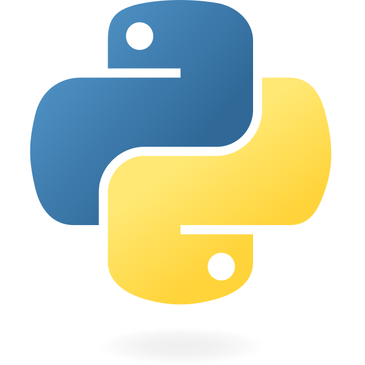

```python
#   Title:      FLAM3H™. SideFX Houdini FLAM3: PYTHON MAP PRM Definitions
#   Author:     F stands for liFe ( made in Italy )
#   date:       April 2023, Last revised January 2026
#   License:    GPL
#   Copyright:  (c) 2021 F stands for liFe
#
#   Name:       PY_FLAM3__UI_PARM_MAP
#
#   Comment:    List of all UI parameters wired with a python definition
#               and the command string they actually run and from where.
#
#               THIS IS ONLY INFORMATIVE AND FOR EASY FIND INSTEAD OF
#               NAVIGATING THE PARAMETERS INSIDE THE OTL TYPE PROPERTIES WINDOW.
```
- #### THIS FILE IS ONLY INFORMATIVE and part of the Documentations
- #### Houdini versions:  `from H21`

</br>
</br>

#### Quick links

- **FLAM3H™** [**UI_ICON_map H21 UP**](FLAM3HUSD__UI_ICON_map_H21_UP.md)
- **FLAM3H™** [**UI_ICON_map H19 to H20.5**](FLAM3HUSD__UI_ICON_map_H19_to_H205.md)
- **FLAM3H™** [**UI_PARM_map H19 to H20.5**](py_flam3__UI_PARM_map_H19_to_H205.md)

</br>

- **FLAM3HUSD** [**UI_ICON_map**](FLAM3HUSD__UI_ICON_map.md)
- **FLAM3HUSD** [**UI_PARM_map H21 UP**](py_flam3usd__UI_PARM_map_H21_UP.md)
- **FLAM3HUSD** [**UI_PARM_map H19 to H20.5**](py_flam3usd__UI_PARM_map_H19_to_H205.md)

</br>

- [**FULL ICON set**](../icons/README.md)

<br>
<br>
<br>
<br>

# FLAM3H™ -> UI_PARM_map
- ### Contents
    - _Collection of all the python modules run by the tool inside the HDA Type properties -> Script tab_.
    - _List of all the UI parameters wired with a python definition and the command string they actually run and from where_.

<br>
<br>
<br>
<br>

The needed **`py_flam3__x_x.py`** files are loaded inside the **Extra Files** section. Renamed as **`py_flam3__x_x`** (no extension).

For example the file for python 3.11 is renamed<br>
from: **py_flam3__3_11.py**<br>
to: **py_flam3__3_11**

</br>
</br>
</br>

#  PythonModule `H21 UP`

| SCRIPT | Description | 
|:---|:---|
| **PythonModule** | The **`flam3`** module is created out of the **`py_flam3__x_x`** file located inside the **Extra Files** section.</br>Inside the **OTL**->**type_properties**->**Scripts**->**PythonModule** | 

```python
#   Title:      FLAM3H™. SideFX Houdini FLAM3
#   Author:     F stands for liFe ( made in Italy )
#   License:    GPL
#   Copyright:  (c) 2021 F stands for liFe

import toolutils

# Set some HDA infos
__version__ = "1.9.70"
__status__  = "Production"
__h_versions__: tuple[int, ...] = (210,)
__range_type__: bool = False # True for closed range. False for open range

# The following are min and max Houdini version where FLAM3H™ can run.
# The max version is always most likely the latest Houdini version released by SideFX
# unless it is a closed range due to moving into newer Houdini and FLAM3H™ versions.
#
# The ranges can be open or close inside this definition:
# - (py_flam3__3_11) -> def flam3h_compatible_type(self, range_type: bool, kwargs: dict | None = None, msg: bool = True) -> bool:
# - (py_flam3__3_7)  -> def flam3h_compatible_type(self, range_type: bool, kwargs: Union[dict, None] = None, msg: bool = True) -> bool:
__h_version_min__: int = 190
__h_version_max__: int = __h_versions__[-1]


def houdini_version(digit: int=1) -> int:
    """Retrieve the major Houdini version number currently in use.

    Args:
        digit(int): Default to 1: 19, 20. if set to 2: 190, 195, 200, 205, and so on.

    Returns:
        (int): By default it will retrieve major Houdini version number. ex: 19, 20 but not: 195, 205
    """ 
    return int(''.join(str(x) for x in hou.applicationVersion()[:digit]))


def py_module_vars() -> str:
    """Return a strings:</br>
    * __module_filename__ -> module filename to use

    Args:
        (None):
        
    Returns:
        (None):
    """ 
    h: int = houdini_version(2)
    if h < 205: 
        __module_filename__: str = "py_flam3__3_7"
    else:
        __module_filename__: str = "py_flam3__3_11_H21_UP"

    return __module_filename__


__module_filename__ = py_module_vars()
flam3 = toolutils.createModuleFromSection("flam3", kwargs["type"], __module_filename__)
```

</br>
</br>
</br>

#  PreFirstCreate `H21 UP`

| SCRIPT | Description | 
|:---|:---|
| **PreFirstCreate** | Before the node is even created but invoked.</br>Inside: **OTL**->**type_properties**->**Scripts**->**PreFirstCreate** | 


```python
#   Title:      FLAM3H™. SideFX Houdini FLAM3
#   Author:     F stands for liFe ( made in Italy )
#   License:    GPL
#   Copyright:  (c) 2021 F stands for liFe

from datetime import datetime

# Get some HDA infos from the HDA module
FLAM3H_NODE_TYPE_NAME_CATEGORY = 'alexnardini::Sop/FLAM3H'
nodetype = hou.nodeType(FLAM3H_NODE_TYPE_NAME_CATEGORY)
__version__ = nodetype.hdaModule().__version__
__status__ = nodetype.hdaModule().__status__
__h_versions__: tuple = nodetype.hdaModule().__h_versions__
__range_type__: bool = nodetype.hdaModule().__range_type__
__h_version_min__: int = nodetype.hdaModule().__h_version_min__


def flam3h_first_time() -> bool:
    """If the version of Houdini running is not allowed for this FLAM3H™ HDA version (different cases)
    will return False, otherwise will return True.

    Args:
        ():

    Returns:
        (bool): True if compatible and False if not.
    """ 
    hou_version: int = nodetype.hdaModule().houdini_version(2)

    if hou_version < __h_version_min__:
        return False
    
    elif __range_type__ is True:
        if hou_version < __h_versions__[0] or hou_version > __h_versions__[-1]:
            return False
        
        return True
        
    elif __range_type__ is False:
        if hou_version < __h_versions__[0]:
            return False
        
        return True
        
    else:
        return True


def flam3h_sys_updated_mode() -> None:
    """Store the current houdini Update mode status into the hou.session
    so FLAM3H™ can pick it up from inside the currently used python module.

    Args:
        ():

    Returns:
        (None):
    """ 
    current: hou.EnumValue = hou.updateModeSetting()
    hou.session.F3H_SYS_UPDATE_MODE: hou.EnumValue = current


def flam3h_compile_first_time_msg() -> None:
    """On first time FLAM3H™ node instance creation:

    - Store the current FLAM3H™ precision mode into the hou.session so FLAM3H™ can pick it up from inside the currently used python module.
    - Additionally build a message to print into the console.

    Args:
        ():

    Returns:
        (None):
    """ 
    now: str = datetime.now().strftime("%b-%d-%Y %H:%M:%S")
    
    h: int = nodetype.hdaModule().houdini_version(2)
    if h < 205: __module_version__: str = "3.7"
    else: __module_version__: str = "3.11"
    
    try:
        hou.session.F3H_FIRST_INSTANCE_32BIT # type: ignore
        first_instance_32bit: bool = False
    except:
        first_instance_32bit: bool = True
        
    try:
        hou.session.F3H_FIRST_INSTANCE_64BIT # type: ignore
        first_instance_64bit: bool = False
    except:
        first_instance_64bit: bool = True

    if first_instance_32bit:
        _MSG_INFO = f"\n-> {now}\n\nFLAM3H™ version: {__version__} - {__status__} - F3H Python module: {__module_version__}\n\nThe CVEX nodes need to cook once to compile their definitions.\nDepending on your PC configuration it can take up to 1(one) minute.\nIt is a one time compile process.\n"
        print(_MSG_INFO)
        hou.ui.setStatusMessage(_MSG_INFO, hou.severityType.Warning) # type: ignore
        
    # we skip 64bit check for now as FLAM3H™ should always be at 32bit to start with.


def flam3h_not_compatible_first_time_msg() -> None:
    """On first time FLAM3H™ node instance creation:

    Run messages if not compatible with this Houdini version.
    
    Compatibility is checked inside:
    * def flam3h_first_time() -> bool:

    Args:
        ():

    Returns:
        (None):
    """ 
    
    _MSG_H_VERSIONS = nodetype.hdaModule().flam3.flam3h_scripts.flam3h_compatible_h_versions_msg(__h_versions__, False)
    _MSG_INFO = f"\n-> FLAM3H™ version: {__version__} - {__status__}\n\nThis Houdini version is not compatible with this FLAM3H™ version.\nYou need {_MSG_H_VERSIONS} to run this FLAM3H™ version"
            
    if hou.isUIAvailable():

        print(_MSG_INFO)

        _MSG_INFO_SB = f"-> FLAM3H™ version: {__version__} - {__status__}. This Houdini version is not compatible with this FLAM3H™ version. You need {_MSG_H_VERSIONS} to run this FLAM3H™ version"
        hou.ui.setStatusMessage(_MSG_INFO_SB, hou.severityType.Error) # type: ignore

        hou.ui.displayMessage(f"Sorry, you need {_MSG_H_VERSIONS} to run this FLAM3H™ version", buttons=("Got it, thank you",), severity=hou.severityType.Error, default_choice=0, close_choice=-1, help=None, title="FLAM3H™ Houdini version check", details=None, details_label=None, details_expanded=False)

    else:
        print(_MSG_INFO)


if flam3h_first_time():
    flam3h_sys_updated_mode()
    flam3h_compile_first_time_msg()
else:
    flam3h_not_compatible_first_time_msg()
```

</br>
</br>
</br>

#  OnCreated `H21 UP`

| SCRIPT | Description | 
|:---|:---|
| **OnCreated** | Initialize what the tool need when you create its node in the network editor.</br>Inside: **OTL**->**type_properties**->**Scripts**->**OnCreated** | 

```python
#   Title:      FLAM3H™. SideFX Houdini FLAM3
#   Author:     F stands for liFe ( made in Italy )
#   License:    GPL
#   Copyright:  (c) 2021 F stands for liFe

kwargs["node"].hdaModule().flam3.flam3h_scripts(kwargs).flam3h_on_create()
```

</br>
</br>
</br>

#  OnLoaded `H21 UP`

| SCRIPT | Description | 
|:---|:---|
| **OnLoaded** | When loading hip files with FLAM3H™ nodes in it do some checks.</br>Inside: **OTL**->**type_properties**->**Scripts**->**OnLoaded** | 

```python
#   Title:      FLAM3H™. SideFX Houdini FLAM3
#   Author:     F stands for liFe ( made in Italy )
#   License:    GPL
#   Copyright:  (c) 2021 F stands for liFe

kwargs["node"].hdaModule().flam3.flam3h_scripts(kwargs).flam3h_on_loaded()
```

</br>
</br>
</br>

#  OnDeleted `H21 UP`

| SCRIPT | Description | 
|:---|:---|
| **OnLoaded** | When deleting a FLAM3H™ node.</br>Inside: **OTL**->**type_properties**->**Scripts**->**OnDeleted** | 

```python
#   Title:      FLAM3H™. SideFX Houdini FLAM3
#   Author:     F stands for liFe ( made in Italy )
#   License:    GPL
#   Copyright:  (c) 2021 F stands for liFe

kwargs["node"].hdaModule().flam3.flam3h_scripts(kwargs).flam3h_on_deleted()
```

</br>
</br>
</br>
</br>
</br>
</br>
</br>
</br>
</br>
</br>

_Parameters to define the quality of the fractal Flame algorithm solution._

</br>

| Tab | Parameter name | Parameter type |  Houdini version |
|:---|:---|---:|---:|
| **GLOBAL** | `iter` | `integer` | `from H21` |

- ###  Callback Script
```python
hou.phm().flam3.out_flame_utils(kwargs).out_auto_change_iter_num_to_prm()
```

</br>
</br>
</br>

| Tab | Parameter name | Parameter type |  Houdini version |
|:---|:---|---:|---:|
| **GLOBAL** | `ptcount_presets` | `ordered menu` | `from H21` |

- ###  Callback Script
```python
hou.phm().flam3.flam3h_iterator_utils(kwargs).menu_global_density_set()
```
- ###  Menu Script
```python
menu = hou.phm().flam3.flam3h_iterator_utils(kwargs).menu_global_density()
return menu
```
- ###  Action Button Script
```python
kwargs['node'].hdaModule().flam3.flam3h_iterator_utils(kwargs).menu_global_density_set_default()
```

</br>
</br>
</br>

| Tab | Parameter name | Parameter type |  Houdini version |
|:---|:---|---:|---:|
| **GLOBAL** | `ptcount_presets_off` | `ordered menu` | `from H21` |

- ###  Action Button Script
```python
n = None
```

</br>
</br>
</br>
</br>
</br>
</br>
</br>
</br>
</br>
</br>

_Tools available to enhance and speed up the workflow.<br>
I keep changing and adding functionalities, it is still a work in progress, but thus far, this most recent configuration has been successful._

</br>

| Tab | Parameter name | Parameter type |  Houdini version |
|:---|:---|---:|---:|
| **SYS** | `sys_help` | `button` | `from H21` |

- ###  Callback Script
```python
hou.phm().flam3.flam3h_general_utils(kwargs).flam3h_display_help(), kwargs['parm'].deleteAllKeyframes()
```

</br>
</br>
</br>

| Tab | Parameter name | Parameter type |  Houdini version |
|:---|:---|---:|---:|
| **SYS** | `iterlist` | `ordered menu` | `from H21` |

- ###  Callback Script
```python
hou.phm().flam3.flam3h_iterator_utils(kwargs).prm_select_iterator(), kwargs['parm'].deleteAllKeyframes()
```
- ###  Menu Script
```python
menu = hou.phm().flam3.flam3h_iterator_utils(kwargs).menu_select_iterator()
return menu
```

</br>
</br>
</br>

| Tab | Parameter name | Parameter type |  Houdini version |
|:---|:---|---:|---:|
| **SYS** | `doff_sysdisabled` | `button` | `from H21` |

- ###  Callback Script
```python
hou.phm().flam3.flam3h_general_utils(kwargs).flam3h_toggle_private_FF(), kwargs['parm'].deleteAllKeyframes()
```

</br>
</br>
</br>

| Tab | Parameter name | Parameter type |  Houdini version |
|:---|:---|---:|---:|
| **SYS** | `doff_sysenabled` | `button` | `from H21` |

- ###  Callback Script
```python
hou.phm().flam3.flam3h_general_utils(kwargs).flam3h_toggle_private_FF(), kwargs['parm'].deleteAllKeyframes()
```

</br>
</br>
</br>

| Tab | Parameter name | Parameter type |  Houdini version |
|:---|:---|---:|---:|
| **SYS** | `rip_disabled` | `button` | `from H21` |

- ###  Callback Script
```python
hou.phm().flam3.flam3h_general_utils(kwargs).flam3h_toggle_private("rip"), kwargs['parm'].deleteAllKeyframes()
```

</br>
</br>
</br>

| Tab | Parameter name | Parameter type |  Houdini version |
|:---|:---|---:|---:|
| **SYS** | `rip_enabled` | `button` | `from H21` |

- ###  Callback Script
```python
hou.phm().flam3.flam3h_general_utils(kwargs).flam3h_toggle_private("rip"), kwargs['parm'].deleteAllKeyframes()
```

</br>
</br>
</br>

| Tab | Parameter name | Parameter type |  Houdini version |
|:---|:---|---:|---:|
| **SYS** | `f3c_chaotica` | `button` | `from H21` |

- ###  Callback Script
```python
hou.phm().flam3.flam3h_general_utils(kwargs).flam3h_toggle_private("f3c"), kwargs['parm'].deleteAllKeyframes()
```

</br>
</br>
</br>

| Tab | Parameter name | Parameter type |  Houdini version |
|:---|:---|---:|---:|
| **SYS** | `f3c_apophysis` | `button` | `from H21` |

- ###  Callback Script
```python
hou.phm().flam3.flam3h_general_utils(kwargs).flam3h_toggle_private("f3c"), kwargs['parm'].deleteAllKeyframes()
```

</br>
</br>
</br>

| Tab | Parameter name | Parameter type |  Houdini version |
|:---|:---|---:|---:|
| **SYS** | `xfviz_off` | `button` | `from H21` |

- ###  Callback Script
```python
hou.phm().flam3.flam3h_general_utils(kwargs).flam3h_xf_viz_toggle(), kwargs['parm'].deleteAllKeyframes()
```

</br>
</br>
</br>

| Tab | Parameter name | Parameter type |  Houdini version |
|:---|:---|---:|---:|
| **SYS** | `xfviz_on` | `button` | `from H21` |

- ###  Callback Script
```python
hou.phm().flam3.flam3h_general_utils(kwargs).flam3h_xf_viz_toggle(), kwargs['parm'].deleteAllKeyframes()
```

</br>
</br>
</br>

| Tab | Parameter name | Parameter type |  Houdini version |
|:---|:---|---:|---:|
| **SYS** | `xfviz_on_solo` | `button` | `from H21` |

- ###  Callback Script
```python
hou.phm().flam3.flam3h_general_utils(kwargs).flam3h_toggle_sys_xf_viz_solo(), kwargs['parm'].deleteAllKeyframes()
```

</br>
</br>
</br>

| Tab | Parameter name | Parameter type |  Houdini version |
|:---|:---|---:|---:|
| **SYS** | `xfvizff_on_solo` | `button` | `from H21` |

- ###  Callback Script
```python
hou.phm().flam3.flam3h_general_utils(kwargs).flam3h_toggle_sys_xf_ff_viz_solo(), kwargs['parm'].deleteAllKeyframes()
```

</br>
</br>
</br>

| Tab | Parameter name | Parameter type |  Houdini version |
|:---|:---|---:|---:|
| **SYS** | `sys_out_sensorviz` | `button` | `from H21` |

- ###  Callback Script
```python
hou.phm().flam3.flam3h_general_utils(kwargs).flam3h_outsensor_toggle(), kwargs['parm'].deleteAllKeyframes()
```

</br>
</br>
</br>

| Tab | Parameter name | Parameter type |  Houdini version |
|:---|:---|---:|---:|
| **SYS** | `sys_out_sensorviz_off` | `button` | `from H21` |

- ###  Callback Script
```python
hou.phm().flam3.flam3h_general_utils(kwargs).flam3h_outsensor_toggle(), kwargs['parm'].deleteAllKeyframes()
```

</br>
</br>
</br>

| Tab | Parameter name | Parameter type |  Houdini version |
|:---|:---|---:|---:|
| **SYS** | `sys_tag_off` | `button` | `from H21` |

- ###  Callback Script
```python
hou.phm().flam3.flam3h_general_utils(kwargs).flam3h_toggle_private("tag"), kwargs['parm'].deleteAllKeyframes()
```

</br>
</br>
</br>

| Tab | Parameter name | Parameter type |  Houdini version |
|:---|:---|---:|---:|
| **SYS** | `sys_tag` | `button` | `from H21` |

- ###  Callback Script
```python
hou.phm().flam3.flam3h_general_utils(kwargs).flam3h_toggle_private("tag"), kwargs['parm'].deleteAllKeyframes()
```

</br>
</br>
</br>

| Tab | Parameter name | Parameter type |  Houdini version |
|:---|:---|---:|---:|
| **SYS** | `tagsize` | `ordered menu` | `from H21` |

- ###  Callback Script
```python
kwargs['parm'].deleteAllKeyframes()
```

</br>
</br>
</br>

| Tab | Parameter name | Parameter type |  Houdini version |
|:---|:---|---:|---:|
| **SYS** | `loaddef` | `button` | `from H21` |

- ###  Callback Script
```python
hou.phm().flam3.flam3h_iterator_utils(kwargs).flam3h_default()
```

</br>
</br>
</br>

| Tab | Parameter name | Parameter type |  Houdini version |
|:---|:---|---:|---:|
| **SYS** | `frameview` | `button` | `from H21` |

- ###  Callback Script
```python
hou.phm().flam3.flam3h_general_utils(kwargs).util_viewport_bbox_frame(), kwargs['parm'].deleteAllKeyframes()
```

</br>
</br>
</br>

| Tab | Parameter name | Parameter type |  Houdini version |
|:---|:---|---:|---:|
| **SYS** | `frameviewsensor` | `button` | `from H21` |

- ###  Callback Script
```python
hou.phm().flam3.flam3h_general_utils(kwargs).util_set_front_viewer(False), kwargs['parm'].deleteAllKeyframes()
```

</br>
</br>
</br>

| Tab | Parameter name | Parameter type |  Houdini version |
|:---|:---|---:|---:|
| **SYS** | `sys_palettepresets_disabled` | `string` | `from H21` |

- ###  Action Button Script
```python
n = None
```

</br>
</br>
</br>

| Tab | Parameter name | Parameter type |  Houdini version |
|:---|:---|---:|---:|
| **SYS** | `sys_palettepresets_off` | `string` | `from H21` |

- ###  Callback Script
```python
hou.phm().flam3.flam3h_palette_utils(kwargs).json_to_flam3h_ramp_sys(False), kwargs['parm'].deleteAllKeyframes()
```
- ###  Menu Script
```python
menu = hou.phm().flam3.flam3h_palette_utils(kwargs).menu_cp_presets_empty()
return menu
```
- ###  Action Button Script
```python
kwargs['node'].hdaModule().flam3.flam3h_palette_utils(kwargs).json_to_flam3h_ramp()
```

</br>
</br>
</br>

| Tab | Parameter name | Parameter type |  Houdini version |
|:---|:---|---:|---:|
| **SYS** | `sys_palettepresets` | `string` | `from H21` |

- ###  Callback Script
```python
hou.phm().flam3.flam3h_palette_utils(kwargs).json_to_flam3h_ramp_sys(False), kwargs['parm'].deleteAllKeyframes()
```
- ###  Menu Script
```python
menu = hou.phm().flam3.flam3h_palette_utils(kwargs).menu_cp_presets()
return menu
```
- ###  Action Button Script
```python
kwargs['node'].hdaModule().flam3.flam3h_palette_utils(kwargs).json_to_flam3h_ramp()
```

</br>
</br>
</br>

| Tab | Parameter name | Parameter type |  Houdini version |
|:---|:---|---:|---:|
| **SYS** | `sys_inpresets_disabled` | `string` | `from H21` |

- ###  Callback Script
```python
hou.phm().flam3.in_flame_utils(kwargs).in_to_flam3h_sys(), kwargs['parm'].deleteAllKeyframes()
```
- ###  Menu Script
```python
menu = hou.phm().flam3.in_flame_utils(kwargs).menu_in_presets_empty()
return menu
```
- ###  Action Button Script
```python
kwargs['node'].hdaModule().flam3.in_flame_utils(kwargs).in_to_flam3h()
```

</br>
</br>
</br>

| Tab | Parameter name | Parameter type |  Houdini version |
|:---|:---|---:|---:|
| **SYS** | `sys_inpresets` | `string` | `from H21` |

- ###  Callback Script
```python
hou.phm().flam3.in_flame_utils(kwargs).in_to_flam3h_sys(), kwargs['parm'].deleteAllKeyframes()
```
- ###  Menu Script
```python
menu = hou.phm().flam3.in_flame_utils(kwargs).menu_in_presets()
return menu
```
- ###  Action Button Script
```python
kwargs['node'].hdaModule().flam3.in_flame_utils(kwargs).in_to_flam3h()
```

</br>
</br>
</br>

| Tab | Parameter name | Parameter type |  Houdini version |
|:---|:---|---:|---:|
| **SYS** | `sys_outpresets_disabled` | `string` | `from H21` |

- ###  Action Button Script
```python
n = None
```

</br>
</br>
</br>

| Tab | Parameter name | Parameter type |  Houdini version |
|:---|:---|---:|---:|
| **SYS** | `sys_outpresets` | `string` | `from H21` |

- ###  Callback Script
```python
hou.phm().flam3.out_flame_utils(kwargs).out_to_flam3h_quick('SYS'), kwargs['parm'].deleteAllKeyframes()
```
- ###  Menu Script
```python
menu = hou.phm().flam3.out_flame_utils(kwargs).menu_out_contents_presets()
return menu
```
- ###  Action Button Script
```python
kwargs['node'].hdaModule().flam3.out_flame_utils(kwargs).out_XML()
```

</br>
</br>
</br>
</br>
</br>
</br>
</br>
</br>
</br>
</br>

_This is where you’ll spend the majority of your time, along with the FF Tab.<br>
Here you will create your fractal Flame logic.<br>Since every parameter has the same name inside, if you have ever used Apophysis, Fractorium, or other fractal Flame editors, you will almost immediately feel at home. The logic you will operate with will be the same._

</br>

| Tab | Parameter name | Parameter type |  Houdini version |
|:---|:---|---:|---:|
| **FLAME** | `flamefunc` |  `multiparm block (tabs)` | `from H21` |

- ###  Callback Script
```python
hou.phm().flam3.flam3h_iterator_utils(kwargs).iterators_count()
```

</br>
</br>
</br>

| Tab | Parameter name | Parameter type |  Houdini version |
|:---|:---|---:|---:|
| **FLAME** | `mp_add_#` |  `geometry data` | `from H21` |

- ###  Action Button Script
```python
kwargs['node'].hdaModule().flam3.flam3h_iterator_utils(kwargs).add_iterator()
```

</br>
</br>
</br>

| Tab | Parameter name | Parameter type |  Houdini version |
|:---|:---|---:|---:|
| **FLAME** | `note_#` |  `string` | `from H21` |

- ###  Callback Script
```python
hou.phm().flam3.flam3h_iterator_utils(kwargs).destroy_data_note(), kwargs['parm'].deleteAllKeyframes()
```

</br>
</br>
</br>

| Tab | Parameter name | Parameter type |  Houdini version |
|:---|:---|---:|---:|
| **FLAME** | `prmpastesel_#` |  `ordered menu` | `from H21` |

- ###  Callback Script
```python
hou.phm().flam3.flam3h_iterator_utils(kwargs).prm_paste_sel()
```
- ###  Menu Script
```python
menu = hou.phm().flam3.flam3h_iterator_utils(kwargs).menu_copypaste()
return menu
```
- ###  Action Button Script
```python
kwargs['node'].hdaModule().flam3.flam3h_iterator_utils(kwargs).prm_paste()
```

</br>
</br>
</br>

| Tab | Parameter name | Parameter type |  Houdini version |
|:---|:---|---:|---:|
| **FLAME** | `doiter_disabled_#` |  `button` | `from H21` |

- ###  Callback Script
```python
hou.phm().flam3.flam3h_iterator_utils(kwargs).iterator_vactive_and_update(), kwargs['parm'].deleteAllKeyframes()
```

</br>
</br>
</br>

| Tab | Parameter name | Parameter type |  Houdini version |
|:---|:---|---:|---:|
| **FLAME** | `doiter_#` |  `button` | `from H21` |

- ###  Callback Script
```python
hou.phm().flam3.flam3h_iterator_utils(kwargs).iterator_vactive_and_update(), kwargs['parm'].deleteAllKeyframes()
```

</br>
</br>
</br>

| Tab | Parameter name | Parameter type |  Houdini version |
|:---|:---|---:|---:|
| **FLAME** | `xfviz_off_#` |  `button` | `from H21` |

- ###  Callback Script
```python
hou.phm().flam3.flam3h_general_utils(kwargs).flam3h_toggle_mp_xf_viz(), kwargs['parm'].deleteAllKeyframes()
```

</br>
</br>
</br>

| Tab | Parameter name | Parameter type |  Houdini version |
|:---|:---|---:|---:|
| **FLAME** | `xfviz_on_#` |  `button` | `from H21` |

- ###  Callback Script
```python
hou.phm().flam3.flam3h_general_utils(kwargs).flam3h_toggle_mp_xf_viz(), kwargs['parm'].deleteAllKeyframes()
```

</br>
</br>
</br>

| Tab | Parameter name | Parameter type |  Houdini version |
|:---|:---|---:|---:|
| **FLAME** | `iw_#` |  `float` | `from H21` |

- ###  Callback Script
```python
hou.phm().flam3.flam3h_iterator_utils(kwargs).iterator_vactive_and_update()
```

</br>
</br>
</br>

| Tab | Parameter name | Parameter type |  Houdini version |
|:---|:---|---:|---:|
| **FLAME** | `xaos_#` |  `string` | `from H21` |

- ###  Callback Script
```python
hou.phm().flam3.flam3h_iterator_utils(kwargs).auto_set_xaos()
```
- ###  Action Button Script
```python
kwargs['node'].hdaModule().flam3.flam3h_ui_msg_utils(kwargs).ui_xaos_infos()
```

</br>
</br>
</br>

| Tab | Parameter name | Parameter type |  Houdini version |
|:---|:---|---:|---:|
| **FLAME** | `alpha_#` |  `float` | `from H21` |

- ###  Callback Script
```python
hou.phm().flam3.flam3h_iterator_utils.destroy_cachedUserData(kwargs['node'], 'iter_sel')
```

</br>
</br>
</br>

| Tab | Parameter name | Parameter type |  Houdini version |
|:---|:---|---:|---:|
| **FLAME** | `preblurtype_#` |  `ordered menu` | `from H21` |

- ###  Menu Script
```python
menu = hou.phm().flam3.flam3h_iterator_utils(kwargs).menu_T_pb()
return menu
```

</br>
</br>
</br>

| Tab | Parameter name | Parameter type |  Houdini version |
|:---|:---|---:|---:|
| **FLAME** | `pre1type_#`, `pre2type_#`, `p1type_#` |  `ordered menu` | `from H21` |

- ###  Menu Script
```python
menu = hou.phm().flam3.flam3h_iterator_utils(kwargs).menu_T_PP()
return menu
```

</br>
</br>
</br>

| Tab | Parameter name | Parameter type |  Houdini version |
|:---|:---|---:|---:|
| **FLAME** | `pre2weight_#` |  `float` | `from H21` |

- ###  Action Button Script
```python
kwargs['node'].hdaModule().flam3.flam3h_iterator_utils(kwargs).swap_iter_pre_vars()
```

</br>
</br>
</br>

| Tab | Parameter name | Parameter type |  Houdini version |
|:---|:---|---:|---:|
| **FLAME** | `v1type_#`, `v2type_#`, `v3type_#`, `v4type_#` |  `ordered menu` | `from H21` |

- ###  Menu Script
```python
menu = hou.phm().flam3.flam3h_iterator_utils(kwargs).menu_T()
return menu
```

</br>
</br>
</br>

| Tab | Parameter name | Parameter type |  Houdini version |
|:---|:---|---:|---:|
| **FLAME** | `scl_#` |  `float` | `from H21` |

- ###  Callback Script
```python
hou.phm().flam3.flam3h_iterator_utils(kwargs).iterator_affine_scale()
```
- ###  Action Button Script
```python
kwargs['node'].hdaModule().flam3.flam3h_iterator_utils(kwargs).prm_paste_sel_pre_affine()
```

</br>
</br>
</br>

| Tab | Parameter name | Parameter type |  Houdini version |
|:---|:---|---:|---:|
| **FLAME** | `ang_#` |  `float` | `from H21` |

- ###  Action Button Script
```python
kwargs['node'].hdaModule().flam3.flam3h_iterator_utils(kwargs).reset_preaffine()
```

</br>
</br>
</br>

| Tab | Parameter name | Parameter type |  Houdini version |
|:---|:---|---:|---:|
| **FLAME** | `pscl_#` |  `float` | `from H21` |

- ###  Callback Script
```python
hou.phm().flam3.flam3h_iterator_utils(kwargs).iterator_post_affine_scale()
```
- ###  Action Button Script
```python
kwargs['node'].hdaModule().flam3.flam3h_iterator_utils(kwargs).prm_paste_sel_post_affine()
```

</br>
</br>
</br>

| Tab | Parameter name | Parameter type |  Houdini version |
|:---|:---|---:|---:|
| **FLAME** | `pang_#` |  `float` | `from H21` |

- ###  Action Button Script
```python
kwargs['node'].hdaModule().flam3.flam3h_iterator_utils(kwargs).reset_postaffine()
```

</br>
</br>
</br>
</br>
</br>
</br>
</br>
</br>
</br>
</br>

_Iterators like Final Flame (FF) or finalXform function like camera lenses.<br>
It allows for a great deal of creative experimentation by taking the combined result of all the iterators inside the FLAME Tab and applying further modifications to that result._

</br>

| Tab | Parameter name | Parameter type |  Houdini version |
|:---|:---|---:|---:|
| **FF** | `doff_disabled` |  `button` | `from H21` |

- ###  Callback Script
```python
hou.phm().flam3.flam3h_general_utils(kwargs).flam3h_toggle_private_FF(), kwargs['parm'].deleteAllKeyframes()
```

</br>
</br>
</br>

| Tab | Parameter name | Parameter type |  Houdini version |
|:---|:---|---:|---:|
| **FF** | `doff_enabled` |  `button` | `from H21` |

- ###  Callback Script
```python
hou.phm().flam3.flam3h_general_utils(kwargs).flam3h_toggle_private_FF(), kwargs['parm'].deleteAllKeyframes()
```

</br>
</br>
</br>

| Tab | Parameter name | Parameter type |  Houdini version |
|:---|:---|---:|---:|
| **FF** | `xfvizff_off` |  `button` | `from H21` |

- ###  Callback Script
```python
hou.phm().flam3.flam3h_general_utils(kwargs).flam3h_toggle_xf_ff_viz(), kwargs['parm'].deleteAllKeyframes()
```

</br>
</br>
</br>

| Tab | Parameter name | Parameter type |  Houdini version |
|:---|:---|---:|---:|
| **FF** | `xfvizff_on` |  `button` | `from H21` |

- ###  Callback Script
```python
hou.phm().flam3.flam3h_general_utils(kwargs).flam3h_toggle_xf_ff_viz(), kwargs['parm'].deleteAllKeyframes()
```

</br>
</br>
</br>

| Tab | Parameter name | Parameter type |  Houdini version |
|:---|:---|---:|---:|
| **FF** | `ffnote` |  `string` | `from H21` |

- ###  Callback Script
```python
hou.phm().flam3.flam3h_iterator_utils(kwargs).note_FF(), kwargs['parm'].deleteAllKeyframes()
```

</br>
</br>
</br>

| Tab | Parameter name | Parameter type |  Houdini version |
|:---|:---|---:|---:|
| **FF** | `ffprmpastesel` |  `ordered menu` | `from H21` |

- ###  Callback Script
```python
hou.phm().flam3.flam3h_iterator_utils(kwargs).prm_paste_sel_FF()
```
- ###  Menu Script
```python
menu = hou.phm().flam3.flam3h_iterator_utils(kwargs).menu_copypaste_FF()
return menu
```
- ###  Action Button Script
```python
kwargs['node'].hdaModule().flam3.flam3h_iterator_utils(kwargs).prm_paste_FF()
```

</br>
</br>
</br>

| Tab | Parameter name | Parameter type |  Houdini version |
|:---|:---|---:|---:|
| **FF** | `ffpre1type`, `ffp1type`, `ffp2type` |  `ordered menu` | `from H21` |

- ###  Menu Script
```python
menu = hou.phm().flam3.flam3h_iterator_utils(kwargs).menu_T_PP_FF()
return menu
```

</br>
</br>
</br>

| Tab | Parameter name | Parameter type |  Houdini version |
|:---|:---|---:|---:|
| **FF** | `ffv1type`, `ffv2type` |  `ordered menu` | `from H21` |

- ###  Menu Script
```python
menu = hou.phm().flam3.flam3h_iterator_utils(kwargs).menu_T_FF()
return menu
```

</br>
</br>
</br>

| Tab | Parameter name | Parameter type |  Houdini version |
|:---|:---|---:|---:|
| **FF** | `ffp2weight` |  `float` | `from H21` |

- ###  Action Button Script
```python
kwargs['node'].hdaModule().flam3.flam3h_iterator_utils(kwargs).swap_FF_post_vars()
```

</br>
</br>
</br>

| Tab | Parameter name | Parameter type |  Houdini version |
|:---|:---|---:|---:|
| **FF** | `ffscl` |  `float` | `from H21` |

- ###  Callback Script
```python
hou.phm().flam3.flam3h_iterator_utils(kwargs).iterator_FF_affine_scale()
```
- ###  Action Button Script
```python
kwargs['node'].hdaModule().flam3.flam3h_iterator_utils(kwargs).prm_paste_sel_pre_affine_FF()
```

</br>
</br>
</br>

| Tab | Parameter name | Parameter type |  Houdini version |
|:---|:---|---:|---:|
| **FF** | `ffang` |  `float` | `from H21` |

- ###  Action Button Script
```python
kwargs['node'].hdaModule().flam3.flam3h_iterator_utils(kwargs).reset_preaffine_FF()
```

</br>
</br>
</br>

| Tab | Parameter name | Parameter type |  Houdini version |
|:---|:---|---:|---:|
| **FF** | `ffpscl` |  `float` | `from H21` |

- ###  Callback Script
```python
hou.phm().flam3.flam3h_iterator_utils(kwargs).iterator_FF_post_affine_scale()
```
- ###  Action Button Script
```python
kwargs['node'].hdaModule().flam3.flam3h_iterator_utils(kwargs).prm_paste_sel_post_affine_FF()
```

</br>
</br>
</br>

| Tab | Parameter name | Parameter type |  Houdini version |
|:---|:---|---:|---:|
| **FF** | `ffpang` |  `float` | `from H21` |

- ###  Action Button Script
```python
kwargs['node'].hdaModule().flam3.flam3h_iterator_utils(kwargs).reset_postaffine_FF()
```

</br>
</br>
</br>
</br>
</br>
</br>
</br>
</br>
</br>
</br>

_The palette colors used in a successful fractal Flame are crucial.<br>
In addition to playing with the shader parameters for each iterator, fractal Flames can be transformed into something truly unique by trying out various color schemes._

</br>

| Tab | Parameter name | Parameter type |  Houdini version |
|:---|:---|---:|---:|
| **CP** | `hsv` |  `float vector 3` | `from H21` |

- ###  Callback Script
```python
hou.phm().flam3.flam3h_palette_utils(kwargs).palette_hsv()
```
- ###  Action Button Script
```python
kwargs['node'].hdaModule().flam3.flam3h_palette_utils(kwargs).reset_CP(2)
```

</br>
</br>
</br>

| Tab | Parameter name | Parameter type |  Houdini version |
|:---|:---|---:|---:|
| **CP** | `keephsv` |  `toggle` | `from H21` |

- ###  Callback Script
```python
kwargs['parm'].deleteAllKeyframes()
```

</br>
</br>
</br>

| Tab | Parameter name | Parameter type |  Houdini version |
|:---|:---|---:|---:|
| **CP** | `palettehsv` |  `ramp type color RGB` | `from H21` |

- ###  Callback Script
```python
hou.phm().flam3.flam3h_palette_utils(kwargs).palette_lock()
```
- ###  Action Button Script
```python
kwargs['node'].hdaModule().flam3.flam3h_palette_utils(kwargs).palette_cp()
```

</br>
</br>
</br>

| Tab | Parameter name | Parameter type |  Houdini version |
|:---|:---|---:|---:|
| **CP** | `cp_bases` |  `ordered menu` | `from H21` |

- ###  Callback Script
```python
hou.phm().flam3.flam3h_palette_utils(kwargs).cp_bases_selection_msg(), kwargs['parm'].deleteAllKeyframes()
```

</br>
</br>
</br>

| Tab | Parameter name | Parameter type |  Houdini version |
|:---|:---|---:|---:|
| **CP** | `cp_lookupsamples` |  `ordered menu` | `from H21` |

- ###  Callback Script
```python
kwargs['parm'].deleteAllKeyframes()
```

</br>
</br>
</br>

| Tab | Parameter name | Parameter type |  Houdini version |
|:---|:---|---:|---:|
| **CP** | `palette` |  `ramp type color RGB` | `from H21` |

- ###  Callback Script
```python
hou.phm().flam3.flam3h_palette_utils(kwargs).palette_cp(True)
```
- ###  Action Button Script
```python
kwargs['node'].hdaModule().flam3.flam3h_palette_utils(kwargs).reset_CP_palette_action()
```

</br>
</br>
</br>

| Tab | Parameter name | Parameter type |  Houdini version |
|:---|:---|---:|---:|
| **CP** | `palettefile` |  `file` | `from H21` |

- ###  Callback Script
```python
hou.phm().flam3.flam3h_general_utils(kwargs).flam3h_init_presets_CP_PRESETS(), kwargs['parm'].deleteAllKeyframes()
```

</br>
</br>
</br>

| Tab | Parameter name | Parameter type |  Houdini version |
|:---|:---|---:|---:|
| **CP** | `palettename` |  `string` | `from H21` |

- ###  Callback Script
```python
hou.phm().flam3.flam3h_palette_utils(kwargs).cp_preset_name_set(), kwargs['parm'].deleteAllKeyframes()
```
- ###  Action Button Script
```python
kwargs['node'].hdaModule().flam3.flam3h_palette_utils(kwargs).flam3h_ramp_save()
```

</br>
</br>
</br>

| Tab | Parameter name | Parameter type |  Houdini version |
|:---|:---|---:|---:|
| **CP** | `palettepresets_off` |  `string` | `from H21` |

- ###  Callback Script
```python
hou.phm().flam3.flam3h_palette_utils(kwargs).json_to_flam3h_ramp(False), kwargs['parm'].deleteAllKeyframes()
```
- ###  Menu Script
```python
menu = hou.phm().flam3.flam3h_palette_utils(kwargs).menu_cp_presets_empty()
return menu
```
- ###  Action Button Script
```python
kwargs['node'].hdaModule().flam3.flam3h_palette_utils(kwargs).json_to_flam3h_ramp()
```

</br>
</br>
</br>

| Tab | Parameter name | Parameter type |  Houdini version |
|:---|:---|---:|---:|
| **CP** | `palettepresets` |  `string` | `from H21` |

- ###  Callback Script
```python
hou.phm().flam3.flam3h_palette_utils(kwargs).json_to_flam3h_ramp(False), kwargs['parm'].deleteAllKeyframes()
```
- ###  Menu Script
```python
menu = hou.phm().flam3.flam3h_palette_utils(kwargs).menu_cp_presets()
return menu
```
- ###  Action Button Script
```python
kwargs['node'].hdaModule().flam3.flam3h_palette_utils(kwargs).json_to_flam3h_ramp()
```

</br>
</br>
</br>
</br>
</br>
</br>
</br>
</br>
</br>
</br>

_Flame fractal moton blur._<br>
_When animating your fractal Flame, turning this on will compute a proper temporal motion blur._

</br>

| Tab | Parameter name | Parameter type |  Houdini version |
|:---|:---|---:|---:|
| **MB** | `domb` |  `toggle` | `from H21` |

- ###  Action Button Script
```python
kwargs['node'].hdaModule().flam3.flam3h_general_utils(kwargs).reset_MB(False)
```

</br>
</br>
</br>
</br>
</br>
</br>
</br>
</br>
</br>
</br>

_The IN tab allows users to import and manage pre-existing fractal Flame files into FLAM3H™._</br>
_This feature is essential for reloading saved Flames,_</br>
_exploring shared Flame designs, or modifying existing structures._</br>
_It is a native Flame fractal file format containing transformation parameters, gradients, and rendering settings._

</br>

| Tab | Parameter name | Parameter type |  Houdini version |
|:---|:---|---:|---:|
| **IN** | `inpath` |  `file` | `from H21` |

- ###  Callback Script
```python
hou.phm().flam3.flam3h_general_utils(kwargs).flam3h_init_presets_IN_PRESETS(), kwargs['parm'].deleteAllKeyframes()
```

</br>
</br>
</br>

| Tab | Parameter name | Parameter type |  Houdini version |
|:---|:---|---:|---:|
| **IN** | `inpresets_disabled` |  `string` | `from H21` |

- ###  Callback Script
```python
hou.phm().flam3.in_flame_utils(kwargs).in_to_flam3h(), kwargs['parm'].deleteAllKeyframes()
```
- ###  Menu Script
```python
menu = hou.phm().flam3.in_flame_utils(kwargs).menu_in_presets_empty()
return menu
```
- ###  Action Button Script
```python
kwargs['node'].hdaModule().flam3.in_flame_utils(kwargs).in_to_flam3h()
```

</br>
</br>
</br>

| Tab | Parameter name | Parameter type |  Houdini version |
|:---|:---|---:|---:|
| **IN** | `inpresets` |  `string` | `from H21` |

- ###  Callback Script
```python
hou.phm().flam3.in_flame_utils(kwargs).in_to_flam3h(), kwargs['parm'].deleteAllKeyframes()
```
- ###  Menu Script
```python
menu = hou.phm().flam3.in_flame_utils(kwargs).menu_in_presets()
return menu
```
- ###  Action Button Script
```python
kwargs['node'].hdaModule().flam3.in_flame_utils(kwargs).in_to_flam3h()
```

</br>
</br>
</br>

| Tab | Parameter name | Parameter type |  Houdini version |
|:---|:---|---:|---:|
| **IN** | `iternumonload` |  `integer` | `from H21` |

- ###  Callback Script
```python
hou.phm().flam3.in_flame_utils(kwargs).set_iter_on_load_callback(), kwargs['parm'].deleteAllKeyframes()
```

</br>
</br>
</br>

| Tab | Parameter name | Parameter type |  Houdini version |
|:---|:---|---:|---:|
| **IN** | `useiteronload` |  `toggle` | `from H21` |

- ###  Callback Script
```python
hou.phm().flam3.in_flame_utils(kwargs).use_iter_on_load_callback(), kwargs['parm'].deleteAllKeyframes()
```

</br>
</br>
</br>

| Tab | Parameter name | Parameter type |  Houdini version |
|:---|:---|---:|---:|
| **IN** | `oritername` |  `toggle` | `from H21` |

- ###  Callback Script
```python
hou.phm().flam3.in_flame_utils(kwargs).use_iter_on_load_callback(), kwargs['parm'].deleteAllKeyframes()
```

</br>
</br>
</br>

| Tab | Parameter name | Parameter type |  Houdini version |
|:---|:---|---:|---:|
| **IN** | `in_f3h_affine` |  `toggle` | `from H21` |

- ###  Callback Script
```python
kwargs['parm'].deleteAllKeyframes()
```
- ###  Action Button Script
```python
kwargs['node'].hdaModule().flam3.in_flame_utils(kwargs).in_to_flam3h_toggle_f3h_affine()
```

</br>
</br>
</br>

| Tab | Parameter name | Parameter type |  Houdini version |
|:---|:---|---:|---:|
| **IN** | `propertiescp` |  `toggle` | `from H21` |

- ###  Callback Script
```python
kwargs['parm'].deleteAllKeyframes()
```
- ###  Action Button Script
```python
kwargs['node'].hdaModule().flam3.in_flame_utils(kwargs).in_to_flam3h_toggle("propertiescp")
```

</br>
</br>
</br>

| Tab | Parameter name | Parameter type |  Houdini version |
|:---|:---|---:|---:|
| **IN** | `cprendervals` |  `button` | `from H21` |

- ###  Callback Script
```python
hou.phm().flam3.in_flame_utils.in_copy_render_all_stats_msg(kwargs, None, False, True), kwargs['parm'].deleteAllKeyframes()
```

</br>
</br>
</br>

| Tab | Parameter name | Parameter type |  Houdini version |
|:---|:---|---:|---:|
| **IN** | `icon_in_infos_sensor` |  `button` | `from H21` |

- ###  Callback Script
```python
hou.phm().flam3.in_flame_utils.in_copy_sensor_stats_msg(kwargs)
```

</br>
</br>
</br>

| Tab | Parameter name | Parameter type |  Houdini version |
|:---|:---|---:|---:|
| **IN** | `icon_in_infos_render` |  `button` | `from H21` |

- ###  Callback Script
```python
hou.phm().flam3.in_flame_utils.in_copy_render_stats_msg(kwargs)
```

</br>
</br>
</br>
</br>
</br>
</br>
</br>
</br>
</br>
</br>

_The OUT tab provides options to export your current fractal Flame work,_</br>
_preserving all necessary data for future editing, sharing or rendering._</br>
_It ensures your creative progress is safely stored in standard format_</br>
_compatible with other Flame tools and rendering engines._</br>
_It is a native Flame fractal file format containing transformation parameters, gradients, and rendering settings._

</br>

| Tab | Parameter name | Parameter type |  Houdini version |
|:---|:---|---:|---:|
| **OUT** | `outpath` |  `file` | `from H21` |

- ###  Callback Script
```python
hou.phm().flam3.flam3h_general_utils(kwargs).flam3h_init_presets_OUT_PRESETS(), kwargs['parm'].deleteAllKeyframes()
```

</br>
</br>
</br>

| Tab | Parameter name | Parameter type |  Houdini version |
|:---|:---|---:|---:|
| **OUT** | `outname` |  `string` | `from H21` |

- ###  Callback Script
```python
hou.phm().flam3.out_flame_utils(kwargs).out_auto_add_iter_num_to_prm(), kwargs['parm'].deleteAllKeyframes()
```
- ###  Action Button Script
```python
kwargs['node'].hdaModule().flam3.out_flame_utils(kwargs).out_XML()
```

</br>
</br>
</br>

| Tab | Parameter name | Parameter type |  Houdini version |
|:---|:---|---:|---:|
| **OUT** | `outpresets` |  `string` | `from H21` |

- ###  Callback Script
```python
hou.phm().flam3.out_flame_utils(kwargs).out_to_flam3h_quick(), kwargs['parm'].deleteAllKeyframes()
```
- ###  Menu Script
```python
menu = hou.phm().flam3.out_flame_utils(kwargs).menu_out_contents_presets()
return menu
```
- ###  Action Button Script
```python
kwargs['node'].hdaModule().flam3.out_flame_utils(kwargs).out_presets_copy_menu_label_callback()
```

</br>
</br>
</br>

| Tab | Parameter name | Parameter type |  Houdini version |
|:---|:---|---:|---:|
| **OUT** | `outpalette` |  `string` | `from H21` |

- ###  Callback Script
```python
kwargs['parm'].deleteAllKeyframes()
```

</br>
</br>
</br>

| Tab | Parameter name | Parameter type |  Houdini version |
|:---|:---|---:|---:|
| **OUT** | `out_f3h_affine` |  `string` | `from H21` |

- ###  Callback Script
```python
kwargs['parm'].deleteAllKeyframes()
```

</br>
</br>
</br>

| Tab | Parameter name | Parameter type |  Houdini version |
|:---|:---|---:|---:|
| **OUT** | `out_in_flame_name` |  `string` | `from H21` |

- ###  Callback Script
```python
hou.phm().flam3.out_flame_utils(kwargs).out_flame_name_inherit_on_load(), kwargs['parm'].deleteAllKeyframes()
```

</br>
</br>
</br>

| Tab | Parameter name | Parameter type |  Houdini version |
|:---|:---|---:|---:|
| **OUT** | `outfractoriumprm` |  `string` | `from H21` |

- ###  Callback Script
```python
kwargs['parm'].deleteAllKeyframes()
```

</br>
</br>
</br>

| Tab | Parameter name | Parameter type |  Houdini version |
|:---|:---|---:|---:|
| **OUT** | `autoadditer` |  `toggle` | `from H21` |

- ###  Callback Script
```python
hou.phm().flam3.out_flame_utils(kwargs).out_auto_change_iter_num_to_prm(), kwargs['parm'].deleteAllKeyframes()
```

</br>
</br>
</br>

| Tab | Parameter name | Parameter type |  Houdini version |
|:---|:---|---:|---:|
| **OUT** | `outedit` |  `toggle` | `from H21` |

- ###  Callback Script
```python
hou.phm().flam3.flam3h_general_utils(kwargs).flam3h_toggle_off("outsensor"), kwargs['parm'].deleteAllKeyframes()
```
- ###  Action Button Script
```python
kwargs['node'].hdaModule().flam3.out_flame_utils(kwargs).reset_OUT_kwargs()
```

</br>
</br>
</br>

| Tab | Parameter name | Parameter type |  Houdini version |
|:---|:---|---:|---:|
| **OUT** | `out_sensorviz_disabled` |  `button` | `from H21` |

- ###  Callback Script
```python
hou.phm().flam3.flam3h_general_utils(kwargs).flam3h_outsensor_toggle(), kwargs['parm'].deleteAllKeyframes()
```

</br>
</br>
</br>

| Tab | Parameter name | Parameter type |  Houdini version |
|:---|:---|---:|---:|
| **OUT** | `out_sensorviz` |  `button` | `from H21` |

- ###  Callback Script
```python
hou.phm().flam3.flam3h_general_utils(kwargs).flam3h_outsensor_toggle(), kwargs['parm'].deleteAllKeyframes()
```

</br>
</br>
</br>

| Tab | Parameter name | Parameter type |  Houdini version |
|:---|:---|---:|---:|
| **OUT** | `out_sensorviz_off` |  `button` | `from H21` |

- ###  Callback Script
```python
hou.phm().flam3.flam3h_general_utils(kwargs).flam3h_outsensor_toggle(), kwargs['parm'].deleteAllKeyframes()
```

</br>
</br>
</br>

| Tab | Parameter name | Parameter type |  Houdini version |
|:---|:---|---:|---:|
| **OUT** | `outres` |  `integer vector 2` | `from H21` |

- ###  Callback Script
```python
hou.phm().flam3.flam3h_general_utils(kwargs).util_set_front_viewer(False)
```

</br>
</br>
</br>

| Tab | Parameter name | Parameter type |  Houdini version |
|:---|:---|---:|---:|
| **OUT** | `outrespresets` |  `string` | `from H21` |

- ###  Callback Script
```python
hou.phm().flam3.out_flame_utils(kwargs).menu_sensor_resolution_set(False), kwargs['parm'].deleteAllKeyframes()
```
- ###  Menu Script
```python
menu = hou.phm().flam3.out_flame_utils(kwargs).menu_sensor_resolution()
return menu
```

</br>
</br>
</br>

| Tab | Parameter name | Parameter type |  Houdini version |
|:---|:---|---:|---:|
| **OUT** | `outcprendervals` |  `button` | `from H21` |

- ###  Callback Script
```python
hou.phm().flam3.in_flame_utils.in_copy_render_all_stats_msg(kwargs, None, False, True), kwargs['parm'].deleteAllKeyframes()
```

</br>
</br>
</br>

| Tab | Parameter name | Parameter type |  Houdini version |
|:---|:---|---:|---:|
| **OUT** | `outcenter` |  `float vector 2` | `from H21` |

- ###  Callback Script
```python
hou.phm().flam3.flam3h_general_utils(kwargs).util_set_front_viewer(False)
```

</br>
</br>
</br>

| Tab | Parameter name | Parameter type |  Houdini version |
|:---|:---|---:|---:|
| **OUT** | `outrotate` |  `float` | `from H21` |

- ###  Callback Script
```python
hou.phm().flam3.flam3h_general_utils(kwargs).util_set_front_viewer(False)
```

</br>
</br>
</br>

| Tab | Parameter name | Parameter type |  Houdini version |
|:---|:---|---:|---:|
| **OUT** | `outscale` |  `float` | `from H21` |

- ###  Callback Script
```python
hou.phm().flam3.flam3h_general_utils(kwargs).util_set_front_viewer(False)
```

</br>
</br>
</br>

| Tab | Parameter name | Parameter type |  Houdini version |
|:---|:---|---:|---:|
| **OUT** | `outsensorupdate` |  `toggle` | `from H21` |

- ###  Callback Script
```python
hou.phm().flam3.flam3h_general_utils(kwargs).util_set_front_viewer(False), kwargs['parm'].deleteAllKeyframes()
```

</br>
</br>
</br>

| Tab | Parameter name | Parameter type |  Houdini version |
|:---|:---|---:|---:|
| **OUT** | `outccdefault` |  `toggle` | `from H21` |

- ###  Callback Script
```python
hou.phm().flam3.out_flame_utils.out_render_curves_compare_and_set_toggle(kwargs['node']), kwargs['parm'].deleteAllKeyframes()
```

</br>
</br>
</br>

| Tab | Parameter name | Parameter type |  Houdini version |
|:---|:---|---:|---:|
| **OUT** | `icon_f3h_cc_defaults_copy` |  `button` | `from H21` |

- ###  Callback Script
```python
hou.phm().flam3.in_flame_utils.in_copy_cc_curves_stats_msg(kwargs), kwargs['parm'].deleteAllKeyframes()
```

</br>
</br>
</br>

| Tab | Parameter name | Parameter type |  Houdini version |
|:---|:---|---:|---:|
| **OUT** | `icon_f3h_cc_modified_reset` |  `button` | `from H21` |

- ###  Callback Script
```python
hou.phm().flam3.out_flame_utils.out_render_curves_set_and_retrieve_defaults(kwargs['node']), kwargs['parm'].deleteAllKeyframes()
```

</br>
</br>
</br>

| Tab | Parameter name | Parameter type |  Houdini version |
|:---|:---|---:|---:|
| **OUT** | `outcurveoverallval` |  `string` | `from H21` |

- ###  Callback Script
```python
hou.phm().flam3.out_flame_utils.out_render_curves_retrive_data(kwargs['node'])
```

</br>
</br>
</br>

| Tab | Parameter name | Parameter type |  Houdini version |
|:---|:---|---:|---:|
| **OUT** | `outcurveredval` |  `string` | `from H21` |

- ###  Callback Script
```python
hou.phm().flam3.out_flame_utils.out_render_curves_retrive_data(kwargs['node'])
```

</br>
</br>
</br>

| Tab | Parameter name | Parameter type |  Houdini version |
|:---|:---|---:|---:|
| **OUT** | `outcurvegreenval` |  `string` | `from H21` |

- ###  Callback Script
```python
hou.phm().flam3.out_flame_utils.out_render_curves_retrive_data(kwargs['node'])
```

</br>
</br>
</br>

| Tab | Parameter name | Parameter type |  Houdini version |
|:---|:---|---:|---:|
| **OUT** | `outcurveblueval` |  `string` | `from H21` |

- ###  Callback Script
```python
hou.phm().flam3.out_flame_utils.out_render_curves_retrive_data(kwargs['node'])
```

</br>
</br>
</br>
</br>
</br>
</br>
</br>
</br>
</br>
</br>

_The Preferences tab allows users to customize global settings for FLAM3H™,_</br>
_enabling a more tailored and efficient creative workflow._</br>
_These preferences affect how the software behaves and appears_</br>
_but do not directly impact the visual characteristics of individual fractal Flames._

</br>

| Tab | Parameter name | Parameter type |  Houdini version |
|:---|:---|---:|---:|
| **PREFS** | `paletteplus` |  `toggle` | `from H21` |

- ###  Callback Script
```python
hou.phm().flam3.out_flame_utils(kwargs).out_palette_256_plus_check(), kwargs['parm'].deleteAllKeyframes()
```

</br>
</br>
</br>

| Tab | Parameter name | Parameter type |  Houdini version |
|:---|:---|---:|---:|
| **PREFS** | `solo_follow` |  `toggle` | `from H21` |

- ###  Callback Script
```python
kwargs['parm'].deleteAllKeyframes()
```

</br>
</br>
</br>

| Tab | Parameter name | Parameter type |  Houdini version |
|:---|:---|---:|---:|
| **PREFS** | `flashmsg` |  `toggle` | `from H21` |

- ###  Callback Script
```python
kwargs['parm'].deleteAllKeyframes()
```

</br>
</br>
</br>

| Tab | Parameter name | Parameter type |  Houdini version |
|:---|:---|---:|---:|
| **PREFS** | `iterclr` |  `toggle` | `from H21` |

- ###  Callback Script
```python
kwargs['parm'].deleteAllKeyframes()
```

</br>
</br>
</br>

| Tab | Parameter name | Parameter type |  Houdini version |
|:---|:---|---:|---:|
| **PREFS** | `enumeratemenu` |  `toggle` | `from H21` |

- ###  Callback Script
```python
hou.phm().flam3.flam3h_general_utils(kwargs).menus_refresh_enum_prefs(), kwargs['parm'].deleteAllKeyframes()
```

</br>
</br>
</br>

| Tab | Parameter name | Parameter type |  Houdini version |
|:---|:---|---:|---:|
| **PREFS** | `itericons` |  `toggle` | `from H21` |

- ###  Callback Script
```python
hou.phm().flam3.flam3h_iterator_utils(kwargs).refresh_iterator_vars_menu(), kwargs['parm'].deleteAllKeyframes()
```

</br>
</br>
</br>

| Tab | Parameter name | Parameter type |  Houdini version |
|:---|:---|---:|---:|
| **PREFS** | `vex_precision` |  `string` | `from H21` |

- ###  Callback Script
```python
hou.phm().flam3.flam3h_scripts(kwargs).flam3h_check_first_node_instance_prefs_cvex_precision_msg(), kwargs['parm'].deleteAllKeyframes()
```

</br>
</br>
</br>

| Tab | Parameter name | Parameter type |  Houdini version |
|:---|:---|---:|---:|
| **PREFS** | `xm` |  `ordered menu` | `from H21` |

- ###  Callback Script
```python
hou.phm().flam3.flam3h_iterator_utils(kwargs).flam3h_xaos_convert(), kwargs['parm'].deleteAllKeyframes()
```

</br>
</br>
</br>

| Tab | Parameter name | Parameter type |  Houdini version |
|:---|:---|---:|---:|
| **PREFS** | `ptcount` |  `integer` | `from H21` |

- ###  Callback Script
```python
hou.phm().flam3.flam3h_iterator_utils.flam3h_on_loaded_set_density_menu(kwargs['node'])
```
- ###  Action Button Script
```python
kwargs['node'].hdaModule().flam3.flam3h_iterator_utils(kwargs).menu_global_density_set_default()
```

</br>
</br>
</br>

| Tab | Parameter name | Parameter type |  Houdini version |
|:---|:---|---:|---:|
| **PREFS** | `camhandle` |  `toggle` | `from H21` |

- ###  Callback Script
```python
kwargs['parm'].deleteAllKeyframes()
```

</br>
</br>
</br>

| Tab | Parameter name | Parameter type |  Houdini version |
|:---|:---|---:|---:|
| **PREFS** | `camcull` |  `toggle` | `from H21` |

- ###  Callback Script
```python
kwargs['parm'].deleteAllKeyframes()
```

</br>
</br>
</br>

| Tab | Parameter name | Parameter type |  Houdini version |
|:---|:---|---:|---:|
| **PREFS** | `fcam` |  `Operator Path` | `from H21` |

- ###  Callback Script
```python
kwargs['parm'].deleteAllKeyframes()
```

</br>
</br>
</br>

| Tab | Parameter name | Parameter type |  Houdini version |
|:---|:---|---:|---:|
| **PREFS** | `setdark` |  `toggle` | `from H21` |

- ###  Callback Script
```python
hou.phm().flam3.flam3h_general_utils(kwargs).colorSchemeDark(), kwargs['parm'].deleteAllKeyframes()
```

</br>
</br>
</br>

| Tab | Parameter name | Parameter type |  Houdini version |
|:---|:---|---:|---:|
| **PREFS** | `vptype` |  `ordered menu` | `from H21` |

- ###  Callback Script
```python
hou.phm().flam3.flam3h_general_utils(kwargs).viewportParticleDisplay(), kwargs['parm'].deleteAllKeyframes()
```

</br>
</br>
</br>

| Tab | Parameter name | Parameter type |  Houdini version |
|:---|:---|---:|---:|
| **PREFS** | `vpptsize` |  `float` | `from H21` |

- ###  Callback Script
```python
hou.phm().flam3.flam3h_general_utils(kwargs).viewportParticleSize()
```
- ###  Action Button Script
```python
kwargs['node'].hdaModule().flam3.flam3h_general_utils(kwargs).viewportParticleSize(1.0)
```

</br>
</br>
</br>

| Tab | Parameter name | Parameter type |  Houdini version |
|:---|:---|---:|---:|
| **PREFS** | `vpww` |  `float` | `from H21` |

- ###  Callback Script
```python
hou.phm().flam3.flam3h_general_utils(kwargs).viewportWireWidth()
```
- ###  Action Button Script
```python
kwargs['node'].hdaModule().flam3.flam3h_general_utils(kwargs).viewportWireWidth(3.0)
```

</br>
</br>
</br>
</br>
</br>
</br>
</br>
</br>
</br>
</br>

_Here you will find informations about FLAM3H™._

</br>

| Tab | Parameter name | Parameter type |  Houdini version |
|:---|:---|---:|---:|
| **ABOUT** | `flam3homepage` |  `geometry data` | `from H21` |

- ###  Action Button Script
```python
kwargs['node'].hdaModule().flam3.flam3h_about_utils(kwargs).flam3h_web_run('web')
```

</br>
</br>
</br>

| Tab | Parameter name | Parameter type |  Houdini version |
|:---|:---|---:|---:|
| **ABOUT** | `flam3github` |  `geometry data` | `from H21` |

- ###  Action Button Script
```python
kwargs['node'].hdaModule().flam3.flam3h_about_utils(kwargs).flam3h_web_run('git')
```

</br>
</br>
</br>

| Tab | Parameter name | Parameter type |  Houdini version |
|:---|:---|---:|---:|
| **ABOUT** | `flam3insta` |  `geometry data` | `from H21` |

- ###  Action Button Script
```python
kwargs['node'].hdaModule().flam3.flam3h_about_utils(kwargs).flam3h_web_run('insta')
```

</br>
</br>
</br>

| Tab | Parameter name | Parameter type |  Houdini version |
|:---|:---|---:|---:|
| **ABOUT** | `flam3youtube` |  `geometry data` | `from H21` |

- ###  Action Button Script
```python
kwargs['node'].hdaModule().flam3.flam3h_about_utils(kwargs).flam3h_web_run('youtube')
```

</br>
</br>
</br>

| Tab | Parameter name | Parameter type |  Houdini version |
|:---|:---|---:|---:|
| **ABOUT** | `tffa_pdf` |  `geometry data` | `from H21` |

- ###  Action Button Script
```python
kwargs['node'].hdaModule().flam3.flam3h_about_utils(kwargs).flam3h_web_run('paper')
```

</br>
</br>
</br>

| Tab | Parameter name | Parameter type |  Houdini version |
|:---|:---|---:|---:|
| **ABOUT** | `tffa_flam3github` |  `geometry data` | `from H21` |

- ###  Action Button Script
```python
kwargs['node'].hdaModule().flam3.flam3h_about_utils(kwargs).flam3h_web_run('flam3git')
```

</br>
</br>
</br>

| Tab | Parameter name | Parameter type |  Houdini version |
|:---|:---|---:|---:|
| **ABOUT** | `fract_git` |  `geometry data` | `from H21` |

- ###  Action Button Script
```python
kwargs['node'].hdaModule().flam3.flam3h_about_utils(kwargs).flam3h_web_run('fractgithub')
```

</br>
</br>
</br>

| Tab | Parameter name | Parameter type |  Houdini version |
|:---|:---|---:|---:|
| **ABOUT** | `fract_web` |  `geometry data` | `from H21` |

- ###  Action Button Script
```python
kwargs['node'].hdaModule().flam3.flam3h_about_utils(kwargs).flam3h_web_run('fractweb')
```
